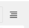

>## Šablóny a zástupné symboly

V tejto časti predstavíme zástupné symboly a tiež ukážeme, ako si môžete vytvoriť vlastné šablóny HTML pripravené na CMS.

### Šablóny

Pomocou šablón HTML môžete prispôsobiť vzhľad svojej webovej lokality, definovať zástupné symboly na označenie sekcií pre spravovaný obsah a použiť špeciálne značky na generovanie ponúk a ďalšie.

Môžete definovať viacero šablón s rôznymi rozloženiami alebo vstavanými komponentmi a vybrať si ich pre každú stránku podľa potreby. Šablónu stránky je možné kedykoľvek zmeniť za inú.

Šablóny stránok nájdete v **tutorial-project/mysite/templates**.

V predvolenom nastavení budú stránky na vašej lokalite používať šablónu **fullwidth.html** ktorá je ako prvá uvedená v CMS_TEMPLATES súboru settings.py:
~~~
CMS_TEMPLATES = (
    ## Customize this
    ('fullwidth.html', 'Fullwidth'),
    ('sidebar_left.html', 'Sidebar Left'),
    ('sidebar_right.html', 'Sidebar Right')
)
~~~
Tieto úpravy vykonať nemusíme vykonať ak sa po inštalácii tu už nachádzajú.

### Zástupné symboly

Zástupné symboly predstavujú jednoduchý spôsob, ako definovať sekcie v šablóne HTML, ktoré sa pri vykreslení stránky naplnia obsahom z databázy. Tento obsah je upravovaný pomocou mechanizmu úprav frontendu django CMS pomocou značiek šablón Django.

Ak ešte nepoznáte značky šablón Django, viac sa dozviete v [dokumentácii Django](https://docs.djangoproject.com/en/dev/topics/templates/).

**fullwidth.html** obsahuje zo začiatku iba jeden zástupný symbol **** V tomto súbore vidíme že je požadovaná knižnica značiek šablón cms_tags ktorá je už vložená pomocou ****.

Pridáme sem do sekcie fullwidth.html ale pár nových zástupných symbolov ako **** a ****.

Celý blok potom bude vyzerať takto:
~~~

     
     
     
 
~~~

Po vytvorení prvej stránky sa vám v pravom hornom rohu objaví takáto ikonka  ktorá umožňuje prepínanie medzi režimom obsahu a režimom štruktúry (Contennts/Structure). Po prepnutí do Structure mode sa vám na pravej strane pod sebou nové zástupné symboly ktoré môžete použiť:

### Statické zástupné symboly

Obsah zástupných symbolov, s ktorými sme sa doteraz stretli, je na každej stránke iný. Niekedy však budete chcieť mať na svojom webe sekciu, ktorá by mala byť rovnaká na každej jednej stránke, napríklad blok päty stránky použitý ako banner.

Svoju pätu by ste mohli síce napevno zakódovať do šablóny, ale bolo by lepšie, keby ste ju mohli spravovať cez CMS. Na to slúžia statické zástupné symboly. To vám totiž aj umožnuje obsah tej päty (napr. reklamy) meniť.

Statické zástupné symboly predstavujú jednoduchý spôsob, ako zobraziť rovnaký obsah na viacerých miestach na vašej webovej lokalite. Statické zástupné symboly fungujú takmer ako bežné zástupné symboly, až na to, že keď sa vytvorí statický zástupný symbol a pridáte doň obsah, uloží sa globálne. Aj keď zo šablóny odstránite statické zástupné symboly, môžete ich neskôr znova použiť.

Pridajme teda pätu na všetky naše stránky. Keďže chceme našu pätu na každej jednej stránke, mali by sme ju pridať do našej **základnej šablóny** ( ***mysite/templates/base.html***). A umiestniť ho pred  blízko konca prvku HTML **</body**>:
~~~
     <footer>

       

     </footer>

     
 </body>
~~~
Uložte šablónu a vráťte sa do prehliadača. Obnovte ľubovoľnú stránku v režime Štruktúra a uvidíte nový statický zástupný symbol.

**Poznámka** Na zníženie neporiadku v rozhraní sú doplnky v statických zástupných symboloch predvolene skryté. Kliknutím alebo klepnutím na názov statického zástupného symbolu ich zobrazíte/skryjete.

Ak do nového statického zástupného symbolu pridáte nejaký obsah zvyčajným spôsobom, uvidíte, že sa zobrazí aj na iných stránkach vašej lokality.

### Vykresľovanie ponúk

Na vykreslenie ponuky CMS vo vašej šablóne môžete použiť tag [show_menu](https://docs.django-cms.org/en/latest/reference/navigation.html). Aká koľvek šablóna ktorá používa show_menu, musí najprv načítať knižnicu CMS **menu_tags**:
~~~

~~~
V našom prípade menu, používame v súbore, **mysite/templates/base.html** kde sú tieto príkazy po inštalácii aj vložené takže túto úpravu nie je potrebné vykonať:
~~~
<ul class="nav">
    
</ul>
~~~
Tieto konštrukcie sa starajú o hierarchické úrovne, ktoré sa zobrazujú v strome ponuk t.j. menu – v tejto fáze sa však o to čo presne robia starať nemusíte.