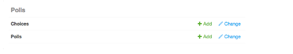
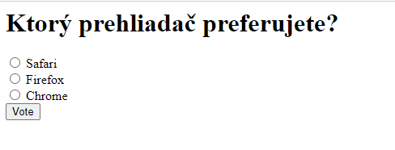
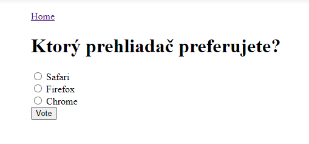

>## Integrácia aplikácií

Všetky **nasledujúce časti** tohto návodu **sa zaoberajú rôznymi spôsobmi integrácie iných aplikácií** do django CMS. Dôležitou vlastnosťou systému je jednoduchosť, s akou je možné do stránok django CMS zabudovať ďalšie aplikácie.

**Integrácia aplikácií** neznamená len ich inštaláciu spolu s django CMS, aby mohli pokojne koexistovať. **Znamená** to **použiť funkcie django CMS na ich zabudovanie do jedného koherentného webového projektu**, ktorý urýchľuje prácu pri správe stránky a umožňuje bohatšie a automatizovanejšie publikovanie.

Kľúčom k tomu, ako funguje integrácia django CMS, je to, že sa   **chcete vyhnúť tomu, aby ste následne museli upravovať aj vaše  aplikácie**. Samozrejme pokiaľ si to neželáte. Toto je obzvlášť dôležité, keď používate aplikácie tretích strán a nechcete, aby ste museli udržiavať svoje vlastné rozvetvené verzie. (Jediná výnimka je, ak sa rozhodnete zabudovať funkcie django CMS priamo do samotných aplikácií, napríklad pri použití zástupných symbolov v iných aplikáciách .)

Pre tento tutoriál si vezmeme základnú aplikáciu **Polls** na prieskum verejnej mienky Django a integrujeme ju do CMS.

Takže musíme vykonať:
* začleniť do projektu aplikáciu Polls
* vytvoriť druhú, nezávislú ***integračnú aplikáciu Polls/CMS*** na riadenie integrácie

Takto môžeme integrovať aplikáciu Polls bez toho, aby sme v nej museli čokoľvek meniť.

### Začlenenie aplikácie polls

obsahuje v prvom kroku najprv aplikáciu polls nainštalovať.

>#### Inštalácia polls

Aplikáciu nainštalujeme z jej úložiska na GitHub-e pomocou pip:
~~~
$ pip install git+http://git@github.com/divio/django-polls.git#egg=polls
~~~
Môže sa však stať že nebudeme mať inicializované lokálne repository (.git). V takom prípade to musíme urobiť príkazom $ git init a potom zopakovať vyššie uvedený príkaz. Ak ale pri tomto príkaze po pozitívnom ozname zostane plný kurzor na konci riadku: 
~~~
...
Installing build dependencies ... done
  Getting requirements to build wheel ... done
  Preparing metadata (pyproject.toml) ... done
tomast@TobiPC MINGW64 /d/tutorial-project
$ pip install git+http://git@github.com/divio/django-polls.git#egg=polls  
~~~
tak ho jednoducho šipkou dole zrušime. Následne pridajme túto aplikáciu **'polls'** do nášho projektu na koniec súboru settings.py do INSTALLED_APPS (pozrite si ev. poznámku o [nastavení INSTALLED_APPS](https://docs.django-cms.org/en/latest/reference/configuration.html#installed-apps) pri vkladaní položiek).

Pridajte **polls** konfiguráciu URL do **urlpatterns** projektového súboruu urls.py čím vznikne :
~~~
urlpatterns += i18n_patterns(
    path("admin/", admin.site.urls), 
    re_path(r'^polls/', include('polls.urls')),
    path("", include("cms.urls")),
)
~~~
**Pozor** musí byť zahrnuté pred riadkom path("", include("cms.urls")), pre adresy URL django CMS. Vzor adresy URL django CMS musí byť posledný, pretože „pohltí“ všetko, čo sa ešte nezhodovalo s predchádzajúcim vzorom. A do príkazu **from django.urls import include, path, re_path** sme ešte na koniec pridali príkaz **re_path**

Teraz je opäť čas na spustenie migrácie aplikácie:
~~~
$ python manage.py migrate polls
~~~
V tomto bode po spustení vstavaného web servera príkazom $ python manage.py runserver by ste sa mali vedieť prihlásiť do Django admin - http://localhost:8000/admin/ a nájsť aplikáciu Ankety (POLLS).

Vytvorte novú **anketu** stlačením +Add a následne stlačením + Pridať anketu. Potom že zadáte otázku, a poskytnete možnosti výberu na odpoveď:

Otázka : ***Ktorý prehliadač preferujete?***

Možnosti výberu sú:
* Safari
* Firefox
* Chrome

A ak teraz navštívite stránku http://localhost:8000/en/polls/, mali by ste mať možnosť vidieť zverejnený prieskum a odoslať odpoveď.

### Vylepšite šablóny pre prieskumy 

Určite ste si všimli, že v aplikácii Polls máme len minimum šablón a žiadnu navigáciu ani štýl.

Naše stránky django CMS na druhej strane majú prístup k množstvu predvolených šablón v projekte, z ktorých všetky rozširujú jednu základnú uloženú pod názvom **base.html**. Poďme to teda vylepšiť prepísaním základnej šablóny aplikáciu použitú pri prieskumoch.

Urobíme to v adresári projektu tak že v **mysite/templates**, pridáme najprv adresár polls a v ňom polls.html aby sm edostali **mysite/templates/polls/base.html**, ktorý obsahuje:
~~~



    
    

~~~
Znova obnovte **/polls/**, ktorá by teraz mala byť správne integrovaná do lokality domovskej stránky **Home**.

### Nastavenie novej aplikácie polls_cms_integration

Zatiaľ však bola aplikácia Polls **iba integrovaná do projektu** mysite, nie však do samotnej aplikácie  django CMS **tutorial-project**. A keďže tieto dve aplikácie (mysite a polls) sú úplne nezávislé nemôžu navzájom využívať svoje údaje alebo funkcie.

Preto vytvorme novú integrujúcu aplikáciu Polls/CMS Integration, kde ich spojíme.

>#### Vytvorenie integrujúcej aplikácie

Urobíme to tak, že vytvorte nový balík v koreňovom adresári projektu s názvom **polls_cms_integration**:
~~~
$ python manage.py startapp polls_cms_integration
~~~
Náš pracovný priestor teraz vyzerá takto:
~~~
tutorial-project/
    media/
    mysite/
    polls_cms_integration/  # nova vytvorena aplikacia
        __init__.py
        admin.py
        models.py
        migrations.py
        tests.py
        views.py
    static/
    manage.py
    project.db
    requirements.txt
~~~

>#### Pridajte to do INSTALLED_APPS

Ďalej je potrebné integrovať aplikáciu **polls_cms_integration** do nášho projektu. Pridajte **'polls_cms_integration'** k **INSTALLED_APPS** v settings.py. Teraz sme pripravení ho použiť na začatie integrácie Polls s django CMS. Začneme [vývojom doplnku Polls](https://docs.django-cms.org/en/latest/introduction/04-plugins.html#plugins-tutorial).

**Poznámka** Aké sú možnosti pridávania šablón do projektu alebo do aplikácie?

Už skôr sme do projektu pridali nové šablóny. Rovnako dobre sme mohli pridať **templates/polls/base.html** dovnútra **polls_cms_integration**. Koniec koncov, tam budeme vykonávať všetky ostatné integračné práce.

Teraz by sme však mali aplikáciu, ktorá predpokladá názov šablóny, ktorú by mala rozšíriť (pozrite si prvý riadok šablóny **base.html**, ktorú sme vytvorili). A to nemusí byť pre iný projekt správne.

Tiež by sme sa museli uistiť, že to **polls_cms_integration** bolo ***predtým*** polls v INSTALLED_APPS, inak by šablóny **polls_cms_integration** v skutočnosti neprepísali šablóny v **polls**. Ich vloženie do projektu zaručuje, že prepíšu tie vo všetkých aplikáciách.

**Každý zo spôsobov je rozumný, pokiaľ poznáte jeho dôsledky.**