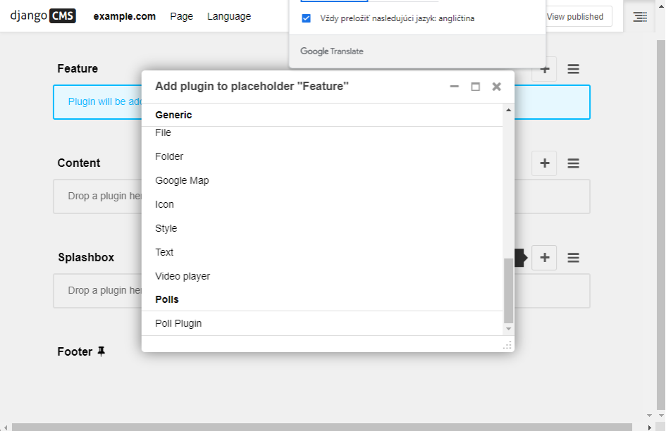

>## Pluginy

V tomto návode vezmeme základnú aplikáciu na prieskum verejnej mienky Django a integrujeme ju do CMS.

### Vytvorte model doplnku 
Do súboru **models.py** ktorý ak ho ešte nemáme, tak si ho  v adresári **polls_cms_integration** vytvoríte a pridáme do neho nasledujúce príkazy:
~~~
from django.db import models
from cms.models import CMSPlugin
from polls.models import Poll

class PollPluginModel(CMSPlugin):
    poll = models.ForeignKey(Poll, on_delete=models.CASCADE)

    def __str__(self):
        return self.poll.question
~~~
Tým sa vytvorí trieda modelu pluginu ktorá všetko dedí zo základnej triedy **cms.models.pluginmodel.CMSPlugin**. 

**Poznámka** Zásuvné moduly django CMS dedia z [**cms.models.pluginmodel.CMSPlugin**](https://docs.django-cms.org/en/latest/reference/plugins.html#cms.models.pluginmodel.CMSPlugin) (alebo ich podtriedy) a nie z [**models.Model**](https://docs.djangoproject.com/en/3.2/ref/models/instances/#django.db.models.Model).

Po vytváraní a menení modelov je potrebné vždy spustiť migrácie:
~~~
$ python manage.py makemigrations polls_cms_integration
$ python manage.py migrate polls_cms_integration
~~~
Kedy **manage.py makemigrations** urobí novú migráciu a **manage.py migrate** to aplikuje.

### Trieda doplnkov
Teraz vytvorte nový súbor **cms_plugins.py** v rovnakom priečinku, v ktorom je súbor **models.py** a zapíšeme sem nižšie uvedený kód. Trieda zásuvných modulov je zodpovedná za poskytnutie potrebných informácií na vykreslenie zásuvného modulu django CMS.

Pre náš doplnok prieskumu napíšeme nasledujúcu triedu doplnkov:
~~~
from cms.plugin_base import CMSPluginBase
from cms.plugin_pool import plugin_pool
from polls_cms_integration.models import PollPluginModel
from django.utils.translation import gettext as _

@plugin_pool.register_plugin  # register the plugin
class PollPluginPublisher(CMSPluginBase):
    model = PollPluginModel  # model where plugin data are saved
    module = _("Polls")
    name = _("Poll Plugin")  # name of the plugin in the interface
    render_template = "polls_cms_integration/poll_plugin.html"

    def render(self, context, instance, placeholder):
        context.update({'instance': instance})
        return context
~~~
**Poznámka** Všetky triedy doplnkov musia dediť z [**cms.plugin_base.CMSPluginBase**](https://docs.django-cms.org/en/latest/reference/plugins.html#cms.plugin_base.CMSPluginBase) a musia sa zaregistrovať v [**plugin_pool**](https://docs.django-cms.org/en/latest/reference/plugins.html#cms.plugin_pool.PluginPool).

Primeraná konvencia pre pomenovanie doplnkov je:

* PollPluginModel: ***trieda modelov***

* PollPluginPublisher: ***trieda doplnkov***

Nemusíte sa držať tejto konvencie, ale vyberte si takú, ktorá dáva zmysel a držte sa jej.

### Šablóna

Atribút **render_template** v triede doplnku je povinný a hovorí doplnku, ktorý [**render_template**](https://docs.django-cms.org/en/latest/reference/plugins.html#cms.plugin_base.CMSPluginBase.render_template) sa má použiť pri vykresľovaní.

V tomto prípade musí byť šablóna na **polls_cms_integration/templates/polls_cms_integration/poll_plugin.html** a mala by vyzerať asi takto:
~~~
<h1>{{ instance.poll.question }}</h1>

<form action="" method="post">
    
    

        
            

                <label>
                    <input type="radio" name="choice" value="{{ choice.id }}">
                    {{ choice.choice_text }}
                </label>
            

        
    

    <input type="submit" value="Vote" />
</form>
~~~

Teraz je potrebné reštartovať runserver (vyžaduje sa to preto, lebo sme pridali nový súbor **cms_plugins.py**. Keď potom navštivime našu stránku na http://localhost:8000/ a prejdeme do režimu štruktúry (ikona vpravo hore) naskytnú sa nám môžnosti umiestniť nahrané pluginy rovnako ako akýkoľvek iný doplnok do ľubovoľného zástupného symbolu na ľubovoľnej stránke.

Na záver treba povedať že existuje veľké množstvo (cca 500 000) pluginov pre [Django a Django CMS](https://pypi.org/) vrátane e-commerce resp e-shop. Pri ich výbere je však potrebné dávať veľký pozor na verzie programovacieho jazyka a verzie použitých knižníc.
