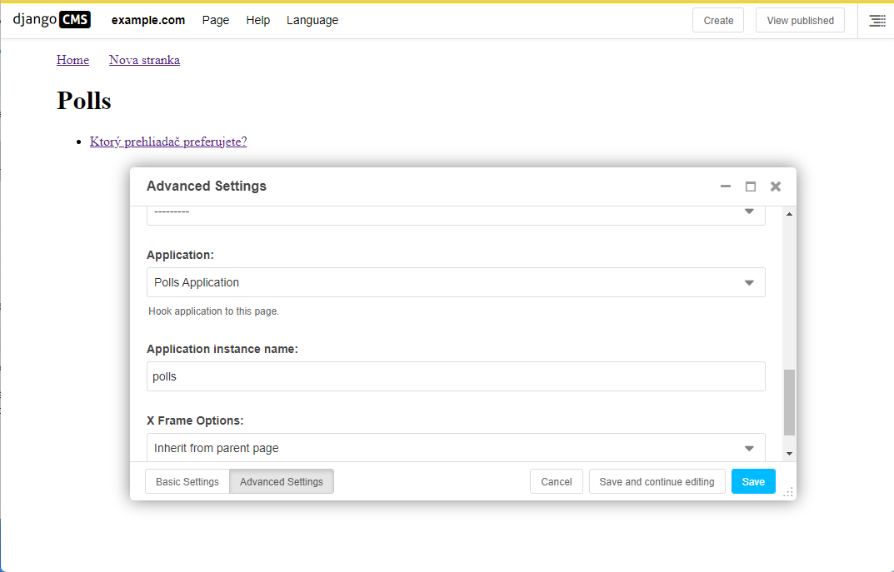

>## Vytvorenie apphook-u

Application Hook (Aplikačný hák), zvyčajne jednoducho označovaný ako **apphook**, je spôsob pripojenia funkcií nejakej inej aplikácie k stránke Django CMS. Je to pohodlný spôsob integrácie iných aplikácií do stránky django CMS.

Zatial je napr. naša aplikácia Django Polls staticky pripojená k projektu urls.py. To je v poriadku, ale môžeme pre ňu urobiť viac pripojením aplikácie k stránkam django CMS.

Pri vytváraní apphooku používame podtriedu [CMSApp](https://docs.django-cms.org/en/latest/reference/api_references.html#cms.app_base.CMSApp) , ktorá hovorí CMS, ako má danú aplikáciu zahrnúť do je štruktúry.

### Vytvorenei triedy apphook

Apphooky žijú v súbore s názvom **cms_apps.py**, takže si ho vytvorte v aplikácii Polls/CMS Integration, tj v **polls_cms_integration**.

Toto je základný príklad apphooku pre aplikáciu django CMS:
~~~
from cms.app_base import CMSApp
from cms.apphook_pool import apphook_pool

@apphook_pool.register  # register the application
class PollsApphook(CMSApp):
    app_name = "polls"
    name = "Polls Application"

    def get_urls(self, page=None, language=None, **kwargs):
        return ["polls.urls"]
~~~
V tejto triede **PollsApphook** sme urobili niekoľko kľúčových vecí:

* **app_name** atribút dáva systému jedinečný spôsob odkazovania na apphook. Z [Django Polls](https://github.com/divio/django-polls/blob/master/polls/urls.py#L6) môžete vidieť, že názvov aplikácie **polls** je pevne zakódovaný do aplikácie, takže tento atribút **musí byť** tiež **polls**.

* **name** je ľudsky čitateľné meno a zobrazí sa správcovi.

* **get_urls()** metóda je to, čo v skutočnosti pripája aplikáciu a vracia zoznam konfigurácií URL, ktoré budú aktívne všade tam, kde sa apphook použije. V tomto prípade použije **urls.py** z **polls**.

### Odstránenie starého polls záznamu z urls.py projektu 

Teraz musíte odstrániť z náho urls.py v projekte mysite položku pre aplikáciu Polls:
~~~
re_path(r'^polls/', include('polls.urls', namespace='polls'))
~~~
Nevyžaduje sa to tam preto, lebo namiesto toho sa k polls dostaneme cez apphook. A keby sme to v urls.py nechali, viedlo by to ku konfliktu so spracovaním URL a apphooku. Vo výpise by sme dostali upozornenie:
~~~
URL namespace 'polls' isn't unique. You may not be able to reverse all URLs in this namespace.
~~~
Nasleduje reštartovanie servera pretože sme vytvorili nový súbor obsahujúci kód Pythonu, ktorý sa nenačíta, kým sa server nereštartuje. Musíte to ale urobiť len pri prvom vytvorení nového súboru.

### Použitie apphook-u na stránke

Teraz musíme vytvoriť novú stránku a pripojiť k nej aplikáciu Polls cez tento apphook. Vytvorte ju teda, uložte ju a potom ju publikujte lebo váš apphook **nebude fungovať, kým nebude stránka zverejnená**.

Keď budete mať vytvorenú novú stránku napr.cez Create nastavte sa na horné menu (v paneli s nástrojmi) na Stranka (Page) a z ponuky vyberte jej rozšírené nastavenie. Z rozbaľovacej ponuky „Aplikacia:“ (Application:) vyberte „Aplikácia na prieskumy“ (Polls Application) a uložte to.

Obnovte stránku a zistíte, že aplikácia Ankety je teraz dostupná priamo z novej stránky django CMS.

**Dôležité** Nepridávajte podradené stránky na stránku s apphookom. Apphook „prehltne“ všetky adresy URL pod adresou stránky a odovzdá ich pripojenej aplikácii. Ak máte nejaké podradené stránky ktoré sú pri pripojenej stránke, django CMS ich totiž nebude môcť spoľahlivo poskytovať.