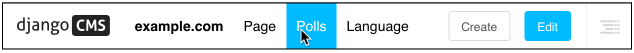
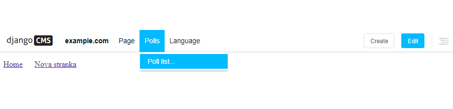

>## Rozšírenie panela s nástrojmi

Na panel s nástrojmi pridáme rôzne ovládacie prvky pomocou podtriedy **cms.toolbar_base.CMSToolbar**.

### Pridať základnú triedu PollToolbar

Na panel s nástrojmi pridáme rôzne ovládacie prvky pomocou podtriedy **cms.toolbar_base.CMSToolbar**.

>### Pridať ponuku na panel s nástrojmi ###

Začnite pridaním nového súboru **cms_toolbars.py** do vašej aplikácie Polls/CMS Integration v adresári **polls_cms_integration**  a vytvorme triedu **CMSToolbar**:
~~~
from cms.toolbar_base import CMSToolbar
from cms.toolbar_pool import toolbar_pool
from polls.models import Poll

class PollToolbar(CMSToolbar):

    def populate(self):
        self.toolbar.get_or_create_menu(
            'polls_cms_integration-polls',  # a unique key for this menu
            'Polls',                        # the text that should appear in the menu
            )

# register the toolbar
toolbar_pool.register(PollToolbar)
~~~
Poznámka

Nezabudnite reštartovať runserver, aby bol váš nový súbor cms_toolbars.py  rozpoznaný. Teraz nájdete na každej stránke lokality novú položku na paneli s nástrojmi:

Metóda **populate()** je to, čo sa volá, keď je vytvorený panel nástrojov. V ňom používame [**get_or_create_menu()**](https://docs.django-cms.org/en/latest/reference/toolbar.html#cms.toolbar.toolbar.CMSToolbar.get_or_create_menu) na pridanie položky Ankety na panel s nástrojmi.

>### Pridať uzly do ponuky Ankety

***Ponuka Ankety*** je zatiaľ prázdna. V súbore cms_toolbars.py môžeme rozšíriť **populate()** a pridať nejaké položky. **get_or_create_menu** vráti ponuku, s ktorou môžeme manipulovať, takže zmeňme **populate()** metódu a nahradíme existujúce položky položkami ktoré nám umožnia vidieť úplný zoznam prieskumov v bočnom rámci po rozbalení Polls s [**add_sideframe_item()**](https://docs.django-cms.org/en/latest/reference/toolbar.html#cms.toolbar.items.ToolbarAPIMixin.add_sideframe_item). Kód ktorým nahradíme pôvodný kód v cms_toolbars.py je nasledovný:
~~~
...

from cms.utils.urlutils import admin_reverse

class PollToolbar(CMSToolbar):

    def populate(self):
        menu = self.toolbar.get_or_create_menu('polls_cms_integration-polls', 'Polls')

        menu.add_sideframe_item(
            name='Poll list',                              # name of the new menu item
            url=admin_reverse('polls_poll_changelist'),    # the URL it should open with
        )
~~~
Po obnovení stránky, aby sa mali načítať zmeny a teraz môžete vidieť zoznam ankiet priamo z ponuky.

Užitočná by bola aj možnosť vytvárať nové ankety. Použijeme na to modálne okno vyvolané pomocou [**add_modal_item()**](https://docs.django-cms.org/en/latest/reference/toolbar.html#cms.toolbar.items.ToolbarAPIMixin.add_modal_item). Pridajte nový kód na koniec metódy populate() a menu Polls sa rozrastie o novú voľbu "Add a new poll...":
~~~
class PollToolbar(CMSToolbar):

    def populate(self):
        [...]

        menu.add_modal_item(
            name='Add a new poll',                # name of the new menu item
            url=admin_reverse('polls_poll_add'),  # the URL it should open with
        )
~~~

### Pridať tlačidlá na panel s nástrojmi

Rovnako ako ponuky môžeme na panel s nástrojmi veľmi podobným spôsobom pridať tlačidlá . Prepíšte metódu **populate()** a všimnite si, ako veľmi sa štruktúra tohto kódu zhoduje so štruktúrou pri pridávaní ponúk.
~~~
def populate(self):

    buttonlist = self.toolbar.add_button_list()

    buttonlist.add_sideframe_button(
        name='Poll list',
        url=admin_reverse('polls_poll_changelist'),
    )

    buttonlist.add_modal_button(
        name='Add a new poll',
        url=admin_reverse('polls_poll_add'),
    )
~~~

## Ďalšie vylepšenia

Tlačidlá a ponuka pre prieskumy sa zobrazujú na paneli s nástrojmi všade na lokalite. Bolo by užitočné obmedziť to na stránky, ktoré sú skutočne relevantné.

Prvá vec, ktorú je treba v tejto súvislosti pridať, je test. ten treba dať hneď na začiatku metódy **populate()**:
~~~
    def populate(self):

        if not self.is_current_app:

            return

        [...]
~~~
Príznak **is_current_app** nám hovorí, či funkcia obsluhujúca toto zobrazenie (napr. zoznam prieskumov) patrí do rovnakej aplikácie ako tá, ktorá je zodpovedná za túto ponuku panela nástrojov.

Často sa to dá zaistiť automaticky, ale v tomto prípade zobrazenie patrí aplikácii **polls**, zatiaľ čo ponuka panela s nástrojmi patrí **polls_cms_integration**. Takže musíme triede **PollToolbar** explicitne povedať, že je skutočne spojená s aplikáciou **polls**. Urobíme to tak že pred def populate(self): vložíme supported_apps = ['polls']:
~~~
class PollToolbar(CMSToolbar):
    
    supported_apps = ['polls']
    
    def populate(self):
         ...   
~~~
Teraz už sa tlačidlá a ponuka menu nezobrazia stále, ale len na príslušných stránkach (na novej stránke kde boli vložené).

### Kompletné cms_toolbars.py

Pre úplnosť zhrnieme celý príklad ktorý sme tu konštruovali po častiach:
~~~
from cms.utils.urlutils import admin_reverse
from cms.toolbar_base import CMSToolbar
from cms.toolbar_pool import toolbar_pool
from polls.models import Poll

class PollToolbar(CMSToolbar):
    supported_apps = ['polls']

    def populate(self):

        if not self.is_current_app:

            return

        menu = self.toolbar.get_or_create_menu('polls_cms_integration-polls', 'Polls')

        menu.add_sideframe_item(
            name='Poll list',
            url=admin_reverse('polls_poll_changelist'),
        )

        menu.add_modal_item(
            name=('Add a new poll'),
            url=admin_reverse('polls_poll_add'),
        )

        buttonlist = self.toolbar.add_button_list()

        buttonlist.add_sideframe_button(
            name='Poll list',
            url=admin_reverse('polls_poll_changelist'),
        )

        buttonlist.add_modal_button(
            name='Add a new poll',
            url=admin_reverse('polls_poll_add'),
        )

toolbar_pool.register(PollToolbar)  # register the toolbar
~~~
Toto je len základný príklad no v triedach panela s nástrojmi django CMS je toho oveľa viac. Nájdete to v časti [Ako rozšíriť panel s nástrojmi]https://docs.django-cms.org/en/latest/how_to/toolbar.html#toolbar-how-to) .