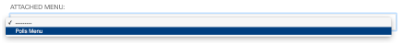

>## Rozšírenie navigačného menu - list boxu

Možno ste si všimli, že zatiaľ čo naša aplikácia Ankety bola integrovaná do CMS s pluginmi, položkami ponuky na paneli s nástrojmi atď. Navigačné menu stránky je stále určené iba stránkami django CMS.

Môžeme sa pripojiť k systému ponuky django CMS a pridať do tejto navigačnej ponuky vlastné uzly.

### Vytvorenie navigačnej ponuky

Vytvoríme menu pomocou podtriedy **CMSAttachMenu** a použijeme metódu **get_nodes()** na pridanie uzlov. Na to potrebujeme v našej aplikáci isúbor s názvom **cms_menus.py**. Pridáme preto cms_menus.py do **polls_cms_integration**:
~~~
from django.urls import reverse
from django.utils.translation import gettext_lazy as _

from cms.menu_bases import CMSAttachMenu
from menus.base import NavigationNode
from menus.menu_pool import menu_pool

from polls.models import Poll

class PollsMenu(CMSAttachMenu):
    name = _("Polls Menu")  # give the menu a name this is required.

    def get_nodes(self, request):
        """
        This method is used to build the menu tree.
        """
        nodes = []
        for poll in Poll.objects.all():
            node = NavigationNode(
                title=poll.question,
                url=reverse('polls:detail', args=(poll.pk,)),
                id=poll.pk,  # unique id for this node within the menu
            )
            nodes.append(node)
        return nodes

menu_pool.register_menu(PollsMenu)
~~~
Reštartujeme webserver, vojdem edo horného menu na Page,potom do Advanced settings a tu do ATTACHED MENU kde máme našu novo vytvorenévoľbu. Čo sa tu týmto udeje:

* definujeme triedu **PollsMenu** a registrujeme ju
* dáme triede atribút **name** (zobrazí sa v admin)
* v jeho metóde **get_nodes()** vytvoríme a vrátime zoznam uzlov, kde:
    * najprv dostaneme všetky objekty **Poll** 
    * ... a potom z každého **NavigationNode** vytvoríme objekt
    * ... a vrátime ich zoznam (**NavigationNodes**)

Táto trieda ponuky v skutočnosti nebude robiť nič, kým nebude pripojená k stránke. V ***pokročilé nastavenia***  (Advanced Settings) stránky, ku ktorej ste predtým pripojili apphook (uvidíte to cez example.com a Pages), vyberte **"Polls Menu"** zo zoznamu možností ktorý ponúka  ***Attached menu*** a uložte te to. (Ponuku môžete pridať na ktorúkoľvek stránku, ale najrozumnejšie je pridať ju na túto stránku.)

Ak to považujete za vhodné, môžete vynútiť automatické pridávanie ponuky na stránku pomocou aplikácie apphook. Informácie o tom, ako to urobiť, nájdete v časti [Pridanie ponúk do aplikácií](https://docs.django-cms.org/en/latest/how_to/apphooks.html#apphook-menus).

**Poznámka** Ide tu o ilustráciu základných princípov. V tomto skutočnom prípade si všimnite, že:
* Ak budete používať podstránky, budete musieť vylepšiť štýl ponuky, aby to fungovalo o niečo lepšie.
* Keďže na stránke Polls sú v každom prípade uvedené všetky Ankety, nie je to práve najpraktickejší doplnok ponuky.