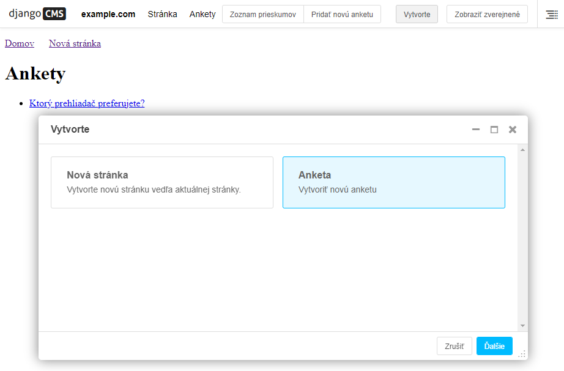

>## Sprievodcovia tvorbou obsahu

Sprievodcovia tvorbou obsahu vám umožňujú používať tlačidlo **Create** na paneli nástrojov vo vašich vlastných aplikáciách. Otvorí sa jednoduché dialógové okno so základnými poľami potrebnými na vytvorenie novej položky.

Django CMS ho prevážne používa na vytváranie stránok, ale môžete doň pridať aj svoje vlastné modely.

Za týmto účelom do aplikácie **polls_cms_integration** pridajte súbor **forms.py** s týmto obsahom:
~~~
from django import forms

from polls.models import Poll

class PollWizardForm(forms.ModelForm):
    class Meta:
        model = Poll
        exclude = []
~~~
Potom ešte v tom istom adresári vytvorme súbor **cms_wizards.py** ktorý obsahuje:
~~~
from cms.wizards.wizard_base import Wizard
from cms.wizards.wizard_pool import wizard_pool

from polls_cms_integration.forms import PollWizardForm

class PollWizard(Wizard):
    pass

poll_wizard = PollWizard(
    title="Poll",
    weight=200,  # determines the ordering of wizards in the Create dialog
    form=PollWizardForm,
    description="Create a new Poll",
)

wizard_pool.register(poll_wizard)
~~~
Reštartujte webserver, urobte migráciu, vymažte data prehliadača a spustite znovu server.Keď  stlačíte tlačidlo **Create** na paneli s nástrojmina pri stránke s Polls (Nová stránka)  tak sa otvorí dialogové okno ktoré vám okrem vytvorenia novej stránky ponúkne aj sprievodcu vytváraním novej Ankety.

Je veľmi pravdepodobné že počas dopĺňania kódu ktorý súvisí s používaním databázy sa pri reštarte objavie varovania že naše modely nemajú primárne kľúče. Ale vytvára ich automaticky django. Ak sa chceme zbaviť týchto WARNING-ov počas startovania web servera je potrebné dať do settings.py nasledovné [priradenie](https://docs.djangoproject.com/en/3.2/releases/3.2/#customizing-type-of-auto-created-primary-keys):
~~~
DEFAULT_AUTO_FIELD='django.db.models.AutoField'
~~~

Pri prenášaní kódu a jeho sprevádzkovaní sa tiež často stáva že je postrádaná knižnica polls ktorú sme sťahovali cez GitHub príkazom :
~~~
$ pip install git+http://git@github.com/divio/django-polls.git#egg=polls
~~~
Túto knižnicu je v takom prípade potrebné znovu nainštalovať. 

V PRÍPADE NEJASNOSTÍ JE VHODNÉ NAZRIEŤ DO KÓDU VZOROVEJ APLIKÁCIE A POROVNAŤ UMIESTNENIE JEDNOTLIVÝCHSÚBOROV, ICH OBSAH A KONŠTRUKCIU JEDNOTLIVÝCH RIADKOV ! NIE JE TO HANBA, TAKTO TO ROBÍ KAŽDÝ VÝVOJÁR ČI UŽ JE ZAČÍNAJÚCI ALEBO SKÚSENÝ EXPERT.