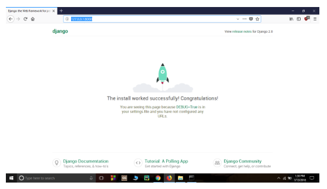

>## Nasadenie do produkcie (skúšobnej)

Táto časť riešenia webovej aplikácie tiež patrí do oblasti prípravy prostredia, ale tento krát nie prostredie pre vývoj našej webovej aplikácie, ale pre jej umiestnenie na produkčnom serveri t.j. SRV ku ktorému bude pristupovať široká verejnosť. 

Nasadenie do produkcie je nevyhnutnou súčasťou nášho riešenia, lebo náš vývoj robíme preto aby náš produkt (webovú aplikáciu) niekto prostredníctvom internetu používal!

Táto téma môže byť trochu ťažšia na pochopenie ale či chceme alebo nie musíme sa ňou prehrýzť aby sme dosiahli vyššie spomínaný zámer. Táto kapitola je umiestnená uprostred nášho návodu, aby ti mentor či mentorka mohli pomôcť s trochu náročnejšími časťami procesu spúšťania tvojej webovej stránky online. Dokončenie návodu by už nemalo robiť väčšie problémy a je veľmi pravdepodobné že by si to mohol zvládnuť aj sam.

Na začitok si treba uvedomť že až **do tohto momentu bola tvoja webová stránka dostupná len v tvojom počítači**. Teraz sa naučíme, ako ju nasadiť na produkčný server! Nasadenie (deployment) je proces publikovania aplikácie na internete, aby ju všetci konečne mohli vidieť a používať ju.

Ako už vieš, webová stránka musí byť umiestnená na serveri. Na internete existuje množstvo serverov od rôznych poskytovateľov. My použijeme **PythonAnywhere**. PythonAnywhere je bezplatný pre malé aplikácie, ktoré nemajú príliš veľa návštevníkov a návštevníčok, takže zatiaľ nám to pre vyukové potreby bude určite stačiť.

Ďalšou externou službou, ktorú budeme využívať, je **GitHub**, ktorý zväčša využívajú vývojári SW na uchovávanie zdrojových kódov. Existujú aj ďalšie podobné služby, no v dnešnej dobe už majú takmer všetci programátori a programátorky githubové konto a teraz by si ho mal mať aj ty!

Tieto tri miesta a činnosti budú pre teba dôležité:
* **Lokálny počítač** bude miestom, kde budeš vyvíjať a testovať. 
* Keď budeš spokojný so zmenami, uložíš kópiu programu na **GitHub**. 
* Tvoja webová stránka bude na **PythonAnywhere** a budeš ju aktualizovať presunom novej kópie svojho kódu z GitHubu.

## Git 
Vzhľadom k tomu že problematike Git-u a GitHub-u sme sa venovali pri príprave prostredia v predmete [Aplikovaná informatika]() na tomto mieste uskutočme iba zhrnutie základných a najpoužívanejších príkazov.

#### Inštalácia Git-u pre Windows
Git si môžeme stiahnuť z tejto adresy https://git-scm.com/ a pri inštalácii takmer všetko je možné odklikať tak ako je to ponúkané okrem voľby svojho editora ktorým je VS-Code a pri "Adjusting your PATH environment" zvoľ "Use Git and optional Unix tools from the Windows Command Prompt" (spodná možnosť). k ti bude počas inštalácie ponúknutá možnosť "Adjusting the name of the initial branch in new repositories", prosím, zvoľ "Override the default" a použi "main". Týmto bude tvoja inštalácia Gitu v súlade so všeobecným smerovaním globálnej programátorskej komunity. Vetvu "main" budeme používať v celom tomto tutoriáli. V prípade nastavenia master je potrebné urobiť konverziu na main príkazom $ git branch -M main

#### Založenie Git repozitára
Git sleduje zmeny na konkrétnej skupine súborov, v niečom, čo sa nazýva úložisko kódu alebo repozitár (skrátene "repo"). Založme si repo pre náš projekt. Otvor konzolu a spusti nasledujúce príkazy v adresári djangogirls:
~~~
 git init
Initialized empty Git repository in ~/djangogirls/.git/
$ git config --global user.name "Tvoje Meno"
$ git config --global user.email ty@example.com
~~~
Inicializácia Git repozitára je niečo, čo musíme urobiť len raz za projekt (a už nikdy nebudeš musieť znovu zadávať užívateľské meno a e-mail).

#### Upravenie názvu vetvy
Vo verziách Gitu starších ako 2.28 budeš musieť zmeniť meno svojej vetvy na **"main"**. Ak chceš zistiť, akú verziu Gitu máš, prosím, spusti nasledovný príkaz:
~~~
$ git --version
git version 2.xx...
~~~
Na premenovanie názvu vetvy sa používa nasledujúci príkaz. Ak je to verzia 28 alebo viac, pokračuj,  sekciou "Ignorovanie súborov". Rovnako ako v časti "Inicializácia" aj toto musíme spraviť len jeden jediný raz vrámci projektu, a aj to iba v prípade, ak je tvoja verzia Gitu menšia ako 2.28:
~~~
$ git branch -M main
~~~

#### Ignorovanie súborov
Ak nebudeme chcie+t aby boli sledované zmeny v niektorých súboroch musíme ich názvy vložit do súboru .gitignore. Otvor si editor a vytvor nový takýto súbor v púriečinku djangogirls. Pre názornosť uvedieme rozsiahlejší príklad obsahu .gitignore kedy # je označený iba komentár:
~~~
# Python
*.pyc
*~
__pycache__

# Env
.env
myvenv/
venv/

# Database
db.sqlite3

# Static folder at project root
/static/

# macOS
._*
.DS_Store
.fseventsd
.Spotlight-V100

# Windows
Thumbs.db*
ehthumbs*.db
[Dd]esktop.ini
$RECYCLE.BIN/

# Visual Studio
.vscode/
.history/
*.code-workspace
~~~

#### Doporučený postup používania Git-u
1. **git status**\
je dobré vždy použiť kedykoľvek, keď si nebudeš istý, či sa niečo zmenilo. Pomôže ti to vyhnúť sa prekvapeniam ako napríklad pridaniu nesprávnych súborov do archívu. Príkaz git status vracia informácie o nesledovaných (**untracked**) či zmenených (**modified**) súboroch, alebo súboroch pripravených na zmenu (**staged**), o stave vetvy a veľa ďalších vecí. Výstup by mal byť podobný nasledovnému textu:
~~~
$ git status
On branch main

No commits yet

Untracked files:
  (use "git add <file>..." to include in what will be committed)

        .gitignore
        blog/
        manage.py
        mysite/
        requirements.txt

nothing added to commit but untracked files present (use "git add" to track)
~~~

  2. **git add .**\
  príprava súborov ktoré boli zmenené a ktoré majú byť lokálne archivované do local repository, okrem tých ktoré sú označemné v .gitignore.\
   **Pozor** na konci je medzera a bodka.
  
  3. **git commit -m "Poznámka čo sa zmenilo"**\
  zápis súborov do lokálneho archívu (repository) za účelom ev. neskoršieho zápisu na GitHub
~~~
$ git add .
$ git commit -m "My Django Girls app, first commit"
 [...]
 13 files changed, 200 insertions(+)
 create mode 100644 .gitignore
 [...]
 create mode 100644 mysite/wsgi.py
~~~
  4. **GitHub.com** založenie účtu na GitHub ak ho ešte nemáme.

  5. **django-cms-install** vytvorenie nového repository na GitHub ak ho ešte nemáme. Ak tu už máš iný archivačný adresár, nevadí, pridaj si tu ďalší s týmto názvom lebo v ďalšom texte sa na neho budeme odkazovať. Na nasledujúcej stránke sa ti ukáže klonovacia URL adresa tvojho repa, ktorú budeme potrebovať v niektorých z nasledujúcich príkazov:

Ak pri vytváraní nového názvu repository na GitHub-e už pri prvých písmenách vzniká chyba, je potrebné pri tom nastaviť jazyk anglický.

  6. **prepojenie repositárov Git-u a GitHub-u** Napíš do konzoly nasledujúci príkaz (nahraď <your-github-username> svojím užívateľským menom na GitHube, ale bez špicatých zátvoriek - URL by mala byť rovnaká ako klonovacia URL, ktorú si práve videl).
~~~
$ git remote add origin https://github.com/<your-github-username>/django-cms-install.git
~~~

  6. **git push -u origin main**\
  prenos nášho kódu z Git-u na GitHub. Keď pošleš niečo na GitHub, spýta sa ťa to na tvoje githubové meno a heslo (buď rovno v príkazovom riadku alebo vo vyskakovacom okne) a keď ich zadáš, mal by si vidieť niečo takéto:

~~~
ounting objects: 6, done.
Writing objects: 100% (6/6), 200 bytes | 0 bytes/s, done.
Total 3 (delta 0), reused 0 (delta 0)
To https://github.com/ola/my-first-blog.git

 * [new branch]      main -> main
Branch main set up to track remote branch main from origin.
~~~
Ak sa pri použití tohoto príkazu objaví chyba:
~~~
remote: Repository not found.
~~~
Je potrebné v Credential Manager-i (Menežeri poverení) OS Windows takýmto postupom zmazať creditials (poverenia):
1. Otvorte **Ovládací panel** z ponuky Štart.
2. Vyberte položku **Používateľské kontá**.
3. Vyberte **"**Správca poverení**"**.
4. Kliknite na **Poverenia systému Windows**“**.
5. Odstráňte všetky poverenia súvisiace s Git alebo GitHub.
6. Po odstránení všetkých skúste znova klonovať.

Keže neplatené používanie GitHub-u má svoje obmedzenia ako napr. načíta iba 3000 súborov a naša inštalačná verzia pritom ich má 12 869 v 5 025 priečinkoch o celkovej ve+lkosti 144 MB. Preto nie je možné tento kód uložiť na GitHub a tento použiť na odovzdanie hostingu. Problémom pre GitHub sú tiež citlivé slová ako napr. SECRET_KEY ktorý je použitý v súbore settings.py.

>Z toho vyplýva že danú aplikáciu vieme spúšťať iba lokálne alebo ho mimo GitHub-u preniesť na niektorý platený hosting podporujúci Django a ktorý umožňuje z marketingových dôvodov do určitej miery aj bezodplatné použitie. 

Tu je okrem [PythonAnywhere](https://www.pythonanywhere.com/) niekoľko z nich ktoré sú hostitelmi Django:
* [Microsoft Azure](https://azure.microsoft.com/pricing/details/app-service/)
* [Railway](https://railway.app/)
* [AWS Elastic Beanstalk](https://docs.aws.amazon.com/elasticbeanstalk/latest/dg/create-deploy-python-django.html)
* [djangofriendly](https://djangofriendly.com/) so zoznamom cca. 300 hostitelov

K tým lacnejším (5-10 USD/mesiac)patria:
* [Heroku](https://www.heroku.com/)
* [Digital Ocean](https://www.digitalocean.com/) a 
* [Python Anywhere](https://www.pythonanywhere.com/)

Tvoj kód je na GitHube a môžeš sa naň pozrieť! Zistíš, že sa nachádza vo vyberanej spoločnosti - [Django](https://github.com/django/django), [Django Girls Tutorial](https://github.com/DjangoGirls/tutorial) a mnoho iných skvelých open sourcových softvérových projektov uchováva svoj kód na GitHube.

### 
