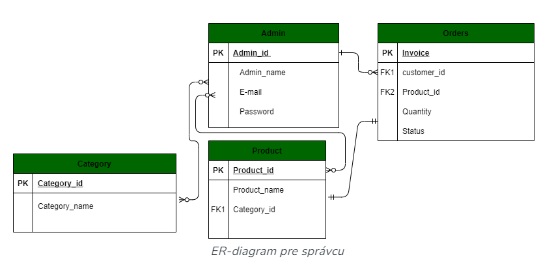

## Webové stránky elektronického obchodu využívajúce framework Django
 
https://www.geeksforgeeks.org/e-commerce-website-using-django/

[GitHub odkaz na projekt](https://github.com/TanuShree952838/Eshop)

Tento projekt sa zaoberá vývojom webovej stránky **„Elektronického obchodu“** . Táto aplikácia poskytuje používateľovi zoznam rôznych produktov dostupných na nákup v obchode. Pre pohodlie tzv. online nakupovania je užívateľovi poskytnutý nákupný košík. Po výbere je tovar odoslaný na proces potvrdenia objednávky. Systém je implementovaný pomocou webového rámca Pythonu Django. Na vytvorenie webovej aplikácie elektronického obchodu Django je potrebné poznať a pochopiť nasledovné technológie.

**Technológie a požadované zručnosti použité v projekte**

•	[Python](https://www.geeksforgeeks.org/python-programming-language/)\
•	[framework Django](https://www.geeksforgeeks.org/django-tutorial/) a\
•	[SQLite](https://www.geeksforgeeks.org/python-sqlite/)

### Webová aplikácia elektronického obchodu Django
Rozsah projektu bude obmedzený iba na niektoré funkcie webovej stránky elektronického obchodu. Zobrazí napr. produkty a zákazníci si môžu vybrať katalógy alebo produkty, môžu vložiť/odstrániť produkty z košíka s uvedením množstva každej položky. Vybrané položky budú zhromaždované v košíku. Pri pokladni bude položka na karte prezentovaná ako objednávka. Zákazníci môžu zaplatiť za položky v košíku, aby dokončili objednávku. Tento projekt má veľký priestor na rozširovanie obsahu. Projekt tiež poskytuje bezpečnosť pomocou prihlasovacieho ID a hesiel, aby sa k vášmu účtu nedostali žiadni neoprávnení používatelia. K softvéru má teda prístup iba oprávnená osoba, ktorá získala  oprávnenie po registrácii. V tejto verzii nebude implementovaná pokladňa resp. integrácia API platobného portálu ako je napr. PayPay, G Pay.

### ER diagram pre webovú stránku elektronického obchodu
**Zákaznícke rozhranie**
1.	Zákazník nakupuje produkt
2.	Zákazník mení množstvo
3.	Zákazník pridáva tovar do košíka
4.	Zákazník si prezerá košík
5.	Zákazník sa skončí výber produktov
6.	Zákazník odošle objednávku
7.	Zákazník však nezaplatí ! 
 

 

**Správcovské rozhranie**
1.	Správca sa prihlási
2.	Správca vloží položku
3.	Správca odstráni položku
4.	Správca upraví položku
 

 

## Implementácia webovej aplikácie krok za krokom 
•	**Vytvoríme nový projekt:** Otvoríme IDE (VS-Code) a vytvoríme nový projekt výberom položky File -> Open Folder. Alebo to urobíme pomocou prieskumníka a vytvorte nový adresár projektu s názvom **E-Shop**\
•   Nainštalujeme Django príkazom **$ pip install django**\
•   Vytvoríme virtuálne prostredie príkazom **$ python –m venv env**\
•	**Aktivujeme vyruálne prostredie** príkazom **$ . env/scripts/activate**\
•	**Nainštalujeme všetky knižnice vrátane Djanga:** Ďalej nainštalujeme všetky knižnice vrátane Djana príkazom **$ pip install -r requirements.txt** Na vykonanie tejto úlohy použijeme integrovaný terminál Git Bash.
•	**Skontrolujeme či boli nainštalované knižnice a aká verzia Djanga** : môžeme to urobiť spustením príkazu **$ pip freeze**\
•	**Skontrolujeme či je inštalácia Djanga funkčná "** príkazom **$ python manage.py runserver číslo_portu**\
•	**Vytvoríme aplikáciu projektu Django:** Keď spustíme príkaz **$ django-admin startproject store** , vytvorí sa Django aplikácia s menom **store**\
•**Skontrolujeme verziu Python:** použitím príkazu **$ python –-version**\
•	**Spustíme predvolený webový server Django:** Django totiž poskytuje  zabudovaný webový server, na ktorom môžeme spúšťať a skúšať naše aplikácie. V terminály zadáme príkaz **python manage.py runserver  ČísloPortu**. V predvolenom nastavení server beží na porte 8000 ale my musíme uviesť port pracoviska (8016, 8015 a 8014). Prístup na webový server uskutočníme kliknutím na zvýraznenú URL adresu http://127.0.0.1:8000

Ak otvoríme priečinok projektu pomocou VS-Code, tak adresárová štruktúra súborov projektu Eshop by mala vyzerať takto:

Teraz pridáme webovú aplikáciu elektronického obchodu **store** do súboru **settings.py** na koniec bloku **INSTALLED_APPS** viď. obrázok.

**urls.py :** Tento súbor obsahuje všetky vzory adries URL používané webom

~~~
from django.contrib import admin
from django.urls import path, include
from django.conf.urls.static import static
from . import settings

urlpatterns = [
	path('admin/', admin.site.urls),
	path('', include('store.urls'))
] + static(settings.MEDIA_URL, document_root=settings.MEDIA_ROOT)
~~~

**models.py :** Nižšie uvedená snímka obrazovky zobrazuje požadované modely, ktoré budeme musieť vytvoriť. Tieto [modely](https://www.geeksforgeeks.org/django-models/) sú reprezentované tabuľkami, ktoré budú uložené v použitej databáze **SQLite**.
 

Pozrime sa trochu bližšie na každý model a polia implementovaných tabuliek ktoré sú v ňom požadované.

**category.py :** Toto je model Django pre **„Category“**, ktorý obsahuje pole meno s maximálnou dĺžkou 50 znakov. Má tiež statickú metódu **get_all_categories()** na získanie všetkých kategórií z databázy. Metóda **__str__** je definovaná tak, aby vrátila názov kategórie, keď sa skonvertuje na reťazec . 

~~~
from django.db import models

class Category(models.Model):
	name = models.CharField(max_length=50)

	@staticmethod
	def get_all_categories():
		return Category.objects.all()

	def __str__(self):
		return self.name

~~~

**customer.py :** Tu je model Djanga pre **„Customer“** s poľami tabuľky pre **meno, telefón, e-mail a heslo**. Zahŕňa metódy registrácie, získavania zákazníkov e-mailom a kontroly, či zákazník existuje.

~~~
from django.db import models

class Customer(models.Model):
	first_name = models.CharField(max_length=50)
	last_name = models.CharField(max_length=50)
	phone = models.CharField(max_length=10)
	email = models.EmailField()
	password = models.CharField(max_length=100)

	# to save the data
	def register(self):
		self.save()

	@staticmethod
	def get_customer_by_email(email):
		try:
			return Customer.objects.get(email=email)
		except:
			return False

	def isExists(self):
		if Customer.objects.filter(email=self.email):
			return True

		return False
~~~

**products.py :** Tu je model Django pre **„Products“** s poľami tabuľky pre **názov, cenu, kategóriu, popis a obrázok**. Zahŕňa aj statické metódy použité na načítanie produktov podľa ID, načítanie všetkých produktov a načítanie produktov podľa ID kategórie.

~~~
from django.db import models
from .category import Category

class Products(models.Model):
	name = models.CharField(max_length=60)
	price = models.IntegerField(default=0)
	category = models.ForeignKey(Category, on_delete=models.CASCADE, default=1)
	description = models.CharField(
		max_length=250, default='', blank=True, null=True)
	image = models.ImageField(upload_to='uploads/products/')

	@staticmethod
	def get_products_by_id(ids):
		return Products.objects.filter(id__in=ids)

	@staticmethod
	def get_all_products():
		return Products.objects.all()

	@staticmethod
	def get_all_products_by_categoryid(category_id):
		if category_id:
			return Products.objects.filter(category=category_id)
		else:
			return Products.get_all_products()
~~~

**orders.py :** Toto je model Django pre **„Order“** s poľami tabuľky pre produkt, zákazníka, množstvo, cenu, adresu, telefón, dátum a stav. Zahŕňa tiež metódy na zadanie objednávky a získanie objednávok podľa ID zákazníka.

~~~
from django.db import models
from .product import Products
from .customer import Customer
import datetime

class Order(models.Model):
	product = models.ForeignKey(Products,
								on_delete=models.CASCADE)
	customer = models.ForeignKey(Customer,
								on_delete=models.CASCADE)
	quantity = models.IntegerField(default=1)
	price = models.IntegerField()
	address = models.CharField(max_length=50, default='', blank=True)
	phone = models.CharField(max_length=50, default='', blank=True)
	date = models.DateField(default=datetime.datetime.today)
	status = models.BooleanField(default=False)

	def placeOrder(self):
		self.save()

	@staticmethod
	def get_orders_by_customer(customer_id):
		return Order.objects.filter(customer=customer_id).order_by('-date')
~~~

**views.py :** Vo views vytvoríme zobrazenia s názvom **home.py, login.py, signup.py, cart.py, checkout.py, orders.py**, ktoré prevezmú požiadavky a v týchto súboroch cez HTML protokol nájdu k nim odpovede. Súbory **home.html, login.html, signup.html, cart.html, checkout.html, orders.html** vytvoríme v priečinku **templates**. Zobrazenia namapujeme (vytvoríme odkazy) do súboru urls.py nachádzajúcemu sa v priečinku **store**.

~~~
from django.contrib import admin
from django.urls import path
from .views.home import Index, store
from .views.signup import Signup
from .views.login import Login, logout
from .views.cart import Cart
from .views.checkout import CheckOut
from .views.orders import OrderView
from .middlewares.auth import auth_middleware

urlpatterns = [
	path('', Index.as_view(), name='homepage'),
	path('store', store, name='store'),

	path('signup', Signup.as_view(), name='signup'),
	path('login', Login.as_view(), name='login'),
	path('logout', logout, name='logout'),
	path('cart', auth_middleware(Cart.as_view()), name='cart'),
	path('check-out', CheckOut.as_view(), name='checkout'),
	path('orders', auth_middleware(OrderView.as_view()), name='orders'),

]
~~~

Nižšie uvedené súbory ukazujú ako vyzerajú views pre každú funkcionalitu na stránke.

**home.py :** Toto je Django view na ošetrenie internetového online obchodu. Zahŕňa metódy na zobrazenie indexu obchodu, pridávanie alebo odstraňovanie položiek z košíka a vykresľovanie záznamov o produktoch obchodu. Zobrazenie tiež používa relácie Django na správu nákupného košíka používateľa.

~~~
from django.shortcuts import render, redirect, HttpResponseRedirect
from store.models.product import Products
from store.models.category import Category
from django.views import View

# Create your views here.
class Index(View):

	def post(self, request):
		product = request.POST.get('product')
		remove = request.POST.get('remove')
		cart = request.session.get('cart')
		if cart:
			quantity = cart.get(product)
			if quantity:
				if remove:
					if quantity <= 1:
						cart.pop(product)
					else:
						cart[product] = quantity-1
				else:
					cart[product] = quantity+1

			else:
				cart[product] = 1
		else:
			cart = {}
			cart[product] = 1

		request.session['cart'] = cart
		print('cart', request.session['cart'])
		return redirect('homepage')

	def get(self, request):
		# print()
		return HttpResponseRedirect(f'/store{request.get_full_path()[1:]}')

def store(request):
	cart = request.session.get('cart')
	if not cart:
		request.session['cart'] = {}
	products = None
	categories = Category.get_all_categories()
	categoryID = request.GET.get('category')
	if categoryID:
		products = Products.get_all_products_by_categoryid(categoryID)
	else:
		products = Products.get_all_products()

	data = {}
	data['products'] = products
	data['categories'] = categories

	print('you are : ', request.session.get('email'))
	return render(request, 'index.html', data)
~~~

**login.py :** Toto Django zobrazenie spracováva autentifikáciu používateľa vrátane prihlásenia a odhlásenia. Používateľom umožňuje prihlásiť sa pomocou e-mailu a hesla a po úspešnom prihlásení vytvorí session a uloží ID zákazníka do tejto relácie (session). Zobrazenie **Login** podporuje aj návratovú URL adresu, pomocou ktorej je možné po úspešnom prihlásení presmerovať používateľov na konkrétnu stránku aplikácie (spravidla Home).
Okrem toho existuje funkcia **logout** na zrušenie resp. vymazanie relácie používateľa a jeho odhlásenie, ktoré ho presmeruje zase na prihlasovaciu stránku.

~~~
from django.shortcuts import render, redirect, HttpResponseRedirect
from django.contrib.auth.hashers import check_password
from store.models.customer import Customer
from django.views import View

class Login(View):
	return_url = None

	def get(self, request):
		Login.return_url = request.GET.get('return_url')
		return render(request, 'login.html')

	def post(self, request):
		email = request.POST.get('email')
		password = request.POST.get('password')
		customer = Customer.get_customer_by_email(email)
		error_message = None
		if customer:
			flag = check_password(password, customer.password)
			if flag:
				request.session['customer'] = customer.id

				if Login.return_url:
					return HttpResponseRedirect(Login.return_url)
				else:
					Login.return_url = None
					return redirect('homepage')
			else:
				error_message = 'Invalid !!'
		else:
			error_message = 'Invalid !!'

		print(email, password)
		return render(request, 'login.html', {'error': error_message})

def logout(request):
	request.session.clear()
	return redirect('login')
~~~

**signup.py :** Toto Django views spracováva registráciu používateľa (sing-up). Používatelia môžu zadať svoje meno, priezvisko, telefón, e-mail a heslo. Vykonáva sa tu niekoľko overovacích kontrol, aby sme sa ubezpečil, že zadané prihlasovacie údaje sú správne. Ak je overenie úspešné, heslo sa z bezpečnostných dôvodov zahašuje-zakóduje (hashed) a používateľ sa zaregistruje. Ak sa vyskytnú nejaké chyby, zobrazia sa na stránke registrácie.

~~~
from django.shortcuts import render, redirect
from django.contrib.auth.hashers import make_password
from store.models.customer import Customer
from django.views import View

class Signup (View):
	def get(self, request):
		return render(request, 'signup.html')

	def post(self, request):
		postData = request.POST
		first_name = postData.get('firstname')
		last_name = postData.get('lastname')
		phone = postData.get('phone')
		email = postData.get('email')
		password = postData.get('password')
		# validation
		value = {
			'first_name': first_name,
			'last_name': last_name,
			'phone': phone,
			'email': email
		}
		error_message = None

		customer = Customer(first_name=first_name,
							last_name=last_name,
							phone=phone,
							email=email,
							password=password)
		error_message = self.validateCustomer(customer)

		if not error_message:
			print(first_name, last_name, phone, email, password)
			customer.password = make_password(customer.password)
			customer.register()
			return redirect('homepage')
		else:
			data = {
				'error': error_message,
				'values': value
			}
			return render(request, 'signup.html', data)

	def validateCustomer(self, customer):
		error_message = None
		if (not customer.first_name):
			error_message = "Please Enter your First Name !!"
		elif len(customer.first_name) < 3:
			error_message = 'First Name must be 3 char long or more'
		elif not customer.last_name:
			error_message = 'Please Enter your Last Name'
		elif len(customer.last_name) < 3:
			error_message = 'Last Name must be 3 char long or more'
		elif not customer.phone:
			error_message = 'Enter your Phone Number'
		elif len(customer.phone) < 10:
			error_message = 'Phone Number must be 10 char Long'
		elif len(customer.password) < 5:
			error_message = 'Password must be 5 char long'
		elif len(customer.email) < 5:
			error_message = 'Email must be 5 char long'
		elif customer.isExists():
			error_message = 'Email Address Already Registered..'
		# saving

		return error_message
~~~

**cart.py :** Tento model Django predstavuje v aplikácii elektronického obchodu **„Order“** t.j objednávku. Má polia ako **„product“** a **„customer“**, ktoré sú cudzími kľúčmi (**F**oring **K**ey) k modelom **„Product“** a **„Customer“**. Model uchováva informácie o objednanom produkte vrátane jeho množstva, ceny, adresy doručenia a kontaktného telefónneho čísla. V poli „date“ je uložený dátum objednávky a v poli „status“ sa uvádza, či je objednávka dokončená alebo nie.
Trieda (class) poskytuje metódy na zadanie objednávky a načítanie objednávok podľa špecifického ID zákazníka a tieto sú zoradené podľa dátumu vystavenia v zostupnom poradí.

~~~
from django.db import models
from .product import Products
from .customer import Customer
import datetime

class Order(models.Model):
	product = models.ForeignKey(Products,
								on_delete=models.CASCADE)
	customer = models.ForeignKey(Customer,
								on_delete=models.CASCADE)
	quantity = models.IntegerField(default=1)
	price = models.IntegerField()
	address = models.CharField(max_length=50, default='', blank=True)
	phone = models.CharField(max_length=50, default='', blank=True)
	date = models.DateField(default=datetime.datetime.today)
	status = models.BooleanField(default=False)

	def placeOrder(self):
		self.save()

	@staticmethod
	def get_orders_by_customer(customer_id):
		return Order.objects.filter(customer=customer_id).order_by('-date')
~~~

**checkout.py :** **„CheckOut“** sa stará o zobrazenie (views) ošetrenia procesu platby v aplikácii elektronického obchodu Django. Zhromažďuje dodaciu adresu a telefónne 
číslo zákazníka prostredníctvom operácie POST. Z relácie tiež získa ID zákazníka a jeho nákupný košík. Zobrazenie vytvára záznamy objednávok pre vybraté produkty vrátane podrobností o produkte, informácií o zákazníkovi, cien a množstiev. Po spracovaní objednávky vymaže nákupný košík v relácii a presmeruje používateľa na stránku **„cart“**.

~~~
from django.shortcuts import render, redirect

from django.contrib.auth.hashers import check_password
from store.models.customer import Customer
from django.views import View

from store.models.product import Products
from store.models.orders import Order

class CheckOut(View):
	def post(self, request):
		address = request.POST.get('address')
		phone = request.POST.get('phone')
		customer = request.session.get('customer')
		cart = request.session.get('cart')
		products = Products.get_products_by_id(list(cart.keys()))
		print(address, phone, customer, cart, products)

		for product in products:
			print(cart.get(str(product.id)))
			order = Order(customer=Customer(id=customer),
						product=product,
						price=product.price,
						address=address,
						phone=phone,
						quantity=cart.get(str(product.id)))
			order.save()
		request.session['cart'] = {}

		return redirect('cart')
~~~

**orders.py :** **„OrderView“** je view v aplikácii elektronického obchodu Django ktoré ošetruje zobrazovanie objednávok pre prihláseného zákazníka. Získa ID zákazníka z relácie a použije ho na načítanie objednávok zákazníka z databázy. Views potom využije šablónu **„orders.html“** , ktorá odovzdá zoznam objednávok, ktoré sa majú zobraziť. To umožňuje zákazníkovi zobraziť históriu svojich objednávok. **„auth_middleware“** sa používa na zabezpečenie toho, aby k tomuto zobrazeniu (views) mali prístup iba overení zákazníci.

~~~
from django.shortcuts import render, redirect
from django.contrib.auth.hashers import check_password
from store.models.customer import Customer
from django.views import View
from store.models.product import Products
from store.models.orders import Order
from store.middlewares.auth import auth_middleware

class OrderView(View):

	def get(self, request):
		customer = request.session.get('customer')
		orders = Order.get_orders_by_customer(customer)
		print(orders)
		return render(request, 'orders.html', {'orders': orders})
~~~

## Záver
Správanie sa našej webovej aplikácie si môžeme pozrieť prostrednícvom nasledovného videa : video_prezentácia webovej aplikácie Tento projekt síce obsahuje veľké množstvo funkcií, avšak ponúka priestor aby bolo možné v budúcnosti identifikovať a začleniť ešte ďalšie funkcie. Hlavnými užívateľmi sú zákazníci aj správcovia, ktorým môže zvládnutie online správania aplikácie trvať trochu dlhšie. Pochopenie ďalších potrieb a prispôsobenie sa danému počítačovému systému resp. implementáciu ďalších funkcií si bude však vyžadovať ešte omnoho viac času a úsilia.
