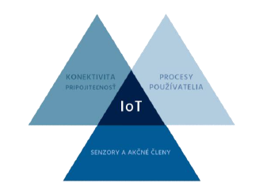
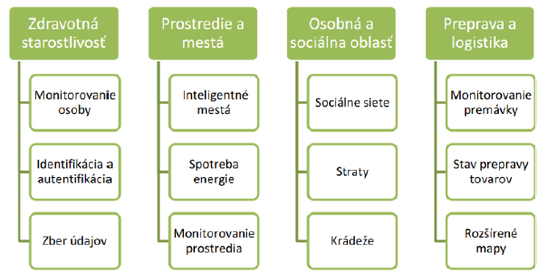
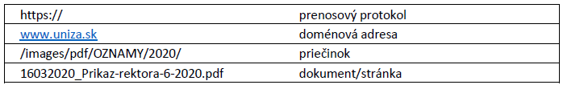
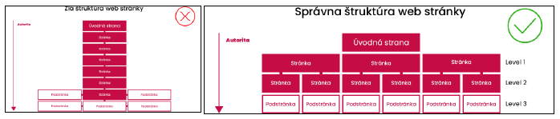
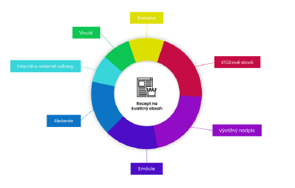
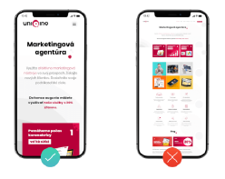
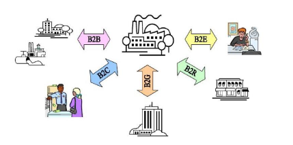

># Spracovanie a vizualizácia dát 2023/2024

>## 1. Koncept IoT (B obrázok)

https://youtu.be/LlhmzVL5bm8 

**Internet vecí** (angl. **Internet of things**, skratka **IoT**) je v informatike označenie pre prepojenie zariadení/objektov/ľudí prostredníctvom internetu.

~~~
Internet vecí (angl. Internet of things, skratka IoT) je označenie pre obrovskú sieť prepojených zariadení. Tieto zariadenia počas svojho používania jednak zhromažďujú a zdielajú údaje o prostredí v ktorom sú používané a jednak vykonávajú požadované úkony.

To všetko sa deje pomocou vstavaných senzorov a aktorov (výkonných členov) 
~~~

Pri tomto **prepojení** zariadení sa okrem **internetu** často využíva aj pripojenie pomocou **Wi-Fi** (dosah cca 100 až 200m) a **Bluetooth** (dosah >10m).

Prepojené zariadenie by malo byť najmä bezdrôtové a malo by priniesť nové možnosti vzájomnej interakcie nielen medzi jednotlivými systémami a tiež priniesť nové možnosti ich ovládania, sledovania a zabezpečenie pokročilých služieb.

V súčasnosti architektúra založená na Internete dovoľuje výmenu služieb a tovarov medzi prvkami, zariadeniami a objektami pripojenými do siete.
IoT sa odvoláva na sieťové pripojenie každodenných objektov, ktoré sú často vybavené určitým druhom inteligencie.
V tomto kontexte môže byť Internet taktiež platforma pre zariadenia na elektronickú komunikáciu, zdieľanie informácií a špecifických dát so svetom okolo nich.
IoT môžeme považovať za kombináciu senzorov a akčných členov poskytujúcich a prijímajúcich informáciu, ktorá je digitalizovaná a odoslaná na obojsmernú sieť schopnú preniesť všetky dáta určené na použitie rôznymi službami a koncovými používateľmi.

Subjekty ktoré sú zdrojom a príjemcom informácii môžu byť :
* **Poskytovatelia senzorových dát** - Podnikateľské subjekty nasadzujúce a manažujúce senzory
* **Organizácie** - Verejná alebo súkromná. Verejné infraštruktúry. Komerčné organizácie. Súkromné spoločnosti. Poskytovatelia technológií a služieb.
* **Osoby a domácnosti** - Mobilné telefóny, inteligentné hodinky, gyroskopy, kamery, GPS, akcelerometre, mikrofóny, notebooky , televízie, kamery, mrazničky, mikrovlnky, sporáky, umývačky riadu, inteligentné spotrebiče atď.

Viacero rôznych senzorov môže byť pripojených na jeden objekt alebo zariadenie za účelom merania širokej škály fyzikálnych veličín alebo javov. A tieto dáta sú následne prostredníctvom cloud-u prenesené na spracovanie príslušným serverom. Snímanie môže byť chápané ako model služby.

V dnešnej dobe sú najmodernejšie zariadenia, obvykle domové spotrebiče ako chladničky alebo televízory, vybavené komunikačnými a snímacími zariadeniami. Ich schopnosti budú neustále rozširované začlenením čoraz väčšieho počtu inteligentných komunikačných a snímacích nástrojov.

>## 2. IoT technológie v praxi

https://youtu.be/yLZbzbO_7yQ

**PRIPOJENÉ INTELIGENTNÉ BUDOVY**
* Zlepšenie účinnosti (manažment spotreby energie a úspory) a bezpečnosti (senzory a alarmy). Domové aplikácie vrátane inteligentných senzorov a akčných členov na ovládanie domácich spotrebičov.
* Zdravotné a vzdelávacie služby doma.
* Diaľkové ovládanie liečby pacientov.
* Káblové/satelitné služby.
* Systém ukladania/generovania energie.
* Automatické vypínanie elektroniky v prípade jej nevyužívania.
* Inteligentné termostaty.
* Detektory dymu a alarmy.
* Aplikácia na kontrolu prístupu.
* Inteligentné zámky.
* Senzory zabudované v infraštruktúre budovy na výpomoc a asistenciu záchranárom.
* Bezpečnosť pre všetkých členov rodiny.

**INTELIGENTNÉ MESTÁ A DOPRAVA**
* Integrácia bezpečnostných služieb.
* Optimalizácia verejnej a súkromnej dopravy.
* Parkovacie senzory.
* Inteligentná správa parkovacích služieb a premávky v reálnom čase.
* Inteligentné riadenie semaforov v závislosti od dopravných zápchach.
* Zabezpečenie (kamery, inteligentné senzory, informácie pre občanov).
* Vodné hospodárstvo.
* Zavlažovanie parkov a záhrad.
* Inteligentné zberné nádoby.
* Kontrola znečistenia.
* Získavanie okamžitej spätnej väzby a názorov od občanov.
* Inteligentná správa.

**VZDELÁVANIE**
* Prepojenie virtuálnych a fyzických učební na zabezpečenie efektívnejšieho a dostupnejšieho vzdelávania, e-learning.
* Prístupové služby k virtuálnym knižniciam a vzdelávacím portálom.
* Výmena správ a výsledkov v reálnom čase.
* Celoživotné vzdelávanie.
* Učenie sa cudzích jazykov.
* Správa účasti.

**SPOTREBNÁ ELEKTRONIKA**
* Inteligentné telefóny.
* Inteligentná TV.
* Notebooky, počítače a tablety.
* Inteligentné chladničky, umývačky a sušičky.
* Inteligentné domáce kino.
* Inteligentné spotrebiče.
* Obojkové (Pet collar) senzory.
* Personalizácia používateľského komfortu.
* Autonómna prevádzka výrobku. Osobné lokátory.
* Inteligentné okuliare.

**INTELIGENTNÉ PRIPOJENIE**
* Správa dát a poskytovanie služieb.
* Využitie sociálnych sietí a médií.
* Prístup k e-mailom, hlasovým a video službám.
* Interaktívna skupinová komunikácia.
* Streamovanie v reálnom čase.
* Sledovanie zabezpečenia siete.
* Virtuálna realita.
* Služby cloudového spracovania.
* Všadeprítomné spracovanie.

>## 3. Architektúra IoT
**Architektúra IoT je** spôsob, akým sú zariadenia pripojené k internetu, komunikujú medzi sebou a spracovávajú dáta. Existuje viacero možných architektúr IoT, ktoré sa líšia podľa úrovne abstrakcie, funkcionality a bezpečnosti. Všeobecne sa dá povedať, že architektúra IoT pozostáva z troch základných vrstiev: vrstvy snímania objektov, informačno-integračnej vrstvy a vrstvy aplikácií a služieb.

1. **Vrstva snímania objektov** 

    zahŕňa fyzické zariadenia, ktoré snímajú a získavajú dáta z okolia, ako napríklad teplomery, gyroskopy, magnetometre, snímače tlaku a ďalšie. Tieto zariadenia môžu byť pripojené k internetu pomocou rôznych technológií, ako napríklad Wi-Fi, Bluetooth, ZigBee, LoRaWAN, NB-IoT a ďalšie. Zariadenia môžu byť tiež zoskupené do logických celkov, ktoré sa nazývajú aktíva. Aktívum je časť vybavenia, ku ktorej môže byť pripojený jeden alebo viac senzorov, napríklad chladnička, auto, výťah alebo turbína.

2. **Informačno-integračná vrstva** 

    zabezpečuje prenos dát z vrstvy snímania objektov do vrstvy aplikácií a služieb. Táto vrstva sa zaoberá spracovaním nejednoznačných informácií zo siete, filtrovaním nežiadúcich dát a integráciou hlavnej informácie do využiteľných znalostí pre koncových používateľov a služby. Táto vrstva môže využívať rôzne technológie, ako napríklad cloudové služby, edge computing, big data analytics, strojové učenie, umelej inteligencie a ďalšie.

3. **Vrstva aplikácií a služieb**

     poskytuje riešenia pre rôzne oblasti, ktoré využívajú dáta z vrstvy snímania objektov. Táto vrstva môže zahŕňať aplikácie pre monitorovanie, riadenie, optimalizáciu a autonómiu pripojených zariadení. Táto vrstva môže tiež ponúkať služby pre rôzne odvetvia, ako napríklad zdravotníctvo, dopravu, energetiku, poľnohospodárstvo, priemysel, smart city a ďalšie.

>## 4. Úlohy systémov

Systém je skupina vzájomne sa ovplyvňujúcich alebo vzájomne súvisiacich prvkov, ktoré konajú podľa súboru pravidiel tak, aby tvorili jednotný celok. Úlohy systémov sú rôzne podľa toho, akého typu sú a aký je ich cieľ. Všeobecne možno povedať, že systémy sú súbory prvkov, ktoré spolupracujú na dosiahnutí určitého výsledku. Niektoré príklady systémov a ich úloh sú:
* Informačný systém je systém, ktorý spravuje a poskytuje informácie pre potreby riadenia, rozhodovania, komunikácie alebo iných činností. Úlohy informačného systému sú napríklad zhromažďovanie, spracovanie, prenos, uchovávanie, výber, distribúcia a prezentácia údajov.
* Operačný systém je systém, ktorý spravuje zdroje počítača a poskytuje programom rozhranie na prístup k týmto zdrojom. Úlohy operačného systému sú napríklad kontrola a alokovanie pamäte, pridelenie priority systémovým procesom, správa vstupných a výstupných zariadení, umožnenie pripojenia do siete a správa súborov.
* Systém manažérstva kvality je systém, ktorý zabezpečuje, že organizácia spĺňa požiadavky zákazníkov, zákonné predpisy a vlastné ciele. Úlohy systému manažérstva kvality sú napríklad definovanie politiky a cieľov kvality, plánovanie a vykonávanie procesov kvality, monitorovanie a meranie výkonu kvality, vykonávanie korektívnych a preventívnych opatrení a neustále zlepšovanie kvality.

>## 5. Kategorizácia systémov

**Kategorizácia systémov** 

je proces členenia systémov z rôznych hladísk:

#### A) <u>Kategorizácia systémov sa vykonáva v súlade s metodikou klasifikácie informácií a kategorizácie sietí a informačných systémov</u> 

ktorú vydalo Ministerstvo investícií, regionálneho rozvoja a informatizácie Slovenskej republiky. **Cieľom kategorizácie systémov je zabezpečiť primeranú ochranu informácií a systémov pred kybernetickými hrozbami a rizikami.** Kategorizácia systémov sa vykonáva pre každú sieť a informačný systém vytvorením zoznamu komponentov sietí a informačných systémov, ktorý identifikuje jednotlivé siete a informačné systémy, ich podporné systémy a podsystémy s uvedením ich bezpečnostnej funkcie a zaradenia do príslušných bezpečnostných kategórií.

Existujú tri kategórie sietí a informačných systémov:
* **Kategória I** 

    zahŕňa siete a informačné systémy, ktoré spracúvajú prísne chránené informácie, ktorých narušenie by malo **vážne následky** pre základné služby, verejný poriadok, národnú bezpečnosť alebo medzinárodné vzťahy.

* **Kategória II** 

    zahŕňa siete a informačné systémy, ktoré spracúvajú chránené informácie, ktorých narušenie by malo **značné následky** pre základné služby, verejný poriadok, národnú bezpečnosť alebo medzinárodné vzťahy.
* **Kategória III** zahŕňa siete a informačné systémy, ktoré spracúvajú interné informácie, ktorých narušenie by malo **mierny alebo žiadny vplyv** na základné služby, verejný poriadok, národnú bezpečnosť alebo medzinárodné vzťahy.

#### B) <u>Otvorený a uzavretý systém</u>
**Otvorený – Systém**, 

ktorý voľne interaguje so svojím prostredím, prijíma vstupy a vracia výstupy. 

Napríklad vzdelávací systém alebo akýkoľvek systém podnikových procesov, ktorý sa rýchlo zmení, keď sa zmení prostredie.

**Uzavretý – Systém**, 

ktorý je odrezaný od prostredia a neinteraguje s ním.

 Napríklad zapečatené digitálne hodinky, zložené z množstva komponentov, ktoré spolu fungujú na vykonávanie určitej úlohy.

#### C) <u>Fyzický a abstraktný systém</u>

**Fyzické systémy sú hmotné entity.**
Môžeme sa ich dotýkať a cítiť. 

**Fyzický systém môže mať statický alebo dynamický charakter.** Napríklad písacie stoly a stoličky sú fyzické časti výpočtového strediska, ktoré sú statické. A naprogramovaný počítač je dynamický systém, v ktorom sú programy, dáta a aplikácie sa môžu meniť podľa potrieb používateľa.

**Abstraktné systémy sú nehmotné entity** alebo konceptuály, ktoré môžu byť vzorcami, reprezentácia alebo model reálneho systému.

#### D) <u>Adaptívny a neadaptívny systém</u>

**Adaptívny systém** reaguje na zmenu prostredia spôsobom, ktorým zlepší svoj výkon a prežije. Napríklad ľudské bytosti, zvieratá.

**Neadaptívny systém** je systém, ktorý nereaguje na životné prostredie. Napríklad stroje.

#### E) <u>Dočasný a permanentný systém</u>

**Trvalý (Permanentý) systém** pretrváva dlhú dobu. Napríklad obchodné politiky.

**Dočasný systém** je vyrobený len na určený čas. Napríklad, DJ systém je nastavený pre program a potom sa rozoberie.

#### F) <u>Prirodzený systém a systém vyrobený človekom</u>
**Prirodzené systémy** vytvára príroda. Napríklad slnečná sústava, sezónny systém.

**Systém vyrobený človekom** vytvára človek. Napríklad rakety, vlaky ...

KATEGORIZÁCIA SYSTÉMOV z hľadiska praxe:
* Informačný systém
* Registračný systém
* Podnikový informačný systém (firemný/organizačný)
* Databázový systém
* Špeciálne systémy
* Dochádzkový systém
* Bankový systém
* Operačný systém
* Platobný systém
* Stávkový systém
* a mnohé iné

>## 6. Výhody, nevýhody a príležitosti systémov a internetu vecí

IoT výhody a nevýhody

**Výhody internetu vecí:**
* Kontrola zdrojov (napr. sledovanie stavu pôdy pomocou senzorov)
* Okamžitá akcia (napr. pri monitorovaní implantátov, stavu semaforov)
* Úspora času (automatický zber dát zo snímačov teploty)
* Analýza dát (zber a analýza dát v reálnom čase)

**Nevýhody internetu vecí:**
* Softvér nie je bezpečný
* Informácie nie sú šifrované (porušenie súkromia)
* Nedostatok kompatibility (hlavne staršie zariadenia)
* Vyžadovať investíciu (ale rýchlo sa vykompenzuje)

Príležitosti

>## 7. Informačný systém

**Informačný systém** je kombináciou softvéru, hardvéru a telekomunikačných sietí na zhromažďovanie, spracovanie a poskytovanie údajov.

Často sa používajú najmä v organizáciáciách na zber užitočných údajov ktoré priamo súvisia s predmetom ich činnosti. 

Mnoho podnikov používa informačné technológie na vykonávanie a riadenie svojich operácií, interakciu so svojimi spotrebiteľmi a dodávateľmi resp. udržanie si náskoku pred konkurenciou. Pre niektoré spoločnosti sú dnes informačné technológie ich obsahovou náplňou a predmetom podnikania ako je to napríklad v prípade Microsoft, eBay, Amazon, Alibaba a Google a pod.

**Základné zložky (subsystémy) všeobecného informačného systému**

1. **podsystém zhromažďovania údajov**\
–zahŕňa zhromažďovanie údajov pomocou rozličných zariadení a prostriedkov, záznam na príslušné pamäťové médium a kontrolu správnosti údajov. Môže nadobúdať tieto formy:
    * **centralizované zhromažďovanie údajov**\
    – údaje sa na prvotných dokladoch alebo elektronickou cestou odovzdávajú mimo podniku t.j. **mimo miesta ich vzniku** kde sú zaznamenané na pamäťové médiu.
    , kde sa uskutočnil ich záznam na príslušné médium pre vstup do počítača…<s>používa sa v súčasnosti veľmi málo</s>

    * **decentralizované zhromažďovanie údajov**\
    – údaje sa z prvotných dokladov zaznamenajú prostredníctvom technických prostriedkov na pamäťové médium priamo v podniku t.j. **na mieste ich vzniku**

2. **podsystém prenosu údajov**\
 – fyzický alebo elektronický presun údajov na miesto ich uchovania alebo ďalšieho spracovania

3. **podsystém archivácie a uchovávania údajov**\
 – zabezpečuje uchovávanie a zapamätanie údajov, ktoré vstúpili do resp. vystúpili zo systému a budú sa archivovať resp. používať pre v prípade potreby používať pre ďaľšie spracovanie tzv. dátové sklady

4. **podsystém výberu údajov**\
 – rieši výber údajov z pamäťového média na ďalšie spracovanie

5. **podsystém spracovania údajov**\
 – spracovanie údajov zahŕňa aktualizáciu, ich agregáciu (zoskupovanie) údajov a výpočty, ktoré treba urobiť aby sa dosiahol požadovaný výsledok. Výsledkom spracovania údajov sú výstupné údaje.

6. **podsystém prezentácie a distribúcie informácií**\
 – zabezpečuje prezentáciu vo vhodnej forme a ich distribúcia na riadiace miesta v daných termínoch.

<u>**Klasifikácia informačných systémov**</u>

Je zrejmé, že informačné systémy (IO) môžeme klasifikovať podľa celého radu hľadísk, napr.:
* IO podľa funkcie IS,
* IO podľa oblasti využívania,
* IO podľa stupňa automatizácie,
* IO podľa priestorového rozloženia jednotlivých subsystémov.

V súčasnosti nie je všeobecne akceptovaná jednotná metodika klasifikácie informačných systémov. Preto, bez nároku na ich vyčerpávajúce členenie, uvádzame tie, ktoré pokladáme z hľadiska vytvorenia si všeobecného názoru za podstatné.

<u>IO podľa funkcie</u>

Pod uvedeným spôsobom triedenia rozumieme posúdenie IS podľa toho, **aké služby poskytuje IS koncovému používateľovi**. V tomto zmysle rozlišujeme tri druhy IS:
* **Referenčné informačné systémy** – poskytujú používateľovi na jeho dotaz iba odpoveď či dané informácie existujú alebo nie a miesto uloženia kde ich užívateľ môže nájisť. Ich funkciou je pamätať si údaje o správach a informáciách, ktoré sú zaznamenané na dokumentoch, či iných nosičoch mimo IS. Tento druh IS odpovedá používateľovi na jeho otázku nepriamo: informácie, ktoré potrebujete existujú (príp. neexistujú) a obsahujú ich tieto a tieto dokumenty, či iné zdroje.
* **Zdrojové informačné systémy** – poskytujú používateľovi na jeho otázku už cieľové fakty a nie odkaz na ich existenciu, či miesto uloženia.
* **Logické – syntetizujúce informačné systémy** – fakty nielen uchovávajú, ale na ich základe, použitím logických operácií aj odvodzujú nové fakty, úsudky hypotézy, ktoré nie sú v informačnom systéme bezprostredne uložené.

<u>IO podľa oblasti využívania</u>

Podľa oblastí využívania môžeme informačné systémy deliť na:
* informačné systémy **pre oblasť organizácie a riadenia**,
* informačné systémy **pre oblasť vedy výskumu, výchovy a vzdelávania**,
* informačné systémy **pre oblasť masovokomunikačného informovania a informačných služieb verejnosti**, napr. rozhlas, televízia, IS rezervácie leteniek, IS rezervácie vlakových miesteniek, Bratislavská informačná služba a pod.

<u>IO podľa stupňa automatizácie</u>

 Zohľadňuje využitie organizačnej a výpočtovej techniky v IS:
* **automatizované riadenie fondov** informácií pomocou SRBD,
* **automatizovaný zber dát**, napr. pri riadení technologických procesov,
* **automatickú selekciu či indexáciu vstupných dát**, napr. v dokumentografických IS, prípadne
* **automatickú dokumentáciu informačných procesov**

>## 8. Databázový systém

**Databázový systém (DBS)** tvorí srdce každého informačného systému a je tvorený vlastnými údajmi tzv. **bázou dát (BD)** a **systémom riadenia bázy dát (SRBD)** ktorý je programové vybavenie pre prístup k údajom a narábanie s nimi.

***Význam:***

>Zber, uchovávanie a triedenie informácií patrí k základným úlohám informatiky. 

Pred objavením počítacích strojov sa všetky tieto činnosti vykonávali manuálne. Taká práca bola ťažkopádna, zdĺhavá a vyžadovala veľké zdroje ľudskej práce. Pretože išlo o ručné spracúvanie, výsledky často neboli presné ˇobsahovali veľa chýb a vytváranie analýz nad danými informáciami bolo takmer nemožné. 

>Až nástup výpočtovej techniky umožnil zlom v práci s informáciami. 

Nová doba počítačových systémov integrovala informatiku a výpočtovú techniku a dnes môžeme povedať, že bez nich nie je možný rozvoj spoločnosti. Tak ako sa menila výpočtová technika z "kalkulačiek obrovských rozmerov" na dokonalé počítače umiestnené napr. na písacom stole, menili sa aj nároky a požiadavky tých, ktorí určovali podmienky a spôsob spracovávania údajov. 

Rastúca potreba zhromažďovania a spracovania veľkého množstva údajov viedla tvorcov výpočtových prostriedkov k vývoju pamäťových médii s väčšími kapacitami a vývoju softvérových aplikácií troré s nimi budú efektívne a rýchlo pracovať. Bol to impulz pre vznik špecifických prostriedkov informačných systémov, ktoré dnes nazývame databázové systémy. 

>Úlohou DBS je čo najpresnejšie zachytiť reálne údaje a vzťahy medzi nimi, umožniť ich trvalú uchovu, riadiť manipuláciu s nimi, umožniť ďalšie získavanie a dopĺňanie informácii, vedieť ich triediť a sústreďovať podľa daného kľúča.

Databázové systémy sú dnes súčasťou informačného systému so špecifickými úlohami. Majú zabezpečiť rýchly a bezchybný prístup k údajom a manipuláciu s nimi. O to sa stará jeho programové vybavenie a na jeho kvalite záleží do akej miery budú tieto požiadavky splnené.  

**Vývoj databázových systémov**\
postupne prechádzal niekoľkými štádiami. Spočiatku to boli programy ktoré mali v sebe zabudované bloky kódu pre prácu s údajmi. Boli určené iba pre jedného používateľa a **štruktúry údajov ako aj programové bloky ktoré pracovali s údajmi boli súčasťou celého programu**. Pri každej zmene štruktúry údajov preto bolo potrebné upraviť aj vlastný program, odstrániť z neho chyby a znova ho skompilovať (preložiť do spustitelnej podoby). Táto technológia bola zdĺhavá, navyše každú úpravu robil samotný programátor. 

Práve z tohto dôvodu sa postupne vyvinuli funkcie resp. moduly (knižnice), pomocou ktorých boli **údaje ukladané do samostatných súborov** mimo vlastného aplikačného programu. Štruktúra údajov takto už bola oddelená od aplikačných programov a nebola na nich závislá. 

Ďalší dôležitý krok vo vývoji databázových informačných systémov vyvolala **požiadavka na zabezpečenie ochrany údajov** a **požiadavka na súčasný prístup viacerých používateľov k tým istým údajom** tzv. konkurenčný prístup. To viedlo k tvorbe programov tzv. systému riadenia bázy dát a vyčleneniu DBS ako samostatného systému ktorý s danou aplikáciou spolupracuje prostredníctvom rozhrania (databázových ovládačov) a súboru databázových príkazov (Application Programing Interface).

Pokial sm edoposiaľ uvažovali DBS ktoré sú uložené, umiestnené a udržiavané iba na jednom mieste v podobe centrálneho počítača tak hovoríme o **centralizovanom DBS**. K centralizovanému umiestneniu sa pristupuje cez internetové pripojenie (LAN, WAN atď.). Tento centralizovaný DBS využívajú najmä inštitúcie alebo organizácie. 

**Distribuovaný databázový systém** je v podstate typ DBS, ktorá pozostáva z viacerých DBS, ktoré sú navzájom prepojené a sú rozmiestnené na rôznych fyzických miestach. Dáta, ktoré sú uložené na rôznych fyzických miestach, tak môžu byť spravované nezávisle od iných fyzických miest avšak medzi jednotlivými DBS existuje spolupráca a deľba práce. Komunikáciu medzi databázami na rôznych fyzických miestach teda zabezpečuje počítačová sieť. 

Každá z požadovaných zmien vytvárala nové podmienky a zásady, ktoré vznikajúci systém musel spĺňať. Spracovávanie údajov prostredníctvom databázových systémov dnes patrí k najrozšírenejším technológiám v oblasti informatiky

**Výhody DBS:**
* <u>kompaktnosť </u> t.j. údaje sú sústredené na jednom mieste spravidla vo výpočtovom stredisku resp. serverovni
* <u>úspornosť úchovy</u> t.j. údaje sú uchovávané v elektronickej podobe a nie je potrebné ich spracovávať z tradičných papierových dokumentov,
* <u>rýchlosť spracovania</u> t.j. ukladanie a vyhľadávanie požadovaných údajov sa vykonáva veľmi rýchle pomocou elektronických zariadení a algoritmov,
* <u>dostupnosť údajov</u> t.j. prístup k DBS nie je obmedzená ani priestorovo a ani časovo. Údaje sú prístupné na požiadanie v ľubovoľnom čase a na ľubovolnom mieste s možnosťou zabezpečenia kontroly správnosti dostupných údajov.

>## 9. Registračný systémy

Pod pojmom registračný systém sa môže skrývať viacero rôznych systémov, ktoré sa síce používajú na rôzne účely ale majú spoločnú jednu spoločnú vlastnosť že **vykonávajú registráciu uživateľov**.

Príklady registračných systémov:

<u>Systém e-kasa</u>\
Pod tzv. eKasu môžeme zaradiť jednak on-line registračnú pokladnicu, ako aj virtuálnu registračnú pokladnicu. **Podstatou systému eKasa je prepojenie registračných pokladníc a virtuálnych pokladníc na databázu finančnej správy.** 

Každý podnikateľ má k dispozícii on-line tzv. eKasa zónu na webovom sídle finančnej správy, kde sú evidované informácie o prijatých tržbách.

<u>Registračný systém audiovizuálneho fondu</u>\
http://registracia.avf.sk/ ) - je to verejnoprávna inštitúcia na podporu a rozvoj audiovizuálnej kultúry a priemyslu

<u>Registračný systém škôl</u>\
mmožňuje prihlasovanie sa na štúdium, alebo na konkrétne predmety, či skúšky a vybavovanie celej pedagogickej agendy online

*registračný systém pedagogickej fakulty*
https://www.fei.stuba.sk/sk/dekanat-fei-stu/pedagogicke-oddelenie/registracny-system-pgo.html?page_id=5505

*registračný systém filmovej a televíznej fakulty*
https://produkciaftf.sk/

*registračný systém právnickej fakulty*
http://dnidanovehoprava.pravo.upjs.sk/registracny-system.html

<u>Registračný systém na očkovanie</u>\
možnosť očkovania na základe registrácie – registrácia na presne určený čas a miesta očkovania
https://web.vucke.sk/sk/kompetencie/zdravotnictvo/aktuality/covid-19/zupa-spusta-registracny-system-ockovanie-terene-aj-vo-vakcinacnych-centrach.html

Ďalšie odkazy na niektoré registračné systémy:

https://www.lehota.sk/zmos-pripravil-bezplatny-registracny-system-pre-mom-aktualizacia-17-2-2021--oznam/mid/433333/.html

https://www.inviton.sk/registracne-formulare-eventove

https://tvnoviny.sk/domace/clanok/148662-utecencov-ubytuju-rychlejsie

https://www.datatag.co.uk/registration/sk.php

https://www.verejnesutaze.sk/tender/zakazka-s-nizkou-hodnotou/1884

>## 10. Základné pojmy: doména, hosting, stránka, značkovací jazyk, tag,...

>### Doména:
Doména je názov t.j. reťazec znakov, ktorý je priradený (namapovaný) na IP adresu pozostávajúcu zo štvorice čísiel.  Používa sa na prístup k webovej stránke z klientskeho softvéru ktorým je spravidla internetový prehliadač. Jednoducho povedané je názov domény text, ktorý používateľ zadá do okna prehliadača, aby sa dostal na konkrétnu webovú stránku. Napríklad názov domény pre Google je „google.com“.

Skutočná adresa webovej stránky je zložitá číselná IP adresa (napr. pre Google 142.251.36.142), ale vďaka DNS (Domain Name System a jeho serveru) môžu používatelia zadávať ľudsky priateľské doménové mená a byť presmerovaní na webové stránky, ktoré hľadajú. Tento proces je známy ako vyhľadávanie DNS.

* sa používa namiesto IP adresy
* zodpovedá konkrétnemu webu

Príklad doménového mena: [www.sportovaskolatn.sk] https://www.sportovaskolatn.sk

* Doménové meno sa skladá z niekoľkých častí oddelených bodkou.
* Domény sú hierarchicky usporiadané od prava do ľava.
* Vpravo je najvšeobecnejšia doména na najvyššej úrovni (top level), smerom do ľava sú domény a subdomény ktoré presnejšie určujú cieľovú adresu.
* Doména vpravo sa nazýva TLD (Top Level Domain, Doména najvyššej úrovne).
* TLD nemôže byť ľubovoľná, je nutné si vybrať zo zoznamu, ktorý spravuje/schvaľuje organizácia IANA resp. ICANN.

<u>Existujú dve základné skupiny TLD:</u>

* národné TLD (country-code, ccTLD) – dvojznakové skratky štátov2, napríklad .sk, .cz, .pl, .hu, .au, ...

* generické TLD (gTLD) – Týkajú sa nejakej oblasti, napríklad: .edu (education, vzdelávanie), . com (commerce, obchod), .net, .org (organizations (neziskové organizácie), .science (veda), … .mil (military, armáda) a .gov (government, vláda) sú iba pre USA. .co.uk je tiež TLD.

* Pred TLD (vľavo od nej) sú postupne domény 2.úrovne, 3.úrovne, 4. úrovne atď. Hovorí sa im aj subdomény a ich počet a názov je v správe majiteľa TLD

* V prípade, že niekto chce webovú stránku a má zvolenú TLD, tak môže požiadať o registráciu domény 2. úrovne. Doménu 2. úrovne si môže žiadateľ určiť ľubovoľne. Táto doména nesmie byť už registrovaná v rámci danej TLD. Subdomény (domény úrovne 3 a viac) si môže vlastník určovať ľubovoľne.

**DNS (Domain Name System - systém doménových mien)**
* Pretože Internet používa IP adresy, je potrebná služba, ktorá z doménového mena zistí IP adresu (a v niektorých prípadoch naopak). To má na starosti DNS.
* DNS servery (DS) majú tabuľky, kde (okrem iného) sú dvojice doménová adresa a zodpovedajúca IP adresa. Keďže adries je veľa, nemôže každý DS poznať všetky. Preto sú DS usporiadané hierarchicky. Najvyššie sú DS pre jednotlivé TLD.

**URL (Uniform Resource Locator) - jednotná adresa zdroja**
 - jednoznačne určuje dokument alebo službu na Internete - https://www.uniza.sk/images/pdf/OZNAMY/2020/16032020_Prikaz-rektora-6-2020.pdf

>### Webhosting

Pojem webhostingu vyjadruje skutočnosť kde resp. u koho je webová stránka umiestnená na jeho serveri. Slovo hosting si možno voľne preložiť ako hosťovanie t.j. kto vašu stránku hosťuje na svojich prostriedkoch. Hostiteľ potom zabezpečuje:

* <u>prevádzku webovej stránky</u> na svojom serveri, s neustálym pripojením na Internet;
* <u>komerčné služby</u>, ktorých základom je okrem platenej prevádzky webovej stránky aj správa elektronickej pošty a rôzne iné ponúkané produkty ako napr. tvorba webových stránok
* <u>poskytovanie úložného priestoru</u> a s tým spojené činnosťi alebo služby.

Tieto aktivity hostitel, ktorým je spravidla ISP (Internet Service Provider) poskytuje ako jednotlivcom tak aj organizáciám a odbremeňuje tým majiteľov webových stránok od nákladov, personálných a technických požiadavok ktoré sú spojené s prístupnením a prevádzkovaním jeho webových stránok širokej verejnosti.

<u>Podľa typu zdieľania systémových prostriedkov:</u>
* **Zdieľaný alebo „sharovaný“ hosting** - prevádzka viacerých webových stránok na jednom serveri.

* **Vyhradený alebo „dedikovaný“ hosting** - prevádzka webovej stránky na samostatnom serveri, vyhradenom pre potreby jedného zákazníka.

**Freehosting** - poskytuje webhosting pre webové stránky zdarma; obvykle je však webová stránka doplnená prevádzkovateľom o reklamnú plochu, alebo sa reklama nachádza priamo v adrese webovej stránky.

**Komerčný** alebo tiež „profesionálny“ webhosting - platená služba (za komerčný webhosting sa platia mesačné poplatky od freehostingu odlišuje predovšetkým absenciou reklamy a prítomnosťou prídavných služieb).

>### Stránka resp. webová stránka

je dokument zvyčajne obsahujúci hypertext, obrázky, multimediálne a ďalšie prvky uložený obyčajne na webovom serveri prístupný prostredníctvom služby WWW v sieti internet.
* zvyčajne písaná/tvorená v značkovom jazyku HTML alebo XHTML, CSS, JavaScript a prenos prebieha pomocou protokolu http;
* v súčasnosti sa tešia veľkej obľube rôzne redakčné systémy (CMS) ktoré tieto technológie vo veľkej miere tiež používajú.

>### Značkový jazyk alebo HTML jazyk a tagy

je hyper textový značkovací jazyk **HTML** (**H**yper**T**ext **M**arkup **L**anguage) 
* ktorý je určený na vytváranie webových stránok a iných informácií zobraziteľných vo webovom prehliadači.
* webové prehliadače rozumejú tomuto jazyku a vedia podla jeho príkazov výtvárať obsah webových stránok a ich dizajn
* HTML jazyk je zložený z tzv. **tagov** (nazývaných aj **značiek**), ktoré určujú zobrazenie jednotlivých elementov na stránke
* tagy sa píšu v lomených zátvorkách <> a rozlišujeme **párové tagy** ktoré musia byť zapísané na začitku a na konci textu a **nepárové**, ktoré stačí zapísať iba na začiatku
* párové tagy majú úvodnú  a koncovú značku napr. <h1> a </h1> kedy koncová značka sa od úvodnej odlišuje tým že začína spätným lomítkom

>## 11. Firemné systémy

**Firemný systém** je softvérové riešenie, ktoré pomáha firmám riadiť a automatizovať základné firemné procesy ako účtovníctvo, výrobu, nákup či personalistiku. 

Tento systém sa skladá z množstva modulov, ktoré sa vedia prispôsobiť Vašemu zameraniu v obore. Všetky moduly sú vzájomne integrované a fungujú ako jeden komplexný celok. Každý z nich však dokáže plniť užívateľské požiadavky aj samostatne.

Jednotlivé moduly spolu vzájomne komunikujú a zdieľajú dáta. Čím viac modulov začnete používať, tým bude mať pre Vás systém väčší prínos. Odhalí totiž súvislosti, ktoré Vám doteraz mohli unikať a získate väčší nadhľad alebo nový uhol pohľadu na samotné fungovanie podniku. Každý používateľ má pridelené určité právomoci podľa postavenia vo firme. Zobrazovanie a úprava citlivých firemných informácií je zabezpečené a dostupné len tomu, kto má dostatočné oprávnenie.

<u>Zoznam modulov vo firemnom systéme:</u>

* **Interná komunikácia** (Každý zamestnanec má k dispozícii firemný chat, prostredníctvom ktorého dokáže kontaktovať každého člena tímu. Okrem toho sú neodmysliteľnou súčasťou modulu aj osobné a skupinové mailové schránke, dôležité oznámenie či firemná WIKI. Vďaka modulu tiež získavate prístup k úložisku firemných dokumentov a kalendára udalostí.)
* **Štatistiky a reporty** (Okrem toho, že vidíte výkonnosť svojich zamestnancov, sledujete aj finančný stav Vašej firmy. Štatistiky môžete sledovať pomocou ukazovateľov, grafov či trendov. Môžete si zvoliť rôzne sledované obdobie, hodnotiť vývoj alebo porovnávať jednotlivé projekty. Získate okamžitý nadhľad, dokážete včas odhaliť slabé miesta a následne tomu prispôsobiť svoje ďalšie plánovanie.)

* **Fakturácia a platby** (Fakturačný modul dáva prístup k došlým a vyšlým faktúram i dobropisom. Na manažérskej pozícii môžete faktúry schvaľovať a zároveň mať neustály prehľad o tom, ktoré sú zaplatené, nezaplatené alebo sa blíži ich termín splatnosti. Modul tiež poskytuje možnosť automatického zasielania faktúr zákazníkovi na e-mail, automatické párovanie platieb a pohybov na účte či vytváranie hromadných platobných príkazov.)

* **Riadenie zákaziek** (Modul zakázok umožní triedenie na základe ľubovoľnej kategórie, typu alebo priority. Tiež vidíte kompletnú históriu každej zákazky od jej vytvorenia až po jej dokončenie a to vrátane identity zamestnanca, ktorý s ňou pracoval.)

* **Sklad/cenník** (Kompletná evidencia skladových zásob, ktorá zahŕňa okrem iného aj tagovanie podľa kľúčových slov a foto-dokumentáciu. Modul umožňuje vidieť detaily skladovej položky, ale tiež jej históriu. A teda vidíte to, kedy a kde bola použitá a kto túto zmenu vykonal. Počet skladových zásob sa upravuje automaticky pri použití v zákazke a vidíte, ktoré zásoby sa míňajú a treba doobjednať. Tento modul je možné využiť takisto ako cenník dodávaných služieb.)

* **Financie** (Disponuje evidenciou všetkých pohybov v pokladniach jednotlivých pobočiek. Všetky údaje tak máte v reálnom čase na jednom mieste. Taktiež viete skontrolovať históriu pohybov a popis transakcií. Okrem toho máte prehľad aj o vyúčtovaní Vašich zamestnancov a vyplatených zálohách. Samozrejme sem spadá aj evidencia bločkov za nákupy do firemných nákladov a ich následné preplácanie. Tie si môžu vyžadovať schválenie, prípadne nastaviť limit pre automatické schvaľovanie.)

* **Úlohy** (Modul pomôže získať podrobnejší a praktickejší prehľad o úlohách vo vašej spoločnosti. Každá hlavná úloha môže obsahovať viacero čiastkových podúloh, ktoré je nutné vyriešiť. Je možné označiť 1 osobu, ale aj ďalších spoluriešiteľov, ktorí sú zodpovední za úspešné dokončenie (prípadne chcú byť len notifikovaní o zmenách). Samozrejmosťou je úschova príloh ako dokumenty a fotografie, ktoré súvisia s danou problematikou. Okrem iného tu vidíte sekciu komentárov a zaznamenávanie progresu v riešení úlohy.)

* **Dochádzkový systém** (Jednoduchý, ale účinný modul pre evidennciu dochádzky zamestnancov vo firme. Vďaka nemu vždy viete, ktorí kolegovia sa momentálne nachádzajú v práci, no zároveň si na vyššej pozícii môžete prezerať aj históriu ich prítomnosti a sumár odpracovaných hodín za jednotlivé dni/mesiace. Zaznamenávanie príchodov a odchodov sa vykonáva buď manuálne alebo pomocou čipových kariet na vstupe.)

* **Cestovné výkazy** (Kniha jázd Vám pomáha evidovať všetky vozidlá, ktoré sa nachádzajú vo vašom autoparku. Máte prehľad o ich stave, spotrebe, užívaní, počte najazdených kilometrov a lokalite. Mimo toho môže byť vďaka tomuto modulu schvaľovanie jázd plne digitalizované. Modul tiež poskytuje prehľad medzi súkromnými a služobnými kilometrami, ktoré boli na vozidle najazdené. Pre presnejšie sledovania vozidiel je opäť možná integrácia s Google Maps. V tomto prípade viete sledovať aktuálnu polohu, ale tiež presnú trasu, ktorú vozidlo vykonalo za zvolené obdobie.)

* **Adresár** (Adresár je zoznamom všetkých zákazníkov, ktorí vašu spoločnosť kontaktovali v minulosti, alebo spolupráca s nimi práve prebieha. Patrí sem tiež zoznam všetkých obchodných partnerov, dodávateľov a odberateľov. Spoločnosti, osoby a kontakty sú kategorizované podľa oblasti ich pôsobenia. Pri zobrazení detailu okrem iného vidíme prehľad o všetkých objednávkach, zmluvách a faktúrach s daným partnerom alebo klientom.)

>## 12. Špeciálne systémy

**Inteligentné systémy**
Inteligentný systém je pokročilý počítačový systém, ktorý dokáže zhromažďovať, analyzovať a reagovať na údaje, ktoré zhromažďuje z okolitého prostredia. Môže pracovať a komunikovať s inými agentmi, ako sú používatelia alebo iné počítačové systémy. Dokáže sa poučiť aj zo skúseností a prispôsobiť sa aktuálnym údajom. Inteligentný systém môže podporovať aj vzdialené monitorovanie a správu. Patrí sem napríklad: systém riadenia dopravy ovládanie kokpitu leteckej spoločnosti, biometrické monitorovanie, interaktívne online vzdelávanie, systémy predbežného varovania (tsunami, tornáda), terminály telemonitoring
*( Charakteristika: **IS-AI** ... video )*

**Expertné systémy**
V umelej inteligencii je expertný systém počítačový systém napodobňujúci schopnosť rozhodovania ľudského experta. Expertné systémy sú navrhnuté tak, aby riešili komplexné problémy uvažovaním prostredníctvom súborov znalostí, ktoré sú reprezentované hlavne pravidlami „ak–potom“.

*( Charakteristika: **ES** je aplikačný počítačový program alebo systém kooperujúcich programov, ktorý rozhoduje alebo **rieši problémy v istej špecializovanej oblasti s použitím znalostí a pravidiel definovaných expertami z príslušnej oblasti**. https://youtu.be/R49U8pHnb4g )* 

**Multimediálne databázy**
Multimediálna databáza ( MMDB ) je zbierka súvisiacich multimediálnych údajov . Multimediálne údaje zahŕňajú jeden alebo viac typov primárnych mediálnych údajov , ako je text , obrázky , grafické objekty (vrátane kresieb , náčrtov a ilustrácií ) , animačné sekvencie, zvuk a video .

*( Charakteristika: MMDB ... a video)* https://www.youtube.com/watch?v=yuyowbt4Xc8 )*

https://www.google.com/search?q=what+is+multimedia+databases&sca_esv=597300995&biw=1182&bih=801&tbm=vid&sxsrf=ACQVn0-kDNxvD1KOe4KXUknGvnTpV5htVw%3A1704919785370&ei=6QKfZaaZFsuOwPAPmqGxyAc&udm=&oq=what+is+multimedia+datab&gs_lp=Eg1nd3Mtd2l6LXZpZGVvIhh3aGF0IGlzIG11bHRpbWVkaWEgZGF0YWIqAggAMgQQIxgnSJMsUK8IWIUScAB4AJABAJgBXaABlQSqAQE2uAEByAEA-AEBwgIIEAAYFhgeGBOIBgE&sclient=gws-wiz-video

**Geografický informačný systém**
Geografické informačné systémy sa využívajú vo viacerých technológiách, procesoch, technikách a metódach. Sú pripojené k rôznym operáciám a početným aplikáciám, ktoré sa týkajú: inžinierstva, plánovania, manažmentu, dopravy/logistiky, poisťovníctva, telekomunikácií a obchodu. Z tohto dôvodu sú GIS a lokalizačné spravodajské aplikácie základom lokalizačných služieb, ktoré sa spoliehajú na geografickú analýzu a vizualizáciu.

*Charakteristika: **GIS** je informačný systém na získavanie, ukladanie, analyzovanie a manažovanie dát a príslušných vlastností, ktoré **sú viazané k určitému priestoru**, zvyčajne k Zemi. https://youtu.be/Hau_ZCmN8eU?si=5pLXOTOa3G1Woz5S*

*Odpoved od Chatbot-u ChatGPT pracujúceho na báze AI na otázku čo je to IS :*
*Inteligentný systém, často označovaný ako systém umelej inteligencie (AI), je počítačový systém alebo softvér, ktorý vykazuje správanie, ktoré sa považuje za inteligentné. Inteligencia v tomto kontexte znamená schopnosť získavať a aplikovať vedomosti, učiť sa zo skúseností, rozumieť zložitým konceptom, rozumu a adaptovať sa na meniace sa prostredie.*

*Inteligentné systémy môžu byť navrhnuté tak, aby vykonávali rôzne úlohy, od jednoduchých až po veľmi zložité. Niektoré spoločné vlastnosti inteligentných systémov zahŕňajú:*

***Učenie**: Schopnosť získavať vedomosti a zlepšovať výkon v priebehu času prostredníctvom skúseností.*

***Zdôvodnenie**: Schopnosť analyzovať informácie, robiť rozhodnutia a vyvodzovať závery na základe dostupných údajov.*

***Riešenie problémov**: Schopnosť riešiť zložité problémy a prispôsobiť sa novým situáciám.*

***Vnímanie**: Schopnosť interpretovať a porozumieť informáciám z prostredia, často prostredníctvom senzorov alebo vstupných údajov.*

***Adaptabilita**: Schopnosť prispôsobiť sa zmenám v prostredí alebo požiadavkám úloh.*

***Spracovanie prirodzeného jazyka (NLP)**: Schopnosť porozumieť a generovať ľudský jazyk, čo umožňuje komunikáciu medzi ľuďmi a strojmi.*

***Autonómia**: Schopnosť pracovať nezávisle bez nepretržitého ľudského zásahu.*

*Inteligentné systémy možno použiť v rôznych oblastiach vrátane zdravotníctva, financií, výroby, dopravy a ďalších. Môžu mať podobu expertných systémov, modelov strojového učenia, robotiky, chatbotov a ďalších aplikácií AI. Vývoj inteligentných systémov zahŕňa použitie algoritmov, údajov a výpočtového výkonu, ktoré umožňujú strojom vykonávať úlohy, ktoré si tradične vyžadovali ľudskú inteligenciu.\
https://youtu.be/NbEbs6I3eLw\
https://youtu.be/oV74Najm6Nc?si=W5IdMMqcifqxYVRF
https://youtu.be/oHsVAtUUodU?si=guTPPRswve_YBbp5*

>## 13. Možnosti tvorby webových stránok

Ak sa rozhodneme vytvoriť www stránku, tak máme tieto možnosti:

1. Využiť online služby na automatickú tvorbu webu.
2. Použiť redakčný systém (CMS).
3. Vytvoriť web vo wysivig editore.
4. Ručne si ju naprogramovať – HTML a CSS.

**1. Online služby na automatickú tvorbu webu**

Výhody:
* Možnosť vytvorenia www stránky rýchlo a zadarmo, stačí sa zaregistrovať a v niekoľkých krokoch poskladať svoju stránku.
* Nemusíme zdĺhavo študovať programátorský kód.
* Obsah stránok môžeme kedykoľvek upravovať.

Nevýhody:
* K doméne vytvorenej stránky sa pridá označenie portálu.
* Musíme sa prispôsobovať štruktúre nami zvolenej šablóny.
* Umiestnenie reklamy na našej stránke.

Príklady služieb: [Webnode.sk](https://www.Webnode.sk), [eStranky.sk](https://www.eStranky.sk), [webzdarma.cz](https://www.webzdarma.cz), ....

**2. Redakčné systémy CMS**
* CMS – Content Management System
* Systémy na správu obsahu webu.
* Často sú nazývané aj ako redakčné či publikačné systémy.
* Ide o webové aplikácie, pomocou ktorých môžeme tvoriť alebo upravovať články a potom ich publikovať na našej stránke. Obvykle ale majú omnoho viac funkcií, napr. správa používateľov webu, správa diskusií, komentárov, súborov, obrázkov a iné

Najpoužívanejšie CMS: [WordPress](https://sk.wordpress.org/), [Joomla](https://launch.joomla.org/), [Drupal](https://www.drupal.sk/), [Django-CMS](https://www.django-cms.org/en/) .

**3. Tvorba a úprava webov pomocou WYSIWYG editorov**
* Skratkou WYSIWYG (**W**hat **Y**ou **S**ee **I**s **W**hat **Y**ou **G**et - „čo vidíš, to dostaneš“) označujeme editory, v ktorých to, čo vytvoríme na obrazovke počítača, bude rovnako vyzerať aj po vytlačení na tlačiarni. V súvislosti s tvorbou webových stránok takto označujeme editory, v ktorých webové stránky editujeme v takej podobe, v akej budú zobrazené v okne prehliadača.
* Použitie WYSIWYG editoru je ďalší z jednoduchých postupov ako si vytvoriť svoju www stránku. Práca s takýmto editorom sa podobá práci v prostredí textového procesora.
* Výhodou programov slúžiacich na vytváranie stránok je, že sa nemusíme zdĺhavo učiť programovacie jazyky na tvorbu www, ale tieto programy nám automatický vytvárajú zdrojové kódy.
* Nevýhodou je, že sme odkázaní na funkcie a nástroje, ktoré nám takýto editor ponúka.

Príklady: FrontPage z kancelárskeho balíka Microsoft Office od spoločnosti Microsoft po roku 2006 nahradený s [Microsoft Expression Web 4](https://www.youtube.com/watch?v=nLYMha1RLGw)  [Dreamweaver](https://www.adobe.com/sk/products/dreamweaver.html?mv=search&mv=search&mv2=paidsearch&sdid=HZG8WT6Y&ef_id=Cj0KCQiAnfmsBhDfARIsAM7MKi37Kx_PZQFlVEpbVPLkxWVM4pDBEWBp0_la77LHqEcAw6SQLPW2kqkaAnnAEALw_wcB:G:s&s_kwcid=AL!3085!3!474096419412!p!!g!!dreamweaver!11136253334!112760620441&gad_source=1) a [Web Builder](https://www.wysiwygwebbuilder.com/).

>## 14. Etapy tvorby webových stránok

Výroba webových stránok, ktoré majú plniť požiadavky na úspešný web sa skladá z niekoľkých na seba nadväzujúcich fáz, pričom každá z nich hrá v celkovom procese tvorby webu dôležitú úlohu a nemožno ju vynechať alebo preskočiť:

    1. Úvodná analýza
    2. Vytvorenie časového plánu a rozpočtu projektu
    3. Návrh architektúry webu
    4. Návrh grafického designu webovej prezentácie
    5. Kódovanie webových stránok
    6. Schválenie a uvedenie webových stránok do prevádzky

**1. Úvodná analýza**\
Pri úvodnej analýze si najskôr zistíme, aké sú predstavy a funkčné požiadavky na webovú prezentáciu, definujeme si cieľovú skupinu zákazníkov/návštevníkov a ciele projektu. Zistíme si požiadavky na rozsah (veľkosť) webovej prezentácie, ujasníme si predstavy o grafike a o tom, aké služby a funkčnosti by webová prezentácia mala poskytovať.

**2. Vytvorenie časového plánu a rozpočtu projektu**\
Na základe výstupov z analýzy – vytvoríme časový plán realizácie projektu a jeho rozpočet.

**3. Návrh architektúry webu**\
Na vytvorenie úspešného webu je potrebné v počiatočnej fáze správne a účelne navrhnúť jeho optimálnu architektúru. Architektúrou webu nazývame celkové usporiadanie jednotlivých kategórií a podkategórií webových stránok, ich logické usporiadanie a celkové usporiadanie informácií v rámci webu (od všeobecných k detailným), vzájomnú previazanosť informácií, vhodne pomenované odkazy - to všetko vo svojom dôsledku ovplyvňuje prehľadnosť webových stránok, ich použiteľnosť a poskytuje základ na zabezpečenie následnej kvalitnej optimalizácie pre vyhľadávače.

**4. Návrh grafického designu webovej prezentácie**\
V tejto fáze tvorby webu vyrobíme grafický návrh nových webových stránok. Pri tvorbe návrhu webu si stanovíme prípadné obmedzenia, s ktorými budem pri návrhu dizajnu pracovať a riadiť sa nimi – môže sa pritom jednať napríklad o cieľovú skupinu návštevníkov, firemné farby a logá (rešpektujeme corporate design).

**5. Kódovanie webových stránok**\
V ďalšej fáze prebieha kódovanie stránok. Správne kódovanie stránok (používanie validného kódu HTML5 a CSS3) má vplyv na správne zobrazenie webových stránok v jednotlivých typoch a verziách internetových prehliadačov, v mobilných zariadeniach a ich prehliadačoch, prístupnosť pre hlasové čítačky telesne postihnutých ľudí a v neposlednom rade tiež ovplyvňujú prístupnosť webu pre vyhľadávače.

**6. Schválenie a uvedenie webových stránok do prevádzky**\
Po fáze kódovania je web vystavený na testovacom prostredí, umiestnenom na testovacej doméne na serveri a nasleduje akceptačná (schvaľovacia) fáza.
Počas tejto fázy je web testovaný z pohľadu funkčností, vykonávajú sa tu aj obsahové korektúry, apod. **V tejto fáze je k webovej prezentácii znemožnený prístup vyhľadávačov** tak, aby jej obsah nemohol byť naindexovaný a nezobrazoval sa vo výsledkoch vyhľadávania napríklad Googlu.
Po schválení dôjde k spusteniu webu do ostrej prevádzky – jeho umiestnenie (migrácia) na hostingový server, uvoľnenie na indexáciu vyhľadávačom a jeho registráciu vo vyhľadávačoch.

>## 15. Odporúčania pre tvorbu webových stránok športovej organizácie

Dnes má už takmer každá spoločnosť svoj vlastný web. Z tvorby web stránok sa stal fenomén, ktorý dokáže veľmi zásadne ovplyvniť úspešnosť podnikania. Dobrý web pomôže získať zákazníkov, zlý web ich naopak nasmeruje ku konkurencii.

Web stránku môžem pokojne označiť ako základný kameň prezentácie na internete. Je to prioritný zdroj obsahu, ktorým spoločnosti oslovujú zákazníkov / klientov / fanúšikov / obchodných partnerov atď. Aj takmer všetky online reklamné kampane sú smerované na web. Internetová stránka môže plniť viacero úloh v závislosti od cieľov spoločnosti.

**Zlaté pravidlo tvorby web stránok**\
Existuje množstvo pravidiel, ktoré vám pomôžu pri vytváraní úspešnej web stránky. Jedno však svojou dôležitosťou vyčnieva a nikdy by ste naň nemali prestať myslieť. Znie takto: **Web stránku tvoríte pre svojich zákazníkov, nie pre seba!**

Preto musí byť web vytvorený takým spôsobom, aby sa pri jeho používaní zákazníci cítili dobre, aby rýchlo našli požadované informácie a aby mohli jednoducho vykonať požadovanú akciu (nákup, vyplnenie kontaktného formulára atď.). 

**Dizajn**\
Používajte jednoduchý, jednotný a prehľadný dizajn. Vyhnite sa hypersupermoderným grafickým prvkom, ktoré ste videli na nejakej stránke pôsobiacej v úplne inom odvetví. Pamätajte na to, že tvoríte web pre svojich zákazníkov. Neprimeraný až prehnane komplikovaný dizajn môže narušiť ich pozornosť a záujem o vaše produkty a služby. A to určite nechcete. 

**Štruktúra**\
Dbajte o prehľadnosť a jednoduchú orientáciu na web stránke. Pri navrhovaní štruktúry webu sa riaďte dvomi pravidlami:

1. dodržujte horizontálnu štruktúru podstránok
Ako chápať toto pravidlo? Štruktúru webu vytvorte tak, aby ste sa z domácej stránky dostali na najnižšiu úroveň podstránok pomocou najviac 3 kliknutí.

Horizontálna štruktúra je dôležitá aj z pohľadu SEO optimalizácie – vyhľadávače hodnotia podstránky na nižších úrovniach za menej hodnotné a posúvajú ich na nižšie pozície vo výsledkoch vyhľadávania.

2. pri vetvení web stránok dodržujte obsahovú súvislosť
Princíp tohto pravidla je najjednoduchšie vysvetliť na príklade:

Prevádzkujete hotel. Na vašej web stránke sa nachádza časť „Ubytovanie“. Celý obsah týkajúci sa ubytovania sústreďte práve do tejto sekcie. Ďalej môžete do tejto časti pridať podstránky so špecifickými informáciami o konkrétnych izbách alebo apartmánoch. 

**Obsah**\
Netvorte obsah iba kvôli tomu, aby ste na webe mali nejaký text. Je to zbytočná strata času.

V marketingovom odvetví sa už niekoľko rokov veľmi často objavuje fráza „obsah je kráľ“. Čo to pre vás znamená? Jednoducho napísané: úspešné web stránky sú tie, ktoré svojim používateľom poskytujú adekvátny a kvalitný obsah. Dopyt po kvalitnom obsahu ešte nikdy nebol tak veľký. Ľudia na internete hľadajú odpovede na svoje otázky, riešenia pre uspokojenie svojich potrieb. Na tento trend zareagoval aj Google, ktorý postupne mení svoj algoritmus vyhľadávania tak, aby používateľom zobrazoval ten najadekvátnejší obsah.

**Mobilné zariadenia**\
 Pri tvorbe web stránok používajte **responzívny dizajn**. Rozšírenie výkonných mobilných zariadení prispelo k rapídnemu nárastu počtu používateľov internetu. Dominancia stolných počítačov je dávno minulosťou, momentálne používa väčšina návštevníkov web stránok práve mobilné telefóny alebo tablety. 
 
 **Responzívny dizajn** sa stal neodmysliteľnou súčasťou tvorby web stránok. Vďaka nemu sa web prispôsobí veľkosti displeja zariadenia.

**Rýchlosť načítania**\
 Tvorte web stránky, ktoré sa načítajú nanajvýš do 3 sekúnd. Platí pravidlo: čím rýchlejšie, tým lepšie. 
 
 Žijeme v dobe, keď sa ľudia všade ponáhľajú a nechcú zbytočne strácať svoj čas. Platí to aj pre návštevníkov web stránok. Majú radi (a aj očakávajú) rýchle načítanie. 
 
 Názorný príklad: web stránky s rýchlosťou načítania štyri sekundy podľa celosvetových štatistík ihneď opúšťa 17,1% návštevníkov. V prípade, že sa rýchlosť načítania vyšplhá na 7 sekúnd, stránku ihneď opustí tretina používateľov.

Okrem miery okamžitých odchodov má rýchlosť načítania veľký vplyv aj na priemerný počet zobrazených stránok (počet stránok, ktoré si priemerne pozrie jeden používateľ).

Čo sa stane, ak sa váš web načítava príliš dlho? Prichádzate o mnoho potenciálnych klientov. A to je katastrofický scenár, ktorého sa žiadny podnikateľ nechce zúčastniť. 

**Bezpečnosť**\
Na zabezpečenie web stránky používajte SSL certifikát. Ak používate napríklad redakčný systém WordPress, pravidelne ho aktualizujte spolu so všetkými doplnkami.

Pojmy ako bezpečnosť a ochrana osobných údajov, zabezpečenie nákupov sa stali bežnou súčasťou života každého používateľa internetu.

Získanie SSL certifikátu vôbec nie je finančne náročné. Napríklad základný certifikát Let’sEncrypt poskytuje každá kvalitná hostingová spoločnosť úplne bezplatne. V prípade internetových obchodov sa odporúča použiť niektorý z certifikátov „vyššej triedy“. 

**Optimalizácia pre vyhľadávače (SEO)**\
Úspešnou web stránkou sa môže stať iba taká, ktorú zákazníci nájdu. Z tohto dôvodu je nevyhnutné počas tvorby stránky myslieť aj na optimalizáciu pre vyhľadávače.

Pridávajte kvalitný obsah s použitím vhodných kľúčových slov, zabezpečte rýchle načítanie a dbajte na správne používanie nadpisov, alt popisov obrázkov a ďalšie SEO prvky. Čas, ktorý venujete optimalizácii stránky prinesie svoje ovocie. 

**Podpora**\
V prípade, že sa rozhodnete využiť služby webdizajnéra alebo marketingovej agentúry, nezabudnite si dohodnúť podmienky technickej podpory. Najmä v prípade, že nemáte skúsenosti s tvorbou web stránok.

Web stránka nie je ako dokonalý stroj, ktorý raz zapnete a bude naveky fungovať bez problémov. Občas sa môžete stretnúť s chybami, ktorých odstránenie môže trvať niekoľko minút ale aj hodín. Z tohto dôvodu je vhodné mať zabezpečenú podporu zo strany odborníka, ktorý vám vie v prípade potreby pomôcť. V konečnom dôsledku vám vie ušetriť množstvo času, nervozity a aj peňazí.

>## 16. Zdroje dát pre tvorbu webových stránok

* textové
* grafické (obrázok, graf, schéma, infografika,...)
* video
* zvuk
* tabuľka
* databáza
* štatistické dáta z ankiet a prieskumov
* dáta zo senzorov
* streaming
* virtuálna realita
* umelá inteligencia

Jednotlivé typy údajov kladú rozdielne požiadavky na formu spracovania pre webovú prezentáciu.

Vo všeobecnosti pri ich spracovaní kladieme dôraz na splnenie týchto vlastností:
* prezentovanie pravdivých, úplných, originálnych a aktuálnych informácií,
* funkčné odkazy,
* adekvátna grafika a efekty,
* výborná navigácia,
* rýchly prístup k informáciám.

Cieľovému čitateľovi (návštevníkovi webu), ktorému majú byť naše stránky určené, musí byť prispôsobený ich obsah aj forma (vedecký pracovník očakáva stránky plné informácií skôr textového charakteru, naopak, dieťa očakáva zábavu – farby, animácie, zvuky).

Pre zabezpečenie spokojnosti zákazníka je potrebné dodržať:
* oslovenie zákazníka na prvý pohľad
* príťažlivosť služby
* funkčnosť prvkov
* prístupnosť služby – z akéhokoľvek miesta, na akomkoľvek zariadení
* dostupnosť služby pre všetkých– 24/7 bez ohľadu na hendikep
* používateľsky priateľský dizajn
* vizuálnu identita so spoločnosťou (s dizajn manuálom),...

>## 17. Požiadavky na tvorbu obsahu a štruktúry webovej stránky

Pri tvorbe webstránky treba celý obsah a štruktúru webu najprv naplánovať. Treba vedieť, čo bude stránka obsahovať, ako bude celý obsah rozdelený do podstránok, menu, aká bude na webe navigácia a aké bude rozdelenie jednotlivých prvkov na webe. Rovnako ako murár, ktorý stavia dom, potrebuje pevný základ, na ktorom bude ďalej stavať.

Keď otvoríte nejaký web, väčšinou má každý z nich klasickú štruktúru, ktorá je rozdelená na hlavné menu, prípadne aj doplnkové menu. To, koľko druhov menu sa dá vytvoriť na danom webe, závisí od šablóny, ktorá je na stránke nainštalovaná. Existuje mnoho bezplatných aj platených šablón, z ktorých sa dá vyberať podľa účelu webstránky. Avšak bezplatné verzie ponúkajú väčšinou len základné rozloženie do dvoch menu.

**Hlavné menu** by sa malo nachádzať hore v záhlaví webu a obsahuje tieto najdôležitejšie podstránky :
* Úvod
* Služby
* Referencie
* Kontakt

V prípade, že sa jedná o prezentačnú webstránku firmy, takáto prehľadná štruktúra webstránky úplne stačí. Obsahuje všetky dôležité prvky a návštevník webu rýchlo nájde informácie, ktoré hľadá. Predpokladá sa, že logo bude v ľavom hornom rohu a po kliknutí naň sa vždy zobrazí domovská stránka.

**Doplnkové menu** vytvárame pri rozsiahlejších stránkach, kde je napr. s prezentačným webom spojený aj obchod (e-shop). Do tohto menu sa pridajú podstránky ako napr.:
* Produkty
* Nákupný košík
* Pokladňa
* Zákaznícka sekcia
* Doprava, Platby atď.

**UX Dizajn** je skratka z anglického slovného spojenia user experience, čo v preklade znamená “ používateľská skúsenosť, zážitok „. Úlohou UX dizajnéra je teda dosiahnuť, aby sa návštevník na webstránke vedel ľahko a rýchlo orientovať, aby našiel presne to, čo hľadá. Z pohľadu návštevníka webu je preto prehľadná a zrozumiteľná štruktúra webstránky veľmi dôležitá.

UX dizajnér dobre pozná správanie, návyky a potreby návštevníka webu a na základe toho dokáže navrhnúť štruktúru celého webu. Používatelia internetu sú väčšinou zvyknutí na určité rozloženie prvkov a ovládanie webstránok. Preto očakávajú to isté aj od ostatných webov, pri ktorých už intuitívne hľadajú základné prvky na tom istom mieste.

Keď máme návrh a štruktúru webu hotovú, môžeme začať tvoriť **obsah webstránky**.

**Tvorba a publikácia kvalitného obsahu je základom úspešnej webstránky**. Články, blogy, obrázky, návody a hlavne pútavé texty sú často dôvodom vysokej návštevnosti webu. Obsah webstránky má návštevníka zaujať a texty by mali byť dobre čitateľné.

Obsah má byť v prvom rade kvalitný, pretože načo sú tisícky prázdnych slov v jednom článku, keď nudné texty aj tak nikto nečíta. Majte na pamäti, že váš obsah by mal byť vytvorený predovšetkým preto, aby vašim návštevníkom poskytol dobrú skúsenosť a hodnotné informácie. 

**Stránky s hodnotným a kvalitným obsahom zvyšujú autoritu a dôveryhodnosť webu**. Google odmeňuje webové stránky, ktoré často a pravidelne publikujú kvalitný obsah. Aj SEO odborníci súhlasia s tým, že kvalitný obsah na webe môže mať vplyv na pozície vo výsledkoch vyhľadávania.

Je dôležité: **Tvoriť jedinečný obsah, nekopírovať z iných stránok a pri písaní dbať na správnu gramatiku**.

**Copywriter** - je tvorca obsahu (profesionálny spisovateľ), ktorý svojimi originálnymi textami čitateľa zaujme, pútavým článkom vie propagovať daný produkt alebo službu. Tvorí reklamné, marketingové a predajné texty, ktorými v konečnom dôsledku premení čitateľa na spotrebiteľa.

Dobrý copywriter nie je len spisovateľ. Okrem písania textov:
* je kreatívny – dokáže písať texty na rôzne témy,
* vie sa vžiť do role čitateľa a svoj text vždy prispôsobí jeho potrebám,
* vyzná sa v marketingu a vie písať predajné texty,
* pozná silu nadpisov, vie, že názov textu rozhoduje o tom, či ho niekto prečíta,
* má základné vedomosti SEO.

**SEO**\
Význam SEO (z anglického výrazu **S**earch **E**ngine **O**ptimization) v preklade znamená optimalizácia pre vyhľadávače.

Zjednodušene povedané, sú to metódy a postupy, pomocou ktorých viete dostať vašu stránku na vyššie pozície vo výsledkoch vyhľadávania (v našom prípade napr. Google).

Internetové vyhľadávače majú svojich robotov, ktorí prehľadávajú, indexujú a kopírujú obsah webových stránok. Poznáte to.. Do vyhľadávača (Google) zadáte kľúčové slovo – hľadaný výraz. Väčšinou vám vyhľadávač vyhodí tisícky výsledkov, ktoré zoraďuje podľa relevancie hľadaných výrazov na webstránkach. Je preto dôležité, aby bola vaša stránka optimalizovaná na kľúčové slová, ktoré používatelia vyhľadávajú.
*Čo je SEO https://www.youtube.com/watch?v=hF515-0Tduk*

**ON – PAGE SEO** – je to optimalizácia prvkov, ktoré sú priamo na vašej stránke. Patria sem :
* URL adresy – mali by stručne vystihovať opis stránok – kľúčové slová (Keywords)
* kvalitný obsah, dĺžka textu a kľúčové slová v texte – title a description, čiže názvy, popisy, nadpisy a podnadpisy zvyšujú mieru preklikov
* alternatívny popis obrázkov (alt tagy)
* interné prelinkovanie, vytváranie anchor textov, ktoré odkazujú na ďalšie podstránky vášho webu

**OFF – PAGE SEO** – patria sem metódy a stratégie, ktoré vykonávate mimo vašej stránky, napr.
propagácia vášho webu na sociálnych sieťach (Facebook, Twitter, Instagram atď.), zdielanie a publikácia článkov na iných stránkach. Najlepším spôsobom je získavanie a vytváranie spätných odkazov (linkbuilding). To znamená, že na vašom webe budete odkazovať na iný web, rovnako môžu iné webstránky odkazovať na vašu.

*Čo je ON-PAGE SEO a OFF-PAGE SEO https://www.google.com/search?q=difference+between+ON+%E2%80%93+PAGE+SEO+and+OFF+%E2%80%93+PAGE+SEO&sca_esv=597464116&tbm=vid&sxsrf=ACQVn0-NFoS4ek-DwbaghtBi0ceDFFBNDg:1704964862771&ei=_rKfZcupLvWKi-gP6dWR4AE&start=10&sa=N&ved=2ahUKEwjLoP-HgdWDAxV1xQIHHelqBBwQ8tMDegQIDxAE&biw=903&bih=590&dpr=1#fpstate=ive&vld=cid:d1323740,vid:qtWwyc-eT8c,st:0*

Google má rád spätné odkazy, ale iba tie, ktoré pochádzajú z kvalitných a navštevovaných webstránok a ktoré majú tematicky podobný obsah. Najlepším miestom, kde môžete získať spätné odkazy, sú jednoznačne sociálne siete a diskusné fóra, z ktorých sa získava priama návštevnosť.

*Nástroje pre [zvýšenie návštevnosti stránok](https://visibility.sk/blog/slovnik/ahrefs/) ako napr. [Ahrefs](https://ahrefs.com/) ktorý je doporučeným nástrojom pre SEO profesionálov, digitálnych marketérov, webových vývojárov a blogerov, ktorí pracujú na analýze a zlepšení návštevnosti vašich stránok na webe.*

>## 18. Požiadavky na dizajn webovej stránky

Online prezentácia (web, sociálne siete, mobilné aplikácie, ...) zohráva dôležitú úlohu vo vývoji a raste každého podnikania.
~~~
Online prezentácia organizácie by mala dodržiavať dizajn manuál organizácie a pracovať vhodne s logom a farbami organizácie. Jednotnosť grafického dizajnu vo všetkých online prezentáciách je dôležitá z pohľadu jednoznačnej a rýchlej identifikácie organizácie z pohľadu používateľa.
Kvalitná online prezentácia môže získať nových „fanúšikov“ organizácie.
~~~

**Všetky druhy online prezentácie organizácie je potrebné aktualizovať a dodržiavať nové trendy v oblasti digitálneho dizajnu**. Dobrá používateľská skúsenosť (UX) uľahčuje návštevníkom navigáciu, avšak dizajn (vzhľad) je tiež dôležitý, pretože máme len pár sekúnd na to, aby sme upútali pozornosť používateľa skôr, ako odíde.

**Webdizajnér/dizajnér digitálnych médií** je ako módny návrhár, ktorý sleduje najnovšie trendy a techniky vo svojej oblasti. Digitálny dizajn sa neustále mení a vyvíja, preto by sme mali digitálne obsahy neustále obnovovať, aby vyhovovali požiadavkám používateľov. Mnoho expertov je toho názoru, že redizajn digitálneho média by sa mal robiť minimálne každé dva až tri roky.
Pre všetky typy online prezentácií platia tieto zásady digitálneho dizajnu:

**MINIMALIZMUS**\
Minimalizmus je jedným z najobľúbenejších dizajnov, ktorý sa používa už roky a bude naďalej dominovať. Využíva menej dizajnových prvkov, zameriava sa iba na najdôležitejšie časti obsahu, bez zbytočných animácií a rušivých efektov. Minimalistický dizajn je navrhnutý tak, aby používateľovi ukázal presne to, čo hľadá.
Minimalizmus je spojený s FLAT DIZAJNOM, ktorý pozostáva z jednoduchej grafiky, tvarov a farieb. Flat dizajn - plochý dizajn je jednoduchý, prehľadný, ľahko čitateľný, s využitím prázdneho – bieleho priestoru.

**GEOMETRICKÉ TVARY**\
Geometrické a asymetrické tvary ako štvorce, trojuholníky, kruhy alebo vlny nie sú žiadnou novinkou, avšak za posledné roky si získali veľkú popularitu, preto budú v digitálnom dizajne aj naďalej prevládať. Môžu vyplniť nevyužitý priestor na ploche a kombináciou jasných farieb oživia celkový vzhľad stránky.
Zo psychologického hľadiska má každý tvar a symbol svoj význam, napríklad štvorec a obdĺžnik predstavuje stabilitu, kruhy sú symbolom zjednotenia, trojuholník ukazuje smer.

**VEĽKÉ PÍSMO**\
Typografia bola vždy dôležitou súčasťou digitálneho dizajnu. Vybrať si zo širokej ponuky fontov (štýl písma) nie je jednoduché.
Písmo má byť výrazné a ľahko čitateľné.
Máte v online hodnotný text, ale nikto ho nebude čítať, pretože zo splývajúceho písma a zlého kontrastu čitateľa rozbolia oči a z prostredia odíde. Chcete niečo povedať, ukázať? Napíšte to vo veľkom, aby to všetci dobre videli. V mnohých prípadoch nahradzuje kreatívna typografia aj niektoré obrázky.

**VÝRAZNÉ FARBY A GRADIENTY**\
Jasné a výrazné farby budú naďalej dominovať, pretože odvážne farby patria k identite odvážnych ľudí.
Gradient je postupné miešanie a prechod farieb, ktoré umožňuje dosiahnuť nové odtiene farieb. Gradienty sú obľúbené rovnako na pozadí plochy, ako aj v typografii.

Každý rok sú návrhy grafického dizajnu, digitálneho dizajnu, dizajnu obalov aj tlače inšpirované farbou roka, ktorú každoročne vyberá spoločnosť [pantone.com](https://www.pantone.com)

>## 19. Redakčný systém a jeho výhody a nevýhody

**Redakčný systém**
* Naprogramovaný systém, ktorý nám zjednodušuje tvorbu webu, už nemusíme nič programovať, len si tento systém nainštalujeme na webhosting, prihlásime sa doň pod svojim heslom a môžeme vkladať obsah svojho webu. Napr. najvyužívanejším redakčným systémom je WordPress.
* Je špecifický program, ktorý sa nainštaluje do vášho web priestoru a umožňuje vytvárať a spravovať www stránku alebo eshop bez znalosti programovacích jazykov, v ktorých sa štandardne www stránky vytvárajú.

Prostredníctvom redakčného systému CMS (Content management System) si rýchlo a jednoducho vytvoríte svoj web aj „amatér“.
CMS - z anglického content management system = systém na manažment obsahu
* Správa obsahu na našom webe.
* Na rozdiel od prácneho písania kódu a programovania stránok na vašom hostingu si ich môžeme ľahko upravovať cez používateľsky príjemné prostredie administrácie nášho CMS.
* Stačí sa prihlásiť k vašej doméne a prostredníctvom administračného rozhrania meniť vzhľad a upravovať obsah.
* Výber CMS systému vo veľkej miere závisí od toho, čo od webu budete očakávať a takisto od vašej ochoty učiť sa s nimi tvoriť web.

**Najjednoduchšiu formu** redakčného systému ponúkajú website building nástroje, ako napríklad [Wix.com](https://www.wix.com/), [Jimdo.com](https://www.jimdo.com/) alebo [Webnode](https://www.webnode.com/sk/?utm_source=google&utm_medium=cpc&utm_term=webnode&utm_device=c&devicemodel=&trc_p=&trc_cr=583874387710&trc_cp=SK-SK&utm_campaign=%7BCampaign%7D&utm_campaign_id=11794318707&utm_adgroup=%7BAdGroup%7D&utm_adgroup_id=120235721408&gclid=Cj0KCQiAwP6sBhDAARIsAPfK_waWvEVjcmLRxEckW_UN5GklK3IxrjIBZsOWy9AP3B91skGs_lOS0E4aAnUMEALw_wcB). Tieto nástroje ponúkajú už hotové šablóny, kde si používateľ pridá obrázky, texty a iné jednoduché widgety na predom stanovené miesto na stránke. Takto hotové šablóny sú veľmi jednoduchým a finančne nenáročným nástrojom pre informačné stránky, od ktorých sa nevyžaduje príliš komplexný dizajn alebo funkcionalita.

**Komplexnejšou formou** sú voľne dostupné Open Source redakčné systémy ako [WordPress](https://sk.wordpress.org/), [concrete5](https://www.concretecms.org/), [Django-CMS](https://www.django-cms.org/en/) alebo [PrestaShop](https://www.prestashop-project.org/). Odlišujú sa najmä náročnosťou na nasadenie, podporou komunity a možnosťami rozšírenia existujúcimi funkcionalitami. Ich všeobecnou výhodou je široký výber už hotových pluginov podporujúcich rôzne funkcionality stránky. Nevýhodou je však zložitejšia implementácia špecifickejších funkcionalít vyžadujúca schopnosti skúsenejšieho programátora.

**Tretiu skupinu tvoria komerčné redakčné systémy**, ktoré sú vyvíjané a ponúkané developerskými spoločnosťami ako napríklad náš Rockstar. Pri takýchto systémoch je okrem ceny potrebné brať do úvahy aj ich existujúcu funkčnosť, prípadne iné možnosti ponúkaných balíkov. V prípade výberu takéhoto redakčného systému sa zákazník zaväzuje k spolupráci s konkrétnou spoločnosťou, ktorá redakčný systém vyvinula. Na oplátku má zákazník možnosť využívať custom riešenia presne podľa jeho požiadaviek a taktiež má garanciu, že v prípade nových požiadaviek sa bude dobíjať do konkrétnych dverí a nie do virtuálneho sveta. 

*Ponúkajú to aj posledné z vyššie uvedených Open Source-ov, ktorých stránky už majú príponu .com*

Ďalšou možnosťou je **nechať si vybudovať vlastný redakčný systém** alebo riešenie postavené na mieru. Výhodou custom riešenia je flexibilita a absolútna adaptovateľnosť na potrebu a cieľ webstránky. V prípade nespokojnosti so súčasným dodávateľom služieb má klient možnosť prejsť k novému správcovi / vývojárovi, pričom takýto prechod je menej bolestivý a väčšinou si prechod vyžaduje iba analýzu dodaného kódu. Ďalšou výhodou custom riešenia je používanie najmodernejších technológií a ich výsledkom býva rýchlosť, bezpečnosť a flexibilita.

Najlepším riešením, ako si vybrať ten správny redakčný systém, je poradiť sa s odborníkom. K tomu by ste mali mať aspoň základnú predstavu o tom, akú funkciu by mala stránka plniť a čo je jej zámer.

>## 20. Príklady dostupných riešení pre prezentáciu športu

**Tlačoviny** – noviny, časopisy, letáky, vkladačky, plagáty, podpis karty, ...\
**Médiá** – TV, rádio - z tradičného pohľadu\
**Bilboardy, bigboardy**\
**Svetelná reklama** (obrazovky v autobusoch, nákupných centrách, v centrách miest, moderných múzeí a galérií)\
**Hráčsky priemysel** (herné konzoly s hrami – športovec ako avatar v hre (FIFA), klub ako súčasť hráčskeho prostredia)\
**Virtuálna realita cez 3D okuliare, obleky, prilby,...**\
**Vlastná sebaprezentácia v reálnom svete** – športovec, klub – spôsob komunikácie, spôsob vystupovania, riešenie kritických situácií\
**Ostatná prezentácia** – smerom k fanúšikom, organizáciám,...\
**Všetky formy online prezentácie.**
*vrátane využitia digitálných technológii a internetu*

>## 21. Možnosti prezentovania športovcov na internete

Existuje mnoho spôsobov, ako prezentovať športovcov na internete:
1. webové stránky
2. sociálne siete
3. online rozhovory
4. živé prenosy/live streamy
5. online články a blogy
6. videá
7. aplikácie
8. a biznis práca/spolupráca

**Webové stránky**
* vytvorenie osobnej webovej stránky pre športovca je jedným zo spôsobov, ako sa predstaviť fanúšikom,
* webová stránka môže obsahovať informácie o športovcovi, jeho kariére, štatistikách, fotografiách a videách.

***Webové stránky – využitie:***

*Propagácia a branding*\
Webové stránky môžu pomôcť športovcom propagovať sa a budovať svoju osobnú značku. Tým, že ukazujú svoje úspechy, štatistiky a biografiu, môžu prilákať nových fanúšikov, sponzorov a pozornosť médií.

*Zapojenie fanúšikov*\
Webová stránka môže slúžiť ako platforma pre športovcov na komunikáciu s fanúšikmi. Môžu ju využiť na zdieľanie noviniek, aktualizácií a exkluzívneho obsahu, ako sú fotky a videá. Fanúšikovia ju môžu použiť na interakciu so športovcami, zanechanie komentárov a položenie otázok.

*Marketing a merchandising*\
Webová stránka môže slúžiť ako marketingový nástroj pre propagáciu produktov športovcov, ako sú tovar, oblečenie a podpísané predmety. Webová stránka môže tiež slúžiť ako online obchod, kde si fanúšikovia môžu tieto produkty priamo zakúpiť.

*Zbieranie finančných prostriedkov a charita*\
Športovci môžu využiť svoju webovú stránku na získanie finančných prostriedkov pre určitú príčinu alebo charitu, ktorú podporujú. Môžu propagovať svoje úsilie o získanie finančných prostriedkov a povzbudiť fanúšikov na darovanie. Okrem toho môžu využiť svoju webovú stránku na propagáciu podujatí a kampaní súvisiacich s danou príčinou.

*Manažment kariéry*\
Webová stránka môže slúžiť ako nástroj pre športovcov na správu svojej kariéry. Môžu ju využiť na ukázanie svojich zručností, úspechov a skúseností, čo im môže pomôcť pri získavaní nových pracovných príležitostí alebo sponzorstiev. Môžu tiež využiť svoju webovú stránku na budovanie siete kontaktov s ostatnými profesionálmi v športe.

**Sociálne siete**
* Facebook, Twitter, Instagram, YouTube alebo TikTok - sú skvelým miestom pre športovcov, kde môžu pravidelne zdieľať svoje výkony, fotografie, videá a informácie o svojej kariére,
* športovci môžu interagovať s fanúšikmi a získavať nových followerov.

***Sociálne siete – využitie:***

*Zdieľanie osobných príbehov (My story)*\
Športovci môžu využívať sociálne médiá na zdieľanie svojich osobných príbehov vrátane ciest, zápasov a úspechov. Pomáha to fanúšikom sa s nimi spojiť na hlbšej úrovni.

*Zdieľanie tréningových postupov*\
Fanúšikovia často vzhliadajú k športovcom ako vzorom a majú záujem dozvedieť sa o ich tréningových postupoch. Zdieľanie tréningových tipov a videí, kde cvičia na sociálnych sieťach môže inšpirovať fanúšikov, aby si osvojili zdravšie návyky.

*Zdieľajte najdôležitejšie momenty z hry*\
Na sociálnych sieťach môžu zdieľať najdôležitejšie momenty zo svojich hier alebo zápasov, aby fanúšikom umožnili nahliadnuť do zákulisia ich výkonov.

*Interakcia s fanúšikmi*\
Sociálne médiá sú skvelým spôsobom, ako môžu športovci komunikovať so svojimi fanúšikmi a vybudovať si lojálnych fanúšikov. Odpovedanie na komentáre a správy, vedenie relácií otázok a odpovedí a vysielanie priamych prenosov sú skvelé spôsoby, ako sa spojiť s fanúšikmi a vybudovať si silnú komunitu.

*Sponzorstvo*\
Športovci často sponzorujú značky a sociálne médiá sú skvelým spôsobom, ako propagovať tieto partnerstvá. Môžu zdieľať sponzorovaný obsah, propagovať produkty a predvádzať, ako tieto produkty používajú vo svojom každodennom živote.

*Podpora*\
Mnoho športovcov využíva svoju platformu na podporu vecí, ktoré sú pre nich dôležité, ako sú otázky sociálnej spravodlivosti, environmentálne záležitosti alebo charitatívne organizácie. Môžu využívať sociálne médiá na zvyšovanie povedomia, zdieľanie informácií a povzbudzovanie svojich fanúšikov, aby sa zapojili.

**Online rozhovory**
* môžu mať online rozhovory s fanúšikmi a médiami pomocou platformy pre videohovory, ako je napríklad Zoom alebo Skype,
* tieto rozhovory môžu byť užitočné na prezentovanie osobnosti športovca a jeho myšlienok na dané témy.

**Živé prenosy/live streamy**
* športovci môžu streamovať svoje tréningy, preteky a iné športové aktivity cez platformy ako Twitch alebo YouTube Live,
* fanúšikovia môžu sledovať a interagovať s nimi v reálnom čase.

**Online články a blogy**
* športovci a tímy môžu tiež vytvoriť blogy, kde zdieľajú svoje skúsenosti a názory na rôzne témy súvisiace so športom,
* tieto blogy môžu byť umiestnené na ich webovej stránke alebo iných platformách pre blogovanie.

**Videá**
* športovci môžu spravovať svoj YouTube kanál.

**Aplikácie**
* niektorí športovci a tímy vytvárajú aplikácie pre svojich fanúšikov, ktoré im umožňujú získavať aktuálne informácie o tréningoch, zápasoch a iných udalostiach súvisiacich so športom.

<u>**Športovci a biznis**</u>

*Michael Jordan*
* má so spoločnosťou Nike dlhodobé partnerstvo,
*do roku 1986 Nike predala obuv a oblečenie Jordan v hodnote 100 miliónov dolárov a v roku 1997 bola značka Jordan odčlenená ako vlastná značk,a
* v decembri 2019 generálny riaditeľ spoločnosti Nike Mark Parker oznámil, že Jordan Brand prekonal ďalší míľnik s prvým štvrťrokom v hodnote 1 miliardy dolárov.

*Tony Hawk*
* profesionálny skateboardista Tony Hawk je teraz prezidentom spoločnosti Tony Hawk Inc., ktorá zastrešuje značku, ktorá zahŕňa akčné športové videohry, merchandising, udalosti, odporúčania a filmové a digitálne médiá.

*Venus Williams*
* je zakladateľkou niekoľkých spoločností:
* EleVen - oblečenie a opaľovacie krémy,
* V Starr - spoločnosť zaoberajúca sa interiérovým dizajnom.

*Serena Williams*
* oblečenie, doplnky a šperky S od Sereny Williamsovej.

*Cristiano Ronaldo*
* vlastná spoločnosť CR7,
* značka CR7 zahŕňa rad obuvi, spodnej bielizne, riflí a vôní.

>## 22. Možnosti prezentovania športov na internete

1. Živé prenosy a streamovanie
2. Online vysielanie
3. Mobilné aplikácie
4. Športové webové stránky
5. Sociálne médiá
6. Športové spravodajstvo
7. Športové fóra a blogy
8. Športové hry
9. Fantasy športy
10. Podcasty a videoblogy
11. Športové prognózy

**Živé prenosy a streamovanie:**
* živé prenosy a streamovanie sú stále najpopulárnejšie spôsoby prezentovania športov na internete,
* športové organizácie môžu streamovať zápasy alebo podujatia na svojich webových stránkach alebo platformách ako YouTube, Twitch alebo Facebook.

**Online vysielanie:**
* prenášanie športových podujatí v reálnom čase na internete,
* mnoho športových organizácií ponúka online vysielanie zápasov a športových podujatí,
* používatelia môžu sledovať zápasy v reálnom čase na svojich počítačoch, telefónoch alebo tabletoch,
* toto môže byť buď vo forme video prenosu alebo textových komentárov.

**Mobilné aplikácie:**
* mobilné aplikácie sú čoraz viac populárnejšie pre sledovanie športov na cestách,
* športové organizácie môžu vytvoriť vlastné aplikácie pre svojich fanúšikov, kde môžu sledovať živé prenosy, prečítať si novinky a získať informácie o nich,
* Napr. [ESPN](https://www.espn.com/), [CBS Sports](https://www.cbssports.com/fantasy/hockey/) a [Yahoo Sports](https://sports.yahoo.com/), poskytujú používateľom rýchly prístup k správam, živým prenosom, výsledkom, štatistikám a analýzam, ako aj k rôznym funkciám ako sledovanie svojich obľúbených tímov a hráčov, priame oznámenia a diskusné fóra,
* informácie o športových udalostiach, ako sú výsledky, správy, rozhovory a live streamy zápasov,
* niektoré z týchto aplikácií umožňujú používateľom sledovať zápasy a udalosti naživo.

**Športové webové stránky:**
* športové webové stránky ako [ESPN](https://www.espn.com/), [Sky Sports](https://www.skysports.com/) a [Sports Illustrated](https://www.si.com/) poskytujú správy, živé prenosy, výsledky, štatistiky a analýzy športových udalostí,
* mnoho webových stránok sa špecializuje na určité športy alebo športové tímy a poskytujú správy, výsledky, tabuľky a ďalšie informácie o týchto témach.

**Sociálne médiá:**
* sociálne médiá ako Facebook, Twitter a Instagram sa čoraz častejšie používajú na prezentovanie športových udalostí,
* zdieľajú informácie o svojich aktivitách, zápasoch a hráčoch.

**Športové spravodajstvo:**
* táto forma prezentácie sa zameriava na poskytovanie najnovších informácií o športových udalostiach a novinkách, ktoré sa týkajú športových tímov alebo športovcov.

**Športové fóra a blogy:**
* fóra umožňujú fanúšikom diskutovať o rôznych športových témach a súťažiť s ostatnými fanúšikmi,
* blogy umožňujú fanúšikom zdieľať svoje názory a skúsenosti z rôznych športových podujatí a tém.

**Športové hry:**
* táto forma prezentácie umožňuje fanúšikom zahrať si virtuálne hry a simulátory, ktoré sa týkajú rôznych športov,
* mnoho hier na internete umožňuje používateľom hrať športové hry a súťažiť s inými hráčmi z celého sveta.

**Fantasy športy:**
* táto forma športu umožňuje používateľom vytvoriť si vlastný tím a súťažiť s inými používateľmi o virtuálne body a výhry,
* často sa hrá pomocou internetu, kde účastníci zostavujú imaginárne alebo virtuálne tímy zložené zo zástupcov skutočných hráčov profesionálneho športu,
* tímy súťažia na základe štatistického výkonu hráčov v skutočných hrách,
* výkon sa prevádza na body, ktoré sa zostavujú a sčítavajú podľa rozpisu vybraného manažérom každého fantasy tímu.

**Podcasty a videoblogy:**
* niektorí športoví novinári a fanúšikovia vytvárajú podcasty a videoblogy, kde diskutujú o športových témach a poskytujú svoje názory a analýzy.

**Športové prognózy:**
* táto forma prezentácie sa zameriava na predpovedanie výsledkov športových podujatí a poskytovanie odporúčaní na stávky,
* v oblasti športu sa vyhodnocovanie dát môže použiť na identifikáciu najúčinnejších herných stratégií, optimalizáciu tréningových plánov a predikciu výsledkov zápasov,
* zahrňuje analýzu rôznych faktorov, ako je výkon tímu, štatistiky hráčov, počasie, zranenia a minulé výkony,
* táto analýza sa vykonáva pomocou matematických modelov a algoritmov, ktoré zohľadňujú historické údaje a aktuálne trendy.
* Jednou z najčastejšie používaných metód na predikciu výsledku športového zápasu je tzv. Elo ratingový systém,
* tento systém bol pôvodne vyvinutý pre šach, ale neskôr bol upravený pre iné športy ako futbal, basketbal, tenis, atď.
* Elo ratingový systém priradí každému tímu alebo hráčovi číselné hodnotenie, ktoré vychádza z ich výkonu v minulých zápasoch,
* hodnotenie sa upravuje po každom zápase na základe výsledku a ratingu súpera.
* Ďalšie metódy na predikciu výsledkov zápasov zahŕňajú štatistické modely, ako je regresná analýza, a algoritmy strojového učenia, ako sú neurónové siete,
* tieto modely používajú historické dáta na identifikáciu vzorov a trendov, ktoré sa potom použijú na predikciu výsledkov budúcich zápasov,
* je však dôležité si uvedomiť, že žiadny predikčný model nie je 100% presný a neočakávané udalosti, ako sú zranenia, počasie a posledné zmeny v stratégii, môžu mať vplyv na výsledok zápasu,
* prediktívna analýza môže byť cenným nástrojom pre trénerov a športových analytikov.

>## 23. Prezentovanie výsledkov športov na internete

**Športové weby**
* existuje mnoho webových stránok, ktoré sú zamerané na športy a poskytujú aktuálne výsledky a spravodajstvo,
* tieto weby môžu zahrňovať širokú škálu športov vrátane futbalu, basketbalu, hokeja, tenisu atď.

**Mobilné aplikácie**
* mnoho mobilných aplikácií ponúka výsledky pre rôzne športy a zápasy, ako aj živé prenosy a komentáre.

**Sociálne siete**
* mnoho športových tímov a liga má svoje oficiálne účty na sociálnych sieťach, kde pravidelne zdieľajú aktuálne výsledky a informácie o svojich zápasoch.

**Športové televízne stanice**
* mnoho športových tímov a liga má svoje oficiálne účty na sociálnych sieťach, kde pravidelne zdieľajú aktuálne výsledky a informácie o svojich zápasoch.

**Športové fóra a diskusné stránky**
* mnoho fanúšikovských stránok a fór ponúka výsledky a diskusie o aktuálnych športových udalostiach.

**Grafy a vizualizácie**
* niektoré webové stránky a aplikácie používajú grafy a vizualizácie na prezentovanie výsledkov a štatistík,
* napríklad môžu zahŕňať stĺpcové grafy, kruhové grafy alebo heat mapy, ktoré pomáhajú vizualizovať a porovnávať výsledky v rôznych športoch alebo tímov.

**Notifikácie**
* niektoré aplikácie a webové stránky umožňujú používateľom nastaviť notifikácie, aby dostávali upozornenia na aktuálne výsledky a novinky,
* tieto notifikácie môžu byť zaslané prostredníctvom e-mailu, textových správ alebo výstrahy v aplikácii.

**Virtuálne prezentácie**
* virtuálne prezentácie sú interaktívne simulácie športových zápasov a turnajov, ktoré umožňujú používateľom sledovať zápasy v reálnom čase,
* tieto simulácie môžu zahŕňať aj živé komentáre a štatistiky zápasov.

**Podcasty a videá**
* mnoho športových noviniek a blogov poskytuje podcasty a videá, ktoré prezentujú aktuálne výsledky a komentáre z rôznych športov a zápasov,
* tieto formáty môžu byť vhodné pre tých, ktorí radšej počúvajú alebo sledujú spravodajstvo o športoch ako čítajú.

**Športové komunity**
* existuje mnoho športových komunít a fór, kde fanúšikovia môžu diskutovať o aktuálnych výsledkoch, štatistikách a novinkách,
* tieto komunity môžu byť užitočné pre fanúšikov, ktorí chcú zdieľať svoje názory a nápady s ostatnými fanúšikmi športov.

**Virtuálne a rozšírená realita**
* virtuálne a rozšírená realita môžu byť použité na prezentovanie výsledkov športov,
* vďaka týmto technológiám môžu fanúšikovia sledovať športové zápasy v 3D priestore alebo dokonca sledovať hru na svojich vlastných virtuálnych sedadlách.

**Online fantasy športy**
* online fantasy športy sú populárne u fanúšikov, ktorí sa radi stavia a predpovedajú výsledky hry,
* tieto webové stránky umožňujú používateľom zostaviť svoje vlastné tímy z reálne existujúcich hráčov a následne s nimi súťažiť o body a odmeny.

>## 24. Základné pojmy: e-obchodovanie a objekty e-obchodovania

Prostredníctvom Internetu sa čoraz viac využíva elektronický obchod. Všeobecne môžeme pojem elektronický obchod definovať ako akýkoľvek obchod uskutočnený s využitím elektronických nástrojov. To zahrňuje nie len obchodovanie s tovarom (hmotným a nehmotným) a službami, ale aj všetky súvisiace kroky od reklamy, cez uzatvorenie zmluvy, jej plnenie, a to vrátane po predajnej podpory a služieb.

E-obchodovanie spadá do kategórie e-biznis. Ide o generický názov pre všetky typy transakcií uskutočňované cez elektronické médiá. Zahŕňa nakupovanie a predávanie výrobkov alebo služieb cez elektronické systémy, ako napríklad internet alebo iné počítačové siete.

Prostredníctvom e-obchodovania sa uskutočňuje množstvo obchodov, pričom sa využívajú inovácie pomocou elektronických prevodov peňažných prostriedkov na účtoch, supply chain management, internetový marketing, online spracovanie transakcií, elektronická výmena dát (EDI), systémy manažmentu zásob a systémy automatizovaného zberu dát.

Moderné elektronické obchodovanie obyčajne využíva World Wide Web (WWW) aspoň v niektorej z fáz životného cyklu transakcie, hoci to môže byť širší pojem z technológie ako napríklad e-mail.

Malé percento elektronického obchodovania sa vykonáva úplne elektronicky pre "virtuálne" predmety, ako napríklad prístup k prémiovému obsahu na webovej stránke, ale väčšina elektronického obchodovania zahŕňa nejakú formu prepravy fyzických predmetov.

**Účastníkom elektronického obchodu** je ľubovoľná osoba, ktorá sa elektronického obchodu zúčastňuje. V elektronickom obchode sa často používa rozdelenie:
* <u>**business :**</u> obchodné spoločnosti,
* <u>**custumer :**</u> konzument, bežný (konečný) používateľ,
* <u>**government :**</u> vláda a štátna správa,
* <u>**employee :**</u> zamestnanec
* <u>**administration :**</u> subjekt verejnej správy

**Obchodné modely:**
* <u>**E-shop, virtuálna maloobchodná predajňa**</u>

Atraktivita elektronického obchodu vo vzťahu ku konečným spotrebiteľom sa môže výrazne líšiť aj podľa druhu tovaru, napr. letenky oproti odevom alebo obuvi. Základnou myšlienkou e-shopu je presunutie podniku z fyzického sveta do virtuálneho sveta na internete. Treba si uvedomiť, že výrobky sa predávajú v rôznych cenových kategóriách a zákazníci zvyknú skúšať kvalitu výrobkov, a preto by sa mali dať produkty vhodné na predaj cez internet ľahko opísať.

* <u>**Virtuálny obchodný dom (e-mall)**</u>

Virtuálny obchodný dom je bežným príkladom viacerých predajní sústredených na jednom mieste, z ktorého je možné priamo nakupovať. Správny obchodný dom by mal mať zvučné meno, dobre riešený prístup priamo do virtuálnej predajne z rozličných miest. Rozdiel medzi e-shopom a e-mallom je ten, že v e-shope buduje podnik celú infraštruktúru elektronického obchodu sám a v prípade e-mall sú základné infraštruktúrne funkcie dodávané treťou stranou (pripojenie na internet, zálohovanie, garantovaná metóda platieb a pod.), ale spôsob predaja si organizácia realizuje sama.

* <u>**Elektronické zásobovanie (e-procurement)**</u>

Elektronické zásobovanie (verejné obstarávanie) je obchodný model firma - firma, v ktorom prevláda nákupca. Implementuje sa v prípade vládnych inštitúcií alebo veľkých organizácií vyhlasujúcich verejné súťaže na nákup tovarov či služieb. Elektronické zásobovanie je založené na elektronických obchodných vzťahoch medzi dvomi partnermi, teda 1:1, resp. 1:N. Je to spôsob získavania tovarov a služieb od dodávateľov s využitím elektronických médií.

* <u>**Elektronické trhovisko (e-marketplace)**</u>
Elektronické obchodné miesta, resp. elektronické trhoviská na rozdiel od e- procurement predstavujú spoločné obchodné miesta na internete, kde sa realizujú obchodné vzťahy medzi viacerými dodávateľmi a predajcami súčasne, teda M:N. Elektronické trhoviská sú virtuálne miesta, kde sa nakupujúci stretávajú s ponukami predávajúcich. V rámci elektronického trhoviska sa odovzdávajú požiadavky na tovar a jeho parametre všetkým príslušným dodávateľom. S pomocou tejto infraštruktúry sa stanovujú a upresňujú aj ceny produktov a služieb, napr. formou aukcií riadených predajcom alebo kupujúcim.

* <u>**Elektronické aukcie (e-auction)**</u>
Systém aukcií na webe sa osvedčil ako veľmi úspešný podnikateľský model. Môže byť využitý pri type transakcií B2B, ako aj B2C, a keďže dokáže prilákať veľa návštevníkov, je dobré ho integrovať aj do bežnej virtuálnej predajne. Produkty predávané prostredníctvom aukcií môžu byť z ponuky posledných výrobkov (produktov predávaných na poslednú chvíľu – last minute), z nadmerných zásob, alebo radu produktov, ktorých výroba sa skončila,...

>## 25. Etapy tvorby E-shopu

**Etapy tvorby e-shopu**

1. **Výber toho, čo sa bude predávať**
    - Prvým krokom k obchodu je vedieť, aké produkty chceme predávať

    - Hľadáme, ktoré produkty sú populárne, ziskové
    - Nájdeme si výrobcu alebo dodávateľa produktu
2. **Preskúmanie trhu, konkurencie, podnikateľský plán**
    - Je potrebné zistiť, aká je konkurencia, aby sme svoj obchodný model mohli rozlíšiť od toho ich
    - Podnikateľský plán – prehľad podnikania, popis firmy, prieskum trhu, produkty a služby, marketingový plán (propagačná stratégia), plán logistiky a prevádzky, finančný plán ...

3. **Výber vhodného názvu a loga pre web**
    - Názov e-shopu by mal byť ľahko zapamätateľný, jasný a čo najkratší. Je dobré ak obsahuje slovo, ktoré podnikanie najviac vystihuje.
    
    - Logo priťahuje pozornosť, vytvára silný prvý dojem a odlišuje od konkurencie – malo by byť zapamätateľné

4. **Výber hostingu**
    - Webhosting je miesto, kde je „ubytovaná“ doména a obsah e-shopu (web stránky)
    - Výber správneho hostingu môže ovplyvniť veci ako načítavanie stránky a bezpečnosť

5. **Tvorba webu a obsahový marketing pre e-shop**
-   Pri tvorbe e-shopu sa snažíme zákazníkom popísať produkty a služby, ale aj ponúknuť ich benefity
    - Cieľom obsahového marketingu je vzbudiť u potencionálnych zákazníkov túžbu po produktoch/službe

6. **Začiatok podnikania**
    - Začína tvrdá práca na marketingu** produktov – získanie 1. zákazníka

7. **Reklama pre nový e-shop**
    - Cieľom je postarať sa o to, aby náš web našlo čo najviac ľudí
    - Základ – SEO (Optimalizácia pre vyhľadávače) – súbor techník na zlepšenie návštevnosti webstránka z výsledkov vyhľadávania v internetových vyhľadávačoch
    - Reklamy na sociálnych sieťach/bilboardy/webstránky/emaily...

>## 26. Najlepšie praktiky e-obchodovania

1. Poriadok na web stránke = dobrý 1. dojem
    - Ak zákazník dostane veľa informácií hneď ako vstúpi na stránku , môže byť zmätený
    - Predávajúci by mal prezentovať najmä svoje najpredávanejšie produkty a aktuálne akcie

2. Dôveryhodná stránka
    - Dôležité je mať platný SSL certifikát
    - Na stránke by mali byť aj znaky dôvery – fyzická adresa, kontaktné čísla, recenzie ...

3. Príťažlivé obrázky
    - Obrázky sú veľmi dôležité, dokonca viac ako recenzie
    - Čím viac atraktívny je obrázok pre používateľa, tým viac upúta jeho pozornosť
    - Obrázky produktov by mali byť z viacerých uhlov a vo vysokej kvalite

4. Zjednodušené používateľské rozhranie
    - Možnosti ako odporúčané, často kupované spolu, uľahčenie prechodu z jedného produktu na druhý ...

5. Jednoduchá navigácia
    - Jednoduchá navigačná lišta, ktorá zákazníka jednoducho nasmeruje tam kam chce

6. Pútavé ukážky produktov
    - Okrem obrázkov môžu zaujať aj videá

7. Dobrý hosting
    - Čím rýchlejšie sa stránka načíta, tým je zákazník spokojnejší
    - Pomalšie načítavanie môže ľudí odradiť

8. Filtre
    - Filtre triedia produkty tak, aby sa návštevníci webu mohli sústrediť na položky, ktoré ich zaujímajú

9. Často kladené otázky
    - Keďže nie ste fyzicky prítomný na zodpovedanie zákazníckych otázok, najlepším nástrojom pre poskytnutie odpovedí je kategória často kladených otázok
    - Informácie môžu zákazníkom pomôcť urobiť rozhodnutia

10. Nevynucovanie prihlásenia
    - Zákazník by mal mať možnosť platby hosťa, zdĺhavé registrácie nového účtu môžu ľudí odradzovať

11. Popisky produktov
    - Mali by informovať a vytvárať hodnotu
    - Popisky sú aj vo vyhľadávačoch

12. Emaily o opustení nákupného košíka
    - Spätná väzba o tom, čo ich viedlo k opusteniu košíka, prípadne zľava ak sa rozhodnú nákup dokončiť

13. Časy načítavania
    - Zákazník očakáva, že sa web stránka načíta do 2 sekúnd, dlhšie načítavanie vedie k frustrácií a opustenie stránky
    - Minimalizácia požiadaviek HTTP, skrátenie času odozvy servera, povolenie kompresie, ukladanie do vyrovnávacej pamäte PC, minimalizovanie zdrojov, optimalizovanie obrázkov, zníženie počtu pluginov, zníženie presmerovaní

14. Odozva webu
    - Responzívny web pre rôzne zariadenia s rôznymi veľkosťami obrazovky
    - Zmenšenie veľkosti obrázkov, zbavenie sa nepotrebných prvkov

15. Vytvorenie nedostatku
    - Čo je vzácne to je cenné
    - Zákazníkov láka exkluzivita
    - Bleskové ponuky, limited release, do vypredania zásob, ponuky posledný deň

>## 27. E-obchodovanie a šport

Elektronický obchod zaznamenal v posledných rokoch výrazný nárast v dôsledku rastu internetu. Najvýraznejšie sa však online obchodovanie zintenzívnilo počas pandémie koronavírusu. Takéto nakupovanie sa stalo populárnym vďaka jeho pohodliu a jednoduchosti, pričom ľudia ani nemusia opustiť svoje domy, aby si kúpili tovar. Vyššia rýchlosť doručovania tiež viedla k tomu, že si tieto služby osvojilo viac ľudí.

Popredné spoločnosti spojené s e-commerce v oblasti športu sú **[Adidas](https://www.googleadservices.com/pagead/aclk?sa=L&ai=DChcSEwjw3MWH5tWDAxUOiFAGHUENA4UYABACGgJkZw&ase=2&gclid=Cj0KCQiAwP6sBhDAARIsAPfK_wY-B_tx9GAFHOSKR1NkGEKCEDQ0j2yRP65V3cwAISNPgIsS78vdEnQaAqNpEALw_wcB&ohost=www.google.com&cid=CAESVeD2X3vCpLImyXitkruFh_1LnwNltaPdJg1IIDhC882IVQoTTmDRARdEQUT4HKcDXjDOYsBP1d4m9eoFxUeYD4S5qT5hyW70DuUgGIejljNiBHIeT8Y&sig=AOD64_1e3-7tL9B9ra5-j-ctL9ewHY61tg&q&nis=4&adurl&ved=2ahUKEwjP0byH5tWDAxVHUkEAHfgACOUQ0Qx6BAgHEAE), [Amazon](https://www.amazon.com/sports-outdoors/b?ie=UTF8&node=3375251), [Alibaba](https://www.alibaba.com/showroom/sport-clothing.html), [New Balance](https://newbalance.sk/?_sur=&gclid=Cj0KCQiAwP6sBhDAARIsAPfK_wYw8sAevrLBAcRq7H64jgkBdEjoNRQ0jPI-1G8GibLetbcTt6c62xkaAkinEALw_wcB), [Puma](https://eu.puma.com/sk/en/home?gad_source=1&gclid=Cj0KCQiAwP6sBhDAARIsAPfK_wYv1EHlJdNSyMKKmZTwbqLDSwpYAuYeiA7kZMOqn3NllO9Of1Pkmm8aAm2aEALw_wcB), [Nike](https://www.nike.com/sk/), [Tracksmith](https://www.tracksmith.com/), [Specialized](https://www.googleadservices.com/pagead/aclk?sa=L&ai=DChcSEwjv_cWt59WDAxWyWUECHaUAA7AYABACGgJ3cw&ase=2&gclid=Cj0KCQiAwP6sBhDAARIsAPfK_wbFUhZcKwvD7MG9ivNLkkkTLtAJqh-v3UCKowCeiWHdaj-TasRwby4aAruBEALw_wcB&ohost=www.google.com&cid=CAESVeD2P5gVp-0Pk8nbQj6sUdK45_4awDPDvnZvkS6PZ2xPmPrXaJaqPJGQGW7E9pDXLz8gemWNHPea_62TVfEQpXyDtO0TFS7mzXTd8T1Fbop_Uy5Jw0E&sig=AOD64_1mA0a2FTWtkOkkW0D4o-w33ubqhw&q&nis=4&adurl&ved=2ahUKEwjbjLut59WDAxWq-AIHHakWC7MQ0Qx6BAgGEAE), [Sportsshoes](https://www.googleadservices.com/pagead/aclk?sa=L&ai=DChcSEwjTv_q_59WDAxX7OwYAHYGtAl4YABACGgJ3cw&ase=2&gclid=Cj0KCQiAwP6sBhDAARIsAPfK_wa0995tiMNwOn6DfZfDporcrxite1pupBM1IBCpqnX9Y7i-xq2XOscaAgr_EALw_wcB&ohost=www.google.com&cid=CAESVeD2bJyPMz5K3pFKkv_kIpHSnPlobqtU3nV6YfLFpCjWJPG9U5mby0vhyQ8j1MGj8SvxwXqtXCU3OH9EIPlzYrZk7EiuyO8cY7ooVnFh6VMK9K_g6gc&sig=AOD64_11PZDz9AJ7G-U0RBpBs3Q0sWjEEQ&q&nis=4&adurl&ved=2ahUKEwj45PK_59WDAxWfzQIHHYDXA6gQ0Qx6BAgGEAE), [On-running](https://www.on-running.com/en-us/)...**

Platformy ako Nike a Adidas v posledných desaťročiach rozrástli svoje značky, aby sa stali jednými z najväčších mien v biznise. Patria medzi najväčších poskytovateľov športového tovaru a vybavenia pre spotrebiteľov, pričom Nike je najväčším svetovým dodávateľom športovej obuvi, zatiaľ čo Adidas je najväčším výrobcom športového oblečenia v Európe.
* **Online telocvične**
* **Predaj športových potrieb**
* **Predaj športového oblečenia a obuvi**

Typy elektronického obchodu

Podľa účastníkov transakcií, poznáme tieto typy elektronického obchodu:
* **B2B** (Business-to-Business) – zahŕňa transakcie a obchodné aktivity medzi firmami, prípadne inštitúciami,\
* **B2C** (Business-to-Customer) - oblasť predaja koncovým zákazníkom,
* **C2C** (Customer-to-Customer) - obchod medzi dvomi neobchodníkmi / nepodnikateľmi, t.j. medzi spotrebiteľmi navzájom, najtypickejšie sú e-aukcie, inzercie,
* **C2B** (Customer-to-Business) – konečný zákazník si zadá podmienky, napr. ponúkne cenu, za ktorú je ochotný daný produkt kúpiť, a organizácia sa rozhodne, či ponuku akceptuje (využitie je napr. pri predaji leteniek),
* **B2R** (Business-to-Reseller) - obchodné vzťahy medzi podnikom a obchodnými zástupcami, ktorí nakúpia tovar za účelom ďalšieho predaja,
* **B2G** (Business-to-Government) - vzťahy medzi podnikom a štátnou správou, finančnými inštitúciami, poisťovňami, a pod. väčšinou na základe výmeny štruktúrovaných dát.
* **B2E** (Business-to-Employee) - ide o vzťahy medzi podnikom a zamestnancom, predovšetkým na základe interných webových aplikácií a intranetu.
Základné vzťahy v elektronickom podnikaní:

>## 28. E-meny

Digitálna mena je forma meny, ktorá existuje iba v digitálnej alebo elektronickej podobe a nie vo fyzickej podobe. Tieto peniaze sú vytvorené vo virtuálnom prostredí bez priamej väzby na fyzické peniaze. Digitálna mena sa líši od elektronických peňazí, ktoré sú naviazané na existenciu tradičných peňazí, ako sú bankovky a mince vydané centrálnou bankou.

Digitálna mena môže byť vytvorená rôznymi spôsobmi, vrátane tzv. ťažby kryptomien, ktorá spočíva v riešení matematických problémov na počítači. Kryptomeny sú digitálne meny, ktoré sú zabezpečené kryptografiou a decentralizované, čo znamená, že nie sú kontrolované jednou centrálou.

Digitálna mena môže mať mnoho výhod, ako sú rýchlosť a spoľahlivosť transakcií bez väčších sprievodných nákladov. Ďalšou výhodou môže byť náhrada za hotovosť v prípade, že používanie hotovosti výrazne poklesne a už nebude akceptované na niektorých miestach. Digitálna mena tak umožní platiť aj ľuďom, ktorí nemajú bankový účet. Digitálna mena tiež ponúka alternatívnu možnosť platieb v prípade, že by tradičné bankové platby z dôvodu technických problémov alebo kyberútokov neboli dostupné.
* Typy digitálnej meny:
    * kryptomena (bitcoin, ethereum, litecoin, XRP ... )
    * virtuálna mena (v konkrétnej virtuálnej komunite – napr. v hrách)
    * digitálna mena centrálnej banky

* Digitálna mena môže byť zaznamenaná:
    * v distribuovanej databáze na internete,
    * v centralizovanej elektronickej databáze vlastnenej spoločnosťou alebo bankou,
    * v rámci digitálnych súborov,
    * na karte s uloženou hodnotou

* E-mena môže byť použitá na nákup fyzického tovaru a služieb, ale môže byť obmedzená aj na určité komunity (napr. použitie v rámci online hier)

>## 29. E-burza

Burza je platforma, na ktorej môžete nakupovať akcie, dlhopisy a iné finančné nástroje. Ponúka firmám rámec na predaj akcií a obchodníkom na výmenu týchto akcií – to všetko v kontrolovanom prostredí, ktoré sa snaží udržať všetko čo najtransparentnejšie a najzodpovednejšie.

**E-burza**

* Označuje burzu, kde väčšina (alebo všetky) obchody prebiehajú prostredníctvom elektronických obchodných platforiem alebo portálov

* Elektronické obchodovanie je efektívnejšie, rýchlejšie a presnejšie a na burzách po celom svete sa každý deň uskutočňujú obchody v hodnote miliárd dolárov

* Vo virtuálne burze sa kupujúci a predávajúci stretávajú na virtuálne vytvorenej platforme, aby si vymieňali rôzne druhy finančných cenných papierov (akcie, dlhopisy, meny, komodity)

* Medzi prvé elektronické burzy patril [Globex](https://www.cmegroup.com/globex.html) (1987)

**Vplyv e-burzy**
* **Zníženie nákladov na transakcie** (automatizáciou procesov)
* **Vyššia likvidita** – elektronické systémy uľahčujú možnosť obchodovať medzi rôznymi spoločnosťami bez ohľadu na to, kde sa nachádzajú. To vedie k väčšiemu počtu kupujúcich a predávajúcich, a tým k väčšej likvidite trhu , čo zvyšuje efektivitu trhov.
* **Väčšia konkurencia**
* **Zvýšená transparentnosť** – trhy sú menej neprehľadné
* **„Preteky v zbrojení“** – v snahe o rýchlosť

Príklady:
* [NASDAQ](https://www.nasdaq.com/) – americký akciový trh, ktorý sa zaoberá elektronickým obchodovaním s cennými papiermi po celom svete.
* [Globex](https://www.cmegroup.com/globex.html) – prvý elektronický akciový trh, vytvorený CME (Chicago Mercantile Exchange)
* [eToro](https://www.googleadservices.com/pagead/aclk?sa=L&ai=DChcSEwiH0oXI7NWDAxUHhmgJHfZCCekYABACGgJ3Zg&ase=2&gclid=Cj0KCQiAwP6sBhDAARIsAPfK_waL_jJ29Zp65qqY_IXpeo45rCCPr31NHMdkrIi0YWx0M0NZkTAoY6EaAhPvEALw_wcB&ohost=www.google.com&cid=CAESVeD2rPMAyRahbEQY1eyMo-kiBSbKH1_kD7eOGbHMSho6kfDswg_mgUVCmJ5CUpVZJnmfcMq3HcgO1PReSRerbiwnMj8h0k8Z3KHK1JDPjuv-tgUNWQc&sig=AOD64_04_1LExf3cXDmIPKMQZpPhNhH5Lg&q&nis=4&adurl&ved=2ahUKEwi5_P3H7NWDAxVy-gIHHbYAApMQ0Qx6BAgHEAE) – izraelská mezinárodná spoločnosť
* [Plynk](https://www.plynkinvest.com/) – investičná aplikácia, ktorá ponúka akcie, EFT, podielové fondy a kryptomeny
* [Robinhood Markets](https://robinhood.com/us/en/stocks/HOOD/) – americká spoločnosť poskytujúca obchodovanie a akciami a fondami formou aplikácie
* [Acorns](https://www.acorns.com/) – americká spoločnosť v oblasti finančných technológií a finančných služieb, špecializuje sa na mikroinvestovanie
* [SoFi](https://www.sofi.com/) – americká spoločnosť, zaoberá sa investovaním, bankovníctvom ale aj hypotékami, pôžičkami ...
* [Fidelity](https://www.fidelity.com/) – jeden z najväčších správcov aktív na svete
* [Webull](https://www.webull.com/) – lacné obchodovanie s akciami a fondmi
* [Vanguard](https://www.vanguard.com/) – jedna z najväčších spoločností na svete v oblasti správy investícií
* [Betterment](https://www.betterment.com/) – automatizovaná investičná služba (robo-poradca)
* [E*trade](https://us.etrade.com/home) – dcérska spoločnosť Morgan Stanley , ponúka elektronickú obchodnú platformu na obchodovanie s finančnými aktívami

>## 30. Formy e-marketingu

**1. SEO** (optimalizácia pre vyhľadávače) – Dostať svoj produkt pred zákazníkov pomocou správnych kľúčových slov a odkazov sa nazýva optimalizácia pre vyhľadávače. To zaisťuje, že vyhľadávacie nástroje zobrazia váš obsah na prvej stránke vyhľadávania.\
**2. Video marketing** – Videoobsah sa rýchlo stáva najúčinnejším spôsobom, ako osloviť publikum online. Videá môžu byť čokoľvek, od vzdelávania po zábavu, a môžu pomôcť vytvoriť osobnosť vašej značky v priebehu niekoľkých sekúnd.\
**3. Affiliate marketing** – Affiliate marketing zahŕňa poskytnutie dôvodu tretej strane, aby odporučila ľuďom váš produkt. Často to znamená dať im zľavový kód na zdieľanie alebo im ponúknuť malú výplatu za každé kliknutie na ich pridružený odkaz.\
**4. Prichádzajúci marketing** – Prichádzajúci marketing znamená použiť obsah na svojej webovej lokalite na prilákanie čitateľov a potom ich previesť na kupujúcich.\
**5. Referenčný marketing** – Referenčný marketing nastáva, keď je zákazník natoľko šťastný, že povie ostatným ľuďom, aby u vás nakúpili. Recenzie sú formou odporúčacieho marketingu.\
**6. E-mailový marketing** – Odosielanie e-mailov investovanému zoznamu kupujúcich a zainteresovaných strán je skvelý spôsob, ako propagovať svoje produkty a služby.\
**7. Marketing s platbou za kliknutie** – PPC marketing znamená, že platíte za to, aby sa odkaz na vašu webovú stránku zobrazoval viditeľne v reklamnom priestore na rôznych internetových stránkach, predovšetkým na Google alebo iných vyhľadávačoch. Zakaždým, keď niekto klikne, zaplatíte malý poplatok webhostingu.\
**8. Marketing sociálnych médií** – Používanie sociálnych médií na marketing vášho podnikania môže znamenať obrovské množstvo vecí. Sociálne médiá sú predovšetkým skvelým miestom na rozvoj osobnosti vašej značky a spojenie so zákazníkmi alebo fanúšikmi.\
**9. Display marketing** – Display marketing zahŕňa priestor s umeleckými dielami a slovami, ako je napríklad banner na inej populárnej webovej stránke. Predstavte si to ako digitálny billboard.\
**10. Marketing vo vyhľadávačoch** – Používanie SEO, ako aj PPC reklamy, sociálnych sietí a ďalších, všetko dohromady, sa nazýva marketing vo vyhľadávačoch.

>## 31. Základné zásady pre prezentáciu informácií

Prezentácia je poskytovanie nejakých informácií pre väčšiu skupinu ľudí s využitím slovných aj vizuálnych prostriedkov. Jej úlohou je naučiť, informovať,... Napr.: text na papieri, obraz na papieri (doc, pdf), webová stránka (html, swf), premietaná prezentácia (ppt, odp).

Človek si bežne pamätá
* 20 % z počutého
* 30 % z videného
* 50 % ak vidí aj počuje súčasne
* 70 % ak o tom aktívne diskutuje
* 90 % ak to môže vykonávať

Optimálne vnímanie obsahu prezentácie (cyklus vnímavosti) je cca 8–11 minút.

**Multimediálna prezentácia** obsahuje multimediálne objekty: text, obrázky, zvuk, animácie a videozáznamy. Môžeme ju využiť na :
* Referáty, ročníkové práce, laboratórne merania
* SOČ
* Maturitné projekty
* Voľnočasové aktivity
* Propagácia školy, triedy, školských akcií ...

Prezentácia by mala byť jasná, stručná, ucelená, jednoduchá, dobre čitateľná a funkčná... taká, aby si poslucháč zapamätal čo najviac.

Zásady vytvárania prezentácie: Menej je viac a väčšie je lepšie
**1. Čo chceme prezentáciou dosiahnuť?** - Aký cieľ má prezentácia splniť? komunikáciu? šíriť informácie? vyvolať záujem? predať svoju prácu? uspieť pri hodnotení? ...
**2. Komu je prezentácia určená?** - veková kategória, skupina, jednotlivec
**3. Ako to dosiahnuť?** 
* vytvoriť si námet, scenár
* pripraviť materiály
* vhodný výber prezentačnej metódy,
* vhodné texty – kľúčové slová, krátke vety,
* zaujímavé obrázky, grafy, fotografie,
* vytvoríme dokumenty, na ktoré sa budeme v prezentácii odvolávať,
* zaznamenať zdroje.

Počítačová prezentácia je skupina snímok, ktoré sa striedajú po kliknutí myšou (alebo po nastavenom čase) a ktoré sa môžu na obrazovke objavovať s rôznymi efektmi. Snímky obsahujú jednotlivé objekty (texty, obrázky, grafy, ...), ktoré sa tiež môžu objavovať s rôznymi efektmi. Na tvorbu počítačovej (premietanej) prezentácie používame tzv. prezentačný softvér napríklad PowerPoint (je súčasťou kancelárskeho balíka MS Office) alebo OpenOffice.org Impress.

>## 32. Nastavenej marketingovej kampane v praxi

https://www.audiolibrix.com/sk/Podcast/954/marketing-v-praxi

<u>**1. Stanovte si účel a cieľ svojej kampane.**</u>

Prečo spúšťate túto kampaň? Čo by ste chceli, aby vaša kampaň dosiahla pre vaše podnikanie?

Ak máte problémy s definovaním účelu kampane, začnite zoširoka. Pozrite sa na ciele nižšie. Ktorá je najviac v súlade s vašou vlastnou?
* Propagujte nový produkt alebo službu.
* Zvýšte povedomie o značke .
* Získajte spätnú väzbu od zákazníkov alebo obsah.
* Vedenie pohonu.
* Generovať príjmy.
* Zvýšte zapojenie používateľov.
* Inzerujte nadchádzajúcu udalosť.

Zoberme si tento široký účel kampane a premeňme ho na SMART cieľ . Ako príklad použijeme tretiu možnosť: Zhromaždite spätnú väzbu od zákazníkov alebo obsah.

Cieľ je konkrétny (obsah vytvorený používateľmi), merateľný (100 zákazníkov), dosiahnuteľný, relevantný (s novou produktovou radou) a včasný (do 31. decembra).

<u>**2. Stanovte, ako budete merať svoju kampaň.**</u>

Môžete merať miery otvorených e-mailov, nové hodnotenia Páči sa mi na Facebooku alebo predobjednávky produktov. Môžete tiež sledovať kombináciu niekoľkých užitočných metrík.

Tieto odpovede budú závisieť od celkového cieľa vašej kampane. Tu je niekoľko príkladov metrík založených na cieľoch kampane uvedených vyššie.
* Na propagáciu nového produktu alebo služby: Predobjednávky, predaje a upsells.
* Pre zvýšenie povedomia o značke: Sentiment, sociálne zmienky a zmienky v tlači.
* Na zhromažďovanie spätnej väzby alebo obsahu od zákazníkov: Sociálne zmienky a zapojenie.
* Na generovanie výnosov: potenciálni zákazníci, predaje a ďalšie predaje.
* Na zvýšenie zapojenia používateľov: zdieľania na blogu, zdieľania na sociálnych sieťach a e-mailové interakcie.
* Na inzerciu nadchádzajúcej udalosti: Predaj vstupeniek, rezervácie predajcov alebo zábavy a zmienky v sociálnych sieťach.

Ak vaša kampaň zahŕňa viacero marketingových kanálov, je rozumné definovať, ako budete kampaň merať na každom médiu.

Povedzme napríklad, že som spúšťal svoju kampaň s obsahom vytváraným používateľmi na sociálnych médiách, e-maile a našom blogu. Najprv by som definoval svoje kľúčové ukazovatele výkonnosti (KPI) pre každé médium, ktoré môžu vyzerať takto:
* Instagram interakcie (páči sa mi a komentáre) a značky profilu.
* Ceny za otvorenie e-mailu a miery prekliknutia.
* Zobrazenia blogu, prekliknutia a zdieľania na sociálnych sieťach.

Potom by som definoval svoj hlavný KPI kampane: zmienky hashtagov značky Instagram.

Zatiaľ čo vyššie uvedené KPI naznačujú, ako dobre moja kampaň oslovuje a zapája moje publikum, môj primárny KPI mi hovorí, ako blízko som k dosiahnutiu svojho cieľa SMART.

<u>**3. Definujte svoju cieľovú skupinu.**</u>

Snažíte sa prilákať nových zákazníkov? Pokúšate sa získať spätnú väzbu od existujúcich klientov? Robíte marketing pre tých, ktorí poznajú vašu značku? Alebo zavádzate úplne novú identitu značky?

Vaša marketingová správa sa bude líšiť v závislosti od toho, či je publikum vašej kampane vo fáze povedomia, zvažovania alebo rozhodnutia. Aj keď vaša kampaň môže osloviť ľudí mimo vašej cieľovej skupiny, je dôležité, aby ste ju navrhli s konkrétnym cieľom.
* Aké sú všeobecné záujmy môjho publika? Aké časopisy čítajú? Aké televízne programy pozerajú? Ako trávia voľný čas?
* Kde sa moje publikum stretáva online? Na aký účel používajú Instagram, Facebook a iné siete? Zapájajú sa alebo len prehliadajú?
* Aký druh obsahu priťahuje pozornosť môjho publika? Reagujú na priame predajné správy? Chceli by radšej konzumovať vtipný a vtipný obsah? Akým kultúrnym odkazom by rozumeli?
* Aké druhy problémov majú, ktoré by mohol vyriešiť môj produkt, služba alebo značka?

Ak sa dobre zoznámite s publikom svojej kampane, pomôže vám to s istotou odpovedať na tieto otázky a všetky ďalšie, ktoré sa môžu počas kampane vyskytnúť.

<u>**4. Stanovte si koncept kampane a spojte sa so správnym tímom.**</u>

Marketingové kampane si vyžadujú poslanie, víziu a vizuálnu identitu. Skvelé kampane sú odnožou ich materskej značky – vizuálne aj kreatívne. Tieto kampane zostávajú konzistentné s obchodnou značkou a zároveň si zachovávajú svoju vlastnú identitu.

Pri vytváraní prostriedkov kampane niektoré firmy využívajú interný tím. Iní sa rozhodnú pre agentúru. Môžete si tiež najať nezávislého pracovníka alebo dodávateľa na dokončenie špecifickej časti projektu, ako je napríklad kópia alebo návrh.
5. Vyberte kanály, na ktorých spustíte svoju kampaň.
Tento výber závisí od preferencií publika, rozpočtu a úrovne zapojenia značky.
Pozrite sa na aktuálne mediálne kanály, ktoré používate na propagáciu svojej spoločnosti. Ktoré fungujú najlepšie? Ktoré vám umožňujú platiť za reklamy? Ktoré z nich majú najlepšie angažmán? A čo je najdôležitejšie, kde sú vaši zákazníci?

<u>**6. Nastavte časovú os kampane.**</u>

Stanovenie konečného termínu kampane vám poskytne lepšiu predstavu o tom, kedy, ako a ako často ju budete propagovať. Postup:
* Vytvorte všeobecnú časovú os kampane. Potom si do kalendára poznačte dátum spustenia kampane a jej termín.
* Pozrite sa na svoje marketingové aktíva a vybrané propagačné marketingové kanály. 
* Potom postupujte od dátumu spustenia kampane. 
* Na základe vašich zdrojov, ako často si môžete dovoliť uverejňovať a propagovať obsah svojej kampane? 
* S týmito informáciami vytvorte propagačný kalendár pre každý marketingový kanál.
* Rozhodnite sa pre kadenciu pre každý kanál a namapujte si naplánované príspevky, e-maily atď. do svojho kalendára.

<u>**7. Uistite sa, že vaša kampaň privádza používateľov k požadovanej akcii.**</u>

Aj keď je vaša kampaň efektívna a prináša veľa návštevnosti, stále musí dokončiť požadovanú akciu. Pod „požadovanou akciou“ hovorím o SMART cieli, ktorý ste pôvodne definovali.

<u>**8. Sledujte správne metriky.**</u>

Metriky účinnosti vašej kampane budú závisieť od typu marketingovej kampane, ktorú prevádzkujete. Táto časť slúži len ako základný zoznam, aby ste získali predstavu o tom, čo máte sledovať.

Zameranie sa na metriky, ako je generovaná návštevnosť, miera prekliknutia a zobrazenia, je lákavé. Nárast v týchto oblastiach je dobrá vec. Nemusia však nevyhnutne znamenať zmenu v príjmoch.

<u>**9. Stanovte čísla a metriky úspechu.**</u>

Začnite tým, že zvážite počiatočný cieľ kampane SMART. Splnili ste svoj cieľ? Ak áno, skvelé! Ak sa tak nestalo, môžete sa ponoriť do údajov a posúdiť prečo.

Ak napríklad bolo vaším cieľom zvýšiť organický počet zobrazení blogu o 100 000, každý nárast počtu zobrazení by sa považoval za úspešný. Hodnotná kampaň vám poskytne návratnosť investícií úmernú času a energii, ktorú do nej vložíte.

<u>**10. Rozhodnite sa, čo urobíte s údajmi kampane.**</u>

Keď analyzujete a aplikujete svoje údaje, ich hodnota sa desaťnásobne zvýši. Údaje vám pomohli posúdiť výsledky vašej kampane. Ďalšia analýza vám poskytne prehľad o vašom publiku, marketingových metódach, kreatívnej zdatnosti a ďalších.
* Čo sa dalo urobiť inak?
* Ako sme mohli ušetriť peniaze?
* Čokoľvek, čo sa pokazilo, prečo si myslíme, že sa to pokazilo?
* Čo sme sa dozvedeli o našom publiku alebo marketingových kanáloch?
* Aký druh spätnej väzby by sme mohli získať od účastníkov alebo zákazníkov?

>## 33. Výber vhodného nástroja a jeho nastavenia podľa typu komunikácie (napr. videokonferencia, mraky pojmov, pojmové mapy, Prezi...)

**Druhy komunikácie**

Na základe komunikačných kanálov rozlišujeme tri druhy sociálnej komunikácie:

**1. Verbálna/ slovná komunikácia** – dorozumievanie za pomoci prirodzeného jazyka, kt. je najdôležitejším prostriedkom odovzdávania informácií v interpersonálnom styku. Jazyk môže mať hovorenú alebo písanú (grafickú) podobu. Rozsah slovnej zásoby závisí od veku, vzdelania, temperamentu, pracovného zaradenia a pohlavia komunikantov. Výber slov a schopnosť komunikovať súvisí s témou rozhovoru, situáciou a tiež s vlastnosťami účastníkov rozhovoru. Komunikácia môže prebiehať ako:
* dialóg (medzi 2 osobami)
* v malej sociálnej skupine (debaty, diskusie, porady…)
* k veľkej sociálnej skupine (rečnícky prejav)
* ako samovrava (sám k sebe). Doplnkovými prostriedkami rečového prejavu sú intenzita, výška a sfarbenie hlasu, chyby, ale aj kvalita reči.

Nástroje: videokonferencie (skype, teams, messenger...) , chaty (fóra, sociálne siete), streamovanie

**2. Neverbálna (mimoslovná) komunikácia** – pri dorozumievaní nahrádza slová gestikulácia, mimika, reč tela, zovňajšok. Neverbálna komunikácia podporuje verbálnu a je dôležitá najmä pri prejavovaní emócií, ovplyvňovaní postojov a vytváraní dojmov. Neverbálne (paralingvistické) prejavy sú spontánne, ťažko ovládateľné, väčšinou nezámerné, a preto aj dôveryhodnejšie.

Nástroje: videokonferencia (znaková reč),

**3. Komunikácia činom** – napr. kreslenie schém a náčrtov popri verbálnom prejave.

Nástroje: pojmové mapy, grafy, prezentačné materiály ...

**Výber vhodného nastroja a jeho nastavenia podľa typu komunikácie**

Presun z firemných priestorov do domáceho prostredia bol pre IT firmy pomerne plynulý aj v dôsledku toho, že tento sektor vie pracovať bezproblémovo na diaľku. IT firmy počas prísnych opatrení a karantény fungovali naplno. Napomohli tomu aj dostupné online komunikačné nástroje a predovšetkým predchádzajúce skúsenosti, ktoré ľuďom uľahčili zmenený spôsob fungovania.

Spomedzi komunikačných nástrojov sa najviac využívali ZOOM pre jeho jednoduché používanie, Gotomeeting, Webex, Skype, Google Meet či MS TEAMS.

Interná komunikácia prebiehala na Slacku, špecifikácie, zadania a plánovanie si riešime cez GitLab a Jiru.

* Interné komunikačné nástroje

Medzinárodne pôsobiace spoločnosti využívali pre plynulý chod biznisu komunikačné nástroje už pred samotnou pandémiou. Samozrejme, v rámci komunikácie je potrebné rozlišovať externú komunikáciu smerom navonok – so zákazníkom či dodávateľmi – a internú komunikáciu medzi kolegami a zamestnancami, ktorá vie prebiehať aj v menej oficiálnych komunikačných aplikáciách. Potvrdzujú to aj IT firmy.

Interní zamestnanci pre spoločnú komunikáciu využívajú telefón, Skype a email. Pre zamestnancov, ktorí pracujú na outsourcingových projektoch a nachádzajú sa u zákazníka, je najčastejšie využívaným komunikačným prostriedkom email a platformy daného zákazníka, či už je to Skype alebo Webex. Pre projektovú komunikáciu môžu oddelenia používať napríklad webovú aplikáciu Trello.

Na interné účely je možné používať aj aplikácie ako Kahoot či Sli.do pre rôzne súťaže či eventy. Používa sa aj WhatsApp. Na interný čet Outlook mail, či aplikáciu Jabber. Conlfuence je odporúčaný na využitie ako dokumentačný nástroj, ktorý slúži aj na diskusiu a komentovanie dokumentácie.

* Externá komunikácia

Celofiremná oficiálna komunikácia v online prostredí prebieha v IT firmách prostredníctvom najväčších poskytovateľov tejto služby: Webex, Slack, pre celofiremné účely sa využíva MS Teams, ZOOM, Skype for Business, klasický email a Skype, Workplace from Facebook.

Jedným z online komunikačných nástrojov, ktorý v čase koronakrízy vyrástol a najmä zvýšil cenu svojich akcií, je jednoznačne ZOOM.

* Nové nástroje

Samozrejme, v rámci plnohodnotného fungovania vznikla aj potreba nachádzať nové riešenia pre úlohy, ktoré v rámci fyzického bytia na jednom mieste boli bezproblémové. Napríklad počas online meetingu vznikla potreba kresliť grafy (MS Excel) a diagramy (https://app.diagrams.net/), mraky pojmov (https://wordart.com/), vytvárať online prezentácie (https://prezi.com/ ), pojmové mapy (https://bubbl.us/ ).

>## 34. Informačná ekológia

S pribúdaním nových zdrojov informácií, vznikajú nové problémy. Príkladom je informačné zahltenie. V súvislosti s tým sa stretávame s novým prístupom – informačnou ekológiou.

* **Pojem ekológie ako vedy o vzťahoch organizmov a prostredia a ich vzťahov navzájom** sa preniesol do informačného prostredia organizácií. 

Existuje množstvo definícií tohto pojmu. Prvýkrát ho použil v roku **1989** *Rafael Cappuro*, pre ktorého je **informačná ekológia najmä spôsob ako znížiť znečistenie informačného prostredia**. Snažil sa zabezpečiť harmóniu myslenia a konania človeka smerom k technológiám, využívaných na komunikáciu a prácu s informáciami. **Tento prístup spočíva v ochrane spoločnosti pred irelevantným obsahom, nekompatibilnými systémami, nesprávnou prácou s informáciami alebo technológiami.** 

*Luciano Floridi* naopak do centra stavia dáta, entity, informačné procesy. **Poukazuje na digitálnu priepasť** medzi minulosťou a súčasnosťou, vplyvom rýchleho technologického pokroku. **Priepasť vznikla rýchlejším rozvojom technológií v porovnaní s rozvojom myslenia ľudí**. Nastavenie pravidiel práce s informáciami by tieto problémy vyriešili. 

Slovenská autorka Jela Steinerová vníma informačnú ekológiu ako **vzťahy človeka a informačného prostredia.**

**Informačná ekológia:**

* **Je to komplex vzťahov medzi ľuďmi a informačným prostredím.**
* Obsahuje tvorbu, komunikovanie, rozširovanie a využívanie informácií s **cieľom regulovať informačné procesy a vzájomné prispôsobovanie človeka a informačného prostredia.**

>## 35. Ekologické prístupy k práci s dátami

**Faktory ovplyvňujúce informačnú ekológiu:**

* informačné správanie ľudí,
* hodnoty,
* informačné zdroje,
* informačné produkty,
* informačné systémy,
* informačné inštitúcie
* informačné technológie,
* elektronická komunikácia. 

**Meniace sa informačné správanie človeka v elektronickom prostredí vedie k novým ekologickým aspektom využívania informácií.**

**K cieľom informačnej ekológie patrí:**
* **„Čistota“** informačného prostredia ako zmysluplné regulovanie procesov využívania informácií. Informačné prostredie je často „znečistené“ rozmanitosťou zdrojov a ich neorganizovanosťou.
* Informačná ekológia preto môže pomôcť **minimalizovať informačné preťaženie** človeka a riziká využívania informácií v elektronickom prostredí.
* Zlepšovanie **informačnej gramotnosti.**
* Zmierňovanie negatívneho dopadu technológií - **digitálna priepasť, nerovnosť.**
* **Organizácia chaosu** informácií - cez zmysluplné využívanie zásad informačnej architektúry.
* Zabezpečovanie **zmyslu informácií.**
* **Riadenie informačného prostredia.**
* **Prispôsobovanie sa človeka informačnému prostrediu a informačných prostredí človeku.**
* **Zlepšovanie pochopenia informačného správania** (napr. pochopenie „Google generácie“ a generácie https://sk.wikipedia.org/wiki/Gener%C3%A1cia_(pokolenie_%C4%BEud%C3%AD)).

>## 36. Sieťové úložiská a cloudové riešenia

**Cloud či NAS – dve najlogickejšie riešenia**

Pokiaľ hľadáte externé úložisko s možnosťou zdieľania medzi rôznymi zariadeniami, logicky premýšľate nad niektorým z cloudových riešení. Pri Apple používateľoch je samozrejme priamou voľbou iCloud. Mimo ten tu však máme aj Google Drive, Mega či Dropbox.

Takéto cloudové úložisko si však môžete vytvoriť aj priamo u vás doma. Dáta sú fyzicky uložené tam, kde bývate a môžete ich spravovať tak, ako vám to vyhovuje. Zariadenie, ktoré toto a mnoho ďalšieho umožňuje sa nazýva NAS (Network Attached Storage). Ide o prakticky o “externý disk”, ktorý je napojený cez váš router do internetu, takže sa dá k dátam pristupovať aj na diaľku.
* **NAS** - Ako sme už spomenuli vyššie, NAS je úložisko pripojené do siete, ktoré umožňuje autorizovaným používateľom nahrávať alebo sťahovať dáta z jednej lokality. Najlepšie sa hodí na súkromné zálohy veľkých dát, o ktoré v žiadnom prípade nechcete prísť. Je to fyzická krabička, ktorá obsahuje pevné disky, SSD alebo HDD, na ktorých sú uložené vaše údaje. Túto krabičku napojíte pomocou ethernet kábla do vášho routeru a po pomerne jednoduchej inštalácii máte svoj domáci “cloud”. Dnes sa v rámci testu pozrieme na zariadenia NAS od spoločnosti Synology.
* **CLOUD** - Cloud je služba, ktorá sústreďuje vaše dáta do veľkých serverovní v rôznych kútoch sveta. Tieto fyzické serverovne sú úložiskom cloudových aplikácii tretích strán ako je iCloud, Google Drive, Mega alebo Dropbox. Pripojenie k nemu nevyžaduje žiadne extra zariadenie okrem počítača alebo telefónu – prenos dát samozrejme prebieha cez internet. Je to veľmi jednoduché a univerzálne riešenie, za ktoré sa platí najčastejšie mesačný poplatok v závislosti od veľkosti úložiska alebo celkového balíku, ktorý si objednáte.

**1. Jednoduchosť**

Moderné NAS zariadenia sú dnes veľmi jednoduché na inštaláciu i použitie. Stále sa však jedná o hardwarové zariadenie, ktoré je nutné nainštalovať, pripojiť a udržiavať zapnuté.

Samozrejme, prístup ku cloudu si vyžaduje len registráciu a zaplatenie predplatného a ak sa ako Apple používateľ rozhodnete pre iné riešenie ako iCloud, nutná je aj inštalácia ďalšej aplikácie.

Takže i keď NAS zvládne nainštalovať takmer každý, inštalácia a prístup ku cloudu sú objektívne ešte o niečo jednoduchšie – v tejto disciplíne teda mierne vedie cloudové úložisko.

**2. Pripojiteľnosť a zdieľanie dát**

Obe zariadenia poskytujú rýchly prístup uloženým údajom cez internet – rýchlosť uploadu a downloadu je teda závislá od rýchlosti vášho pripojenia.

Čo sa týka napojenia na jedno alebo druhé riešenie, NAS je určite oveľa univerzálnejšie, nakoľko je k nemu možné jednoducho pripojiť aj napr. smart TV alebo herné konzoly.

NAS Synology disponujú aj mnohými aplikáciami zadarmo, ktoré celkovú použiteľnosť a pripojiteľnosť ešte viac zjednodušujú. O tom, ako prepojiť Synology s Apple ekosystémom sme písali tu.

Výhody NAS zariadení pocítia najviac tímy, ktoré pracujú spolu na jednom mieste či rodiny pracujúce a študujúce z domu na rôznych typoch zariadení. Z toho dôvodu za víťaza pripojiteľnosti považujeme NAS.

**3. Spoľahlivosť a zálohovanie**

Najväčší rozdiel medzi NAS a cloudom spočíva v tom, kde sa dáta fyzicky nachádzajú. Obe riešenia majú svoje výhody i nevýhody.

NAS je zariadenie fyzicky umiestnené vo vašej domácnosti či kancelárii. To znamená, že keď sa nachádzate doma, je možné pripojiť sa k nemu a zálohovať dáta na lokálnej sieti, bez závislosti pripojenia k internetu.

Nevýhodou je, že ide o jedno zariadenie u vás, napr. doma, takže existuje väčšie riziko poškodenia. Jednoducho môže nastať technická chyba, s ktorou si budete musieť sami poradiť alebo nejaká nešťastná udalosť – krádež či napr. vytopenie.

Naopak, cloudové úložisko si môžete predstaviť ako niekoľko obrovských hál, ktoré sú po strop naplnené servermi na ukladanie dát. Tieto priestory sú precízne strážené a spravujú ich tímy administrátorov. Najčastejšie sú dáta uložené a niekoľkokrát zálohované vo viacerých geografických lokalitách.

Riziko chyby alebo straty údajov je teda oveľa nižšie a z toho dôvodu považujeme cloudové úložisko za lepšie riešenie v otázke spoľahlivosti – pravdepodobne s ním budete mať menej starostí.

Na veľké zálohy je však akýkoľvek cloud menej praktický, nakoľko neustále uploadovať obrovské sady údajov cez internetové pripojenie môže byť veľmi pomalé (v porovnaní s priamym napojením cez lokálnu sieť). Taktiež netreba zabúdať na to, že maximálna kapacita cloudových služieb je v porovnaní s NAS značne obmedzená.

**4. Pamäť**

Tým sa dostávame k najväčšej devíze NAS zariadení, ktorou je kapacita pamäte. Súčasné cloudové riešenia majú obmedzenú maximálnu kapacitu, ktorú je možné predplatiť. Na iCloude a Google Drive je to 2TB, na Dropboxe 3 TB a jediná cloudová služba, ktorá sa vymyká tomuto trendu je Mega, kde je možné zakúpiť aj väčšie balíčky s kapacitou 8 a 16 TB. Tam už ale samozrejme začína byť otázna cena predplatného, ktorej sa venujeme nižšie.

NAS zariadenia od Synology disponujú technológiou RAID, vďaka ktorej sa celé zariadenie chová ako jedno jediné úložisko (aj keď sa v ňom nachádza viacero fyzických diskov). Môžete mať NAS, ktoré má len 1 slot pre HDD alebo SSD, no častejšie sa stretnete s dvoma alebo štyrmi slotmi pre domáce použitie. Firemné riešenia od Synology môžu mať až 12 slotov.

Pokiaľ do týchto NAS vložíte napríklad dnes dostupné 16 TB disky, dostanete sa na teoretickú kapacitu 16 TB na jeden slot. Samozrejme, takáto inštalácia sa potom pekne predraží, no ak to človek potrebujem tak nie je čo riešiť.

Navyše keď sa pozrime na najväčšiu kapacitu celého zväzku – maximálna teoretická kapacita NAS od Synology je 16 TB – 192 TB v závislosti na verzii. A to už je poriadna nálož miesta pre vaše dáta.

Na strane druhej, v dnešnej dobe 4K a 8K Pro Res videí a filmov, stále väčších fotografii či lossless hudby sú nároky na úložisko čím ďalej tým väčšie a štandardné pamäte dodávané v notebookoch prestávajú byť dostatočné. Jednotky terabajtov cloudových služieb ako zálohovacie centrum pre celú rodinu alebo malú firmu sa taktiež môžu zaplniť pomerne rýchlo a preto je NAS v tomto prípade tou lepšou voľbou.

Pri výbere riešenia úložného priestoru pre vaše najcennejšie dáta je potreba myslieť v dlhodobom horizonte. Prirodzene, NAS môžete zaplniť kľudne niekoľkými 1 TB či 2 TB diskami, ktoré sú dnes dostupné za veľmi dobré ceny a v prípade potreby niekedy v budúcnosti urobiť update kapacity pomocou väčších diskov.

Bez žiadnych pochybností, v otázke kapacity jasne vedie NAS.

**5. Bezpečnosť**

Bezpečnosť cloudových riešení je téma, ktorá rozdeľuje ľudí na dva tábory. Už sme sa jej zľahka dotkli v časti spoľahlivosť.

V otázke bezpečnosti je nutné rozhodnúť sa podľa toho, čo je vám viac po chuti. Pokiaľ pôjdete cestou cloudového poskytovateľa služieb, automaticky dávate svoje drahocenné dáta do rúk niekoho cudzieho, kto s nimi hypoteticky môže nejako nakladať. Takisto neviete zaručiť ochranu pred akýmkoľvek poškodením tam, kde sú fyzicky uložené. Z technického pohľadu sú však dáta v dobrých rukách – niekoľkokrát zálohované, prísne strážené a spravované odborníkmi.

Na druhej strane si môžete zvoliť NAS riešenie, ktoré je k vám podstatne bližšie – dáta môžete mať všetky fyzicky doma. Taktiež sa k nemu dá napojiť cez lokálnu sieť a nahrávať dáta oveľa rýchlejšie než na cloud. Ak však príde jedno z vašich detí a omylom do NAS naleje malinovku, je dosť možné, že o dáta alebo aspoň o ich časť prídete. Tomuto sa však dá vyhnúť aj tak, že celý obsah Synology zašifrujete a ešte uložíte raz za čas do cloudu, prípadne do druhého NAS, ktoré sa fyzicky nachádza na inom mieste.

Záleží teda na vašich preferenciách, ku ktorej strane sa v otázke bezpečnosti prikloníte. Túto kategóriu teda nechávame bez víťaza.

**6. Cena**

Jedným z najväčších rozhodovacích parametrov bude ako inak cena. Cloudové úložiská fungujú na princípe prakticky nekonečného subscription – malých mesačných platieb, ktoré platíte ako poplatok za prevádzku služby. NAS zariadenie vám na začiatku vytiahne z peňaženky oveľa viac peňazí, no ďalšia prevádzka je už len otázkou veľmi nízkej spotreby elektriny.

Pokiaľ nepatríte medzi fanúšikov predplatného a nechcete sa zaviazať platiť za uloženie dát v podstate navždy, NAS je jednoznačne lepšia voľba.
