>## Vytvorenie webovej aplikácie blogu
https://tutorial.djangogirls.org/en/ 

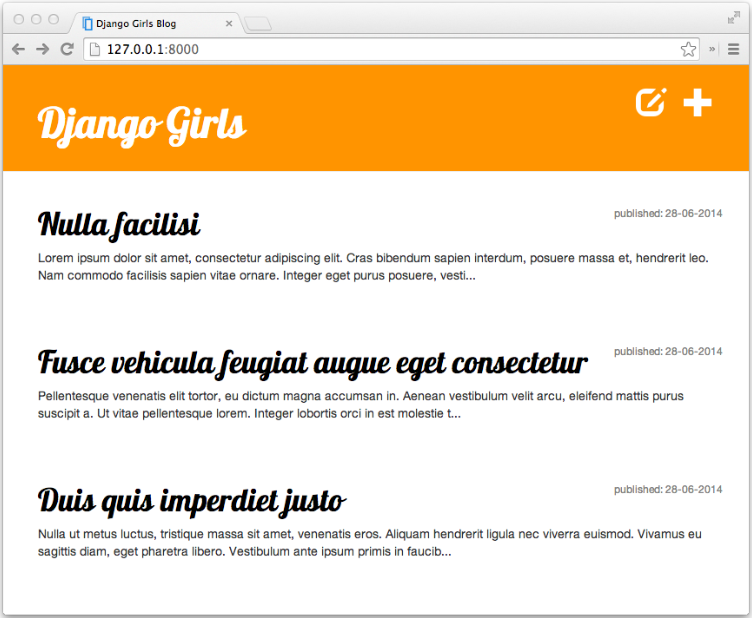

>### Inštalácia a príprava

1. Pre túto aplikáciu vytvoríme pomocou prieskumníka nový adresár **djangogirls** z vášho domovského adresára.
2. Vytvoríme virtuálne prostredie s názvom **myvenv** pomocou príkazu **$ python -m venv myvenv** v termináli Git Bash VS-Code
3. Aktivujeme virtualne prostredie príkazom **$ . myvenv/scripts/activate**

4. Nainštalujeme Django

    a. najprv aktualizujeme inštalačný program pythonu pip príkazom 

    ~~~
    $ python -m pip install --upgrade pip
    ~~~

    b. potom nainštalizujeme programové knižice a balíky\
        
    1. Spustite inštaláciu Django knižníc zo súboru requirements.txt príkazom

    ~~~    
    $ pip install -r requirements.txt
    ~~~

    2. Preinštalujeme verziu Django pomocou príkazu 
    ~~~
    $ pip install Django==3.2.10
    ~~~    

náš adresárový strom teraz bude vyzerať takto:
        
        DJANGOGIRLS
        │
        ├── myvenv
        │   └── ...
        └───requirements.txt

5. Vytvoríme adresár našeho projektu blog príkazom

Aby sme mali vo všetkom poriadok, vytvoríme v našom adresári **djangogirls** projekt s názvom **blog**. Na vytvorenie tohoto projektu musíme v konzole Git Bash spustiť nasledujúci príkaz :
~~~
$ django-admin.exe startproject blog .
~~~
Tým sa vytvoril nový adresár **blog** ktorý obsahuje množstvo súborov. Adresáre a súbory v našom projekte by mali potom vyzerať takto:
~~~
DJANGOGIRLS
│
├── blog
│   ├── admin.py
│   ├── apps.py
│   ├── __init__.py
│   ├── migrations
│   │   └── __init__.py
│   ├── models.py
│   ├── tests.py
│   └── views.py
│
├── myvenv
│   └── ...
├── manage.py
└── requirements.txt
~~~
Keď  vytvoríme adresár nového projektu musíme to tiež povedať Djangovi aby ho mohol použiť. Urobíme to v súbore blog/settings.py. Musíme v ňom nájsť čast INSTALLED_APPSa pridať riadok obsahujúci 'blog',tesne nad ]. Takže konečný produkt by mal vyzerať takto:
~~~
INSTALLED_APPS = [
    'django.contrib.admin',
    'django.contrib.auth',
    'django.contrib.contenttypes',
    'django.contrib.sessions',
    'django.contrib.messages',
    'django.contrib.staticfiles',
    'blog',
]
~~~

6. Vytvoríme adresár našej aplikácie mysite príkazom 

~~~
$ python manage.py startapp mysite
~~~
 a dostaneme novú adresárovú štruktúru:

~~~
DJANGOGIRLS
│
├── blog
│   ├── admin.py
│   ├── apps.py
│   ├── __init__.py
│   ├── migrations
│   │   └── __init__.py
│   ├── models.py
│   ├── tests.py
│   └── views.py
│
├── mysite
│   ├── asgi.py
│   ├── __init__.py
│   ├── settings.py
│   ├── urls.py
│   └── wsgi.py
├── myvenv
│   └── ...
├── manage.py
└── requirements.txt
~~~

7. Vykonáme zmeny v nastavení v súbore settings.py
   1. nájdeme riadok, ktorý obsahuje TIME_ZONE, a upravíme ho tak, aby sme si vybrali svoje vlastné časové pásmo napr. TIME_ZONE = 'Europe/Berlin'

   2. ak chcete iný jazyk, zmeňte kód jazyka zmenou nasledujúceho riadku LANGUAGE_CODE = 'sk-sk'
   
   3. budeme tiež musieť pridať cestu pre statické súbory pod STATIC_URL vložíme STATIC_ROOT
   ~~~
    STATIC_URL = '/static/'
    STATIC_ROOT = BASE_DIR / 'static'
    ~~~

8. keď DEBUGje True a ALLOWED_HOSTS je prázdne, hostiteľ je overený voči ['localhost', '127.0.0.1', '[::1]']. Po nasadení našej aplikácie na PythonAnywhere sa to ale nebude zhodovať s naším názvom hostiteľa, takže zmeníme nasledujúce nastavenie na :
~~~
ALLOWED_HOSTS = ['127.0.0.1', '.pythonanywhere.com']
~~~
9. Nastavenie databázy. Keďže použijeme predvolenú databázu SQLlite3 nemusíme pri tejto položke nič meniť a dopĺňať.

10. Ak chcete vytvoriť databázu pre náš blog, spustite v konzole nasledovné: 
~~~
$ python manage.py migrate
~~~
 (pritom musíme byť v adresári djangogirls, ktorý obsahuje súbor manage.py). Ak to pôjde dobre, mali by ste vidieť niečo takéto:
~~~
(myvenv) ~/djangogirls$ python manage.py migrate
Operations to perform:
  Apply all migrations: admin, auth, contenttypes, sessions
Running migrations:
  Applying contenttypes.0001_initial... OK
  Applying auth.0001_initial... OK
  Applying admin.0001_initial... OK
  Applying admin.0002_logentry_remove_auto_add... OK
  Applying admin.0003_logentry_add_action_flag_choices... OK
  Applying contenttypes.0002_remove_content_type_name... OK
  Applying auth.0002_alter_permission_name_max_length... OK
  Applying auth.0003_alter_user_email_max_length... OK
  Applying auth.0004_alter_user_username_opts... OK
  Applying auth.0005_alter_user_last_login_null... OK
  Applying auth.0006_require_contenttypes_0002... OK
  Applying auth.0007_alter_validators_add_error_messages... OK
  Applying auth.0008_alter_user_username_max_length... OK
  Applying auth.0009_alter_user_last_name_max_length... OK
  Applying auth.0010_alter_group_name_max_length... OK
  Applying auth.0011_update_proxy_permissions... OK
  Applying auth.0012_alter_user_first_name_max_length... OK
  Applying sessions.0001_initial... OK
~~~
Do štruktúry pribudne databáza db.sqlite3 ktorej obsah si môžeme prezrieť SQLite Viewer-om ktorý sme si nainštalovali pomocou Extensions (Ctrl+Shift+X). Adresárová štruktúra potom nadobudne konečný východzí tvar.
~~~
DJANGOGIRLS
│
├── blog
│   ├── admin.py
│   ├── apps.py
│   ├── __init__.py
│   ├── migrations
│   │   └── __init__.py
│   ├── models.py
│   ├── tests.py
│   └── views.py
│
├── mysite
│   ├── asgi.py
│   ├── __init__.py
│   ├── settings.py
│   ├── urls.py
│   └── wsgi.py
├── myvenv
│   └── ...
├── db.sqlite3
├── manage.py
│
└── requirements.txt
~~~

Máme hotovo! Je čas spustiť webový server a zistiť, či náš web funguje!

11. Spustenie webového servera. Musíte byť v adresári, ktorý obsahuje súbor manage.py(adresár djangogirls) a napíšeme **$ python manage.py runserver cislo_portu**

>### Modely Django

To, čo chceme teraz vytvoriť, je niečo, čo bude uchovávať všetky príspevky v našom blogu. Aby sme to však dokázali, musíme sa zoznámiť s vecami ktoré súvisia s pojmom **objects**.

### Objekty

V programovaní existuje koncept s názvom object-oriented programming. Myšlienka je taká, že namiesto toho, aby sme všetko písali ako nudnú sekvenciu programovacích inštrukcií, môžeme veci modelovať a definovať, ako sa navzájom ovplyvňujú.

Čo je teda **objekt**? Je to **súbor vlastností a akcií**. Znie to zvláštne, ale uvedieme príklad.

Ak chceme modelovať mačku, vytvoríme objekt ***Cat***, ktorý má nejaké vlastnosti ako color, age, mood (nálada: dobrá, zlá alebo ospalá) a ***owner*** (ktorý by mohol byť priradený objektu ***Person*** – resp. v prípade zatúlania mačky, by táto vlastnosť bola prázdna).

Potom nad objektom Cat možno registrovať niekoľko aktivít - akcií: purr (pradie), scratch (škrábe), alebo feed (žerie) (v takom prípade dáme mačke nejaké CatFood (mačacie žrádlo), čo môže byť samostatný objekt s vlastnosťami, napríklad taste (chuť)).
~~~
Cat
--------
color
age
mood
owner
purr()
scratch()
feed(cat_food)
~~~
~~~
CatFood
--------
taste
~~~

Takže v podstate ide o opísanie skutočných vecí v pragramovom kóde s vlastnosťami (nazývanými **object properties**) a akciami (nazývanými **methods**).

Ako potom budeme modelovať blogové príspevky? Chceme si totiž vytvoriť vytvoriť aplikáciu na písanie a komentovanie blogu.

Preto si musíme odpovedať na otázku: Čo je to blogový príspevok? Aké vlastnosti by mal mať?

Náš blogový príspevok určite bude obsahovať nejaký text s obsahom a názvom. Bolo by tiež dobré vedieť, kto to napísal – takže potrebujeme autora. Nakoniec chceme vedieť aj to, kedy bol príspevok vytvorený a publikovaný t.j. vložený na web. Jeho vlastnosti potom možno zhrnúť takto:
~~~
Post
--------
title
text
author
created_date
published_date
~~~

Ešte však potrebujeme vedieť aké veci resp. činnosti (metódy) by sa mali robiť s blogovým príspevkom. Bolo by dobré mať niekoho method (funkcii), ako napr. kto uverejní príspevok a pod.
Za týmto účelom budeme teda potrebovať metódu ktorú nazveme **publish**. Keďže už vieme, čo chceme dosiahnuť, začnime to modelovať v Django!

### Model Django

Keď vieme, čo je objekt, môžeme vytvoriť  model Djanga pre náš blogový príspevok.

[**Model**](https://docs.djangoproject.com/en/5.0/topics/db/models/) v Django **je špeciálny druh objektu** – ktorý je uložený v database vo forme samostatnej tabuľky. Aj tento model si môžeme predstaviť ako tabuľku so stĺpcami (poliami) a riadkami (údajmi). Pre model v OOP ktorý je jediný zdroj informácií o našich údajoch je charakteristické to že **obsahuje nielen základné polia o vlastnostiach objektov** ale aj **údaje o ich správaní**. Každý model je trieda Pythonu, ktorá má svoje podtriedy **django.db.models.Model**.

Ako vieme Databáza je súbor údajov a teda miesto, kde budeme ukladať informácie o používateľoch, príspevky na blogu a pod. V tejto aplikácii na ukladanie údajov budeme používať databázu SQLite ktorá je predvoleným databázový adaptérom aj pre Django.

>### Vytvorenie modelu blogového príspevku

To čo sme si vyššie spomenuli, teraz budeme aplikovať v praxi a tým si doplníme predstavu o modeloch Djanga.
Začneme tým že v súbore **mysite/blog/models.py** definujeme všetky používané objekty **Models**. Toto je miesto, v ktorom budeme definovať náš model blogového príspevku.

Otvoríme vo VS-Code súbor mysite/blog/models.py, všetko z neho odstránime a napíšeme tam tento kód:
~~~
from django.conf import settings
from django.db import models
from django.utils import timezone

class Post(models.Model):
    author = models.ForeignKey(settings.AUTH_USER_MODEL, on_delete=models.CASCADE)
    title = models.CharField(max_length=200)
    text = models.TextField()
    created_date = models.DateTimeField(default=timezone.now)
    published_date = models.DateTimeField(blank=True, null=True)

    def publish(self):
        self.published_date = timezone.now()
        self.save()

    def __str__(self):
        return self.title
~~~

Poznámka: Skontrolujte, či na každej strane str používame dva znaky podčiarknutia (__) . Táto konvencia sa v Pythone často používa a niekedy ju nazývame aj „dunder“ (skratka pre „**d**ouble-**under**score“).

### V ďalšom vysvetlíme čo tieto riadky znamenajú

Všetky riadky začínajúce na **from** alebo **import** sú riadkami, ktoré pridávajú nejaké kódy z iných súborov. Takže namiesto kopírovania a vkladania kódov ktoré sa opakujú do iných súborov môžeme niektoré časti zahrnúť do príkazového riadku **from ... import ...**
~~~
class Post(models.Model):– tento riadok definuje náš model (je to object).
~~~
* **class** je špeciálne kľúčové slovo, ktoré označuje, že definujeme objekt.
* **Post** je názov nášho modelu. Môžeme mu dať iný názov (musíme sa však vyhnúť špeciálnym znakom a medzerám). Názov triedy vždy začínajte veľkým písmenom.
* **models.Model** znamená, že príspevok je model Django, takže Django vie, že by sa mal uložiť do databázy.

Teraz definujeme vlastnosti, o ktorých sme hovorili: title, text, created_date, published_date a author. Aby sme to dosiahli, musíme definovať typ každého poľa (Je to text? Číslo? Dátum? Vzťah k inému objektu, napríklad k Používateľovi ?)

* **models.CharField** – takto definujete text s obmedzeným počtom znakov.
* **models.TextField** – toto je pre dlhý text bez obmedzenia. Je to vhodné na to aby sme neobmedzovali obsah blogových príspevkov.
* **models.DateTimeField** – toto je dátum a čas.
* **models.ForeignKey** – toto je odkaz na iný model.

Nebudeme tu vysvetľovať každý kúsok kódu, pretože by to zabralo príliš veľa času. Pokiaľ by vás to však z nejakého dôvodu ale zaujímalo môžete sa pozrieť na dokumentáciu Django, ak sa chcete napr. dozvedieť viac o poliach modelu a o tom, ako definovať aj ine veci ako sme spomínali vyššie ( https://docs.djangoproject.com/en/3.2/ref/models/fields/#field ).

Čo sa týka metódy na publikovanie môžeme použiť **def publish(self)**. Je to presne tá metóda **publish** o ktorej sme hovorili predtým. def znamená, že ide o funkciu/metódu a **publish** je názov metódy.

**Pravidlom** pre pomenovanie funkcie(metody) je, že namiesto medzier používame malé písmená a podčiarkovníky. Napríklad metóda, ktorá vypočíta priemernú cenu, sa môže nazývať calculate_average_price.

Metódy často niečo vrátia (**return**). V našej metóde je to aj prípad __str__. V tomto scenári totiž keď zavoláme __str__() chceme dostať text ( reťazec ) s názvom príspevku.

Všimnite si tiež, že obidve funkcie **def publish(self)** a **def __str__(self)** sú odsadené v našej triede. Je to preto, lebo **Python je citlivý na medzery** a tak musíme v triede naše metódy odsadiť. V opačnom prípade metódy nebudú patriť do triedy a môžeme získať neočakávané správanie.

### Vytvoríme tabuľky pre modely v databáze

Posledným krokom je pridanie nášho nového modelu do našej databázy.  Najprv však musíme dať Djangovi vedieť, že máme nejaké zmeny v našom modeli models.py, ktorý sme práve vytvorili. Prejdime preto do okna konzoly a napíšte **python manage.py makemigrations blog**. Oznam vo forme príkazu bude vyzerať takto:
~~~
(myvenv) ~/djangogirls$ python manage.py makemigrations blog
Migrations for 'blog':
  blog/migrations/0001_initial.py
    - Create model Post
~~~

**Poznámka**: Nezabudnite vždy uložiť súbory, ktoré upravujete. V opačnom prípade váš počítač spustí predchádzajúcu verziu, ktorá vám môže poskytnúť neočakávané chybové hlásenia.

Na základe vyššieho príkazu Django pre nás pripravil migračný súbor 0001_initial.py, ktorý teraz musíme použiť na vlastnú migráciu v našej databáze. Urobíme to príkazom **python manage.py migrate blog** a výstup by mal byť nasledovný:
~~~
(myvenv) ~/djangogirls$ python manage.py migrate blog
Operations to perform:
  Apply all migrations: blog
Running migrations:
  Applying blog.0001_initial... OK
~~~

Náš Post model je teraz v našej databáze db.sqlite3 ako tabuľka  blog_post a možeme si jej štruktúru pozrieť cez SQLite Viewer. Ešte by bolo dobré vidieť aj to ako vyzerá náš príspevok, ale to uvidíme aź nižśie.

### admin Django

Ak chcete pridať, upraviť a odstrániť príspevky, ktoré sme práve vymodelovali, použijeme na to správcu - administrátora Djanga.

Otvorme preto súbor blog/admin.py a nahraďme jeho obsah týmto kedy použijeme avizovanú konštrukciu from ... import ...:
~~~
from django.contrib import admin
from .models import Post

admin.site.register(Post)
~~~

Ako vidíme, importujeme (zahrnieme) do admina model Post  definovaný v súbore models.py v predchádzajúcej kapitole. Aby bol náš model viditeľný na stránke správcu admin, musíme ho tu zaregistrovať a to sa vykoná príkazom **admin.site.register(Post)**.

Týmto si už môžeme náš model Post aj pozrieť. Urobíme to tak že na konzole spustíme webový server príkazom **$ python manage.py runserverv cislo_portu**. Prejdeme do webového prehliadača a zadáme adresu http://127.0.0.1:cislo_portu/admin/ . Zobrazí sa nám prihlasovacia stránka administrátora, ktorá vyzerá takto:

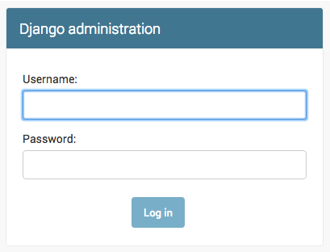

Pre prihlásenie je potrebné vytvoriť superužívateľa, ktorý má kontrolu nad všetkým na stránke. Preto prerušme chod web servera CTRL-C a vrátime sa na príkazový riadok terminálu kde nápíšeme, **python manage.py createsuperuser**. Následne zadáme požadované údaje a zapamätáme si ich pre neskorśie použitie.

**POZOR**: Pamätajme, že ak chceme písať nové príkazy pre Git Bash, kým je webový server spustený je potrebné jeho činnosť ukončiť a až potom môžeme príkazy zadávať.
~~~
(myvenv) C:\Users\Name\djangogirls>$ python manage.py createsuperuser
~~~
Po zobrazení výzvy zadajte svoje používateľské meno (malé písmená, bez medzier), e-mailovú adresu a heslo. Nebojte sa, že nevidíte heslo, ktoré zadávate – tak to má byť. Zadajte ho a stlačením tlačidla enter pokračujte. Výstup by mal vyzerať takto (kde používateľské meno a e-mail by mali byť vaše vlastné):
~~~
Username: admin
Email address: info@comto.sk
Password: admin
Password (again): admin
Superuser created successfully.
~~~

Potom sa vráťte do prehliadača. Prihláste sa pomocou poverení superužívateľa, ktoré ste si vybrali. Mali by ste vidieť Django admin dashboard.

Prejdime na Post (príspevky) a trochu s nimi poexperimentujme. Pridajtme päť alebo šesť blogových príspevkov. Nerobte si pri tom starosti s ich obsahom – je viditeľný iba pre vás na lokálnom počítači. Aby ste ušetrili čas môžete aj skopírovať a prilepiť nejaký text z tohto návodu.

Uistite sa, že aspoň dva alebo tri príspevky (ale nie všetky) majú nastavený dátum zverejnenia - publikovania. Neskôr to budeme potrebovať.

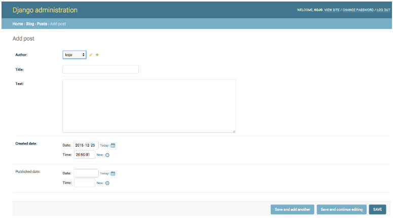

Ak sa chcete dozvedieť viac o Django adminovi, mali by ste si pozrieť dokumentáciu Django: https://docs.djangoproject.com/en/3.2/ref/contrib/admin/

### Nasadenie do produkcie

Nasadenie do produkcie je dôležitou súčasťou procesu vývoja webových stránok. Táto kapitola je umiestnená v strede návodu a vyžaduje určitú námahu naviac ktorú si môžeme aj odpustiť a teda túto kapitolu preskočiť viď. https://tutorial.djangogirls.org/en/deploy/ 

>### I. Django URL

Pokračujeme vo vývoji našej webovej aplikácie blogu. Najprv sa však musíme niečo dozvedieť o adresách URL Django.

#### Čo je to adresa URL?

URL je webová adresa. Adresu URL môžete vidieť pri každej návšteve webovej stránky – je viditeľná v paneli s adresou vášho prehliadača. (Áno! 127.0.0.1:8000je URL. A https://djangogirls.orgje tiež URL.)

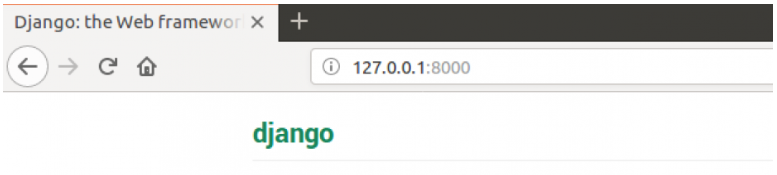

Každá stránka na internete potrebuje svoju vlastnú URL. Vaša aplikácia tak vie, čo má kedy ukázať používateľovi, ktorý otvorí danú adresu URL. V Django používame niečo, čo sa nazýva **URLconf**(konfigurácia URL). URLconf je sada vzorov, ktoré sa Django pokúsi priradiť k požadovanej adrese URL, aby našiel správne zobrazenie.

### Ako fungujú adresy URL v Django?

Otvorme súbor mysite/urls.py v VS-Code a uvidíme ako vyzerá jeho obsah:

~~~
"""mysite URL Configuration

[...]
"""
from django.contrib import admin
from django.urls import path

urlpatterns = [
    path('admin/', admin.site.urls),
]
~~~

Ako vidíme, Django nám sem už niečo dal. Riadky medzi trojitými úvodzovkami ( ''' riadky textu """) sa nazývajú docstring – môžete ich napísať na začiatok súboru, triedy alebo metódy, aby ste opísali, čo robí. Python ich nebude spracov=ava+t .

Administrátorská adresa URL, ktorú ste navštívili v predchádzajúcej kapitole, je už tu:
~~~
path('admin/', admin.site.urls),
~~~
Tento riadok znamená, že pre každú adresu URL, ktorá začína reťazcom admin/, Django nájde zodpovedajúce zobrazenie . V tomto prípade zahrnieme veľa adries URL pre správcov, takže to všetko nie je zabalené do tohto malého súboru – je to čitateľnejšie a čistejšie.

#### Vaša prvá adresa URL Django

Je čas vytvoriť si našu prvú adresu URL a chceme, aby ' http://127.0.0.1:8000/ ' bol domovskou stránkou nášho blogu na ktorej by sa zobrazoval zoznam príspevkov s názvom a obsahom.

Chceme tiež zachovať koncepciu a dôvod existencie súboru **mysite/urls.py** ako aj jehoo čistotu a čitatelnosť súboru. To znamená že do hlavného súboru **mysite/urls.py** budeme importovať aj URL adresy z našej aplikácie blog.

Pokračujeme tak, že pridáme riadok, ktorý bude importovať **blog.urls**. Budeme tiež musieť zmeniť **from django.urls.import …**, pretože tu používame  **include**. Takže tento import budete musieť pridať do tohoto alebo nového riadku.

Náš súbor mysite/urls.py by mal teraz vyzerať takto:
~~~
from django.contrib import admin
from django.urls import path, include

urlpatterns = [
    path('admin/', admin.site.urls),
    path('', include('blog.urls')),
]
~~~
Django teraz presmeruje všetko, čo príde do 'http://127.0.0.1:8000/' na **blog.urls**, a hľadá tam ďalšie informácie kam ísť.

#### blog.urls

V adresári **blog** si ale ešte vytvoríme naviac nový prázdny súbor s názvom **urls.py** a otvoríme si ho vo VS-Code. Do tohoto súboru následne pridáme tieto prvé dva riadky:
~~~
from django.urls import path
from . import views
~~~
Tento súbor ból vytvorený špeciálne iba pre účely adresovania v rámci vlastnej aplikácie **blog**. Tu importujeme funkciu **path** Djanga a vytvárame všetky naše odkazy na views aplikácie **blog**. (Zatiaľ žiadne views pre blog ešte nemáme, ale o chvíľu sa k tomu tiež dostaneme.)

Potom môžeme pridať do blog/urls.py náš prvý vzor resp. odkaz URL adresy pre views ktoré zobrazí zoznam príspevkov:
~~~
urlpatterns = [
    path('', views.post_list, name='post_list'),
]
~~~

Ako vidíme, ku koreňovej adrese URL ('' - neni udaný vzor) teraz priraďujeme adresy ktoré sú volané z **view. post_list**. Prvý paremeter funkcie path je tzv. vzor URL adresy podľa ktorého sa hľadá URL adresa ktorá má byť priradená viď. admin/ v prípade administrátorskej stránky. Ak by sme napr. do prehliadač nezadali presne vzor admin, tak príslušná stránka sa nenájde nakoľko nebude existovať priradenie na zobrazenie (views) a následnú Šablónu kotrá vytvorí obsah stránky. 

Ak bude daný vzor prázdnym reťazcom, tak pomocná funkcia Djanga resolve(), ktorá je zodpovedná za zisťovanie URL ciest k príslušným funkciam zobrazenia (views) bude ignorovať názov domény (t.j. http://127.0.0.1:8000/ ), ktorý je predponou každej celej URL cesty.

Tento vzor povie Djangovi, že **views.post_list** je to správne miesto, kam má ísť, ak niekto vstúpi na našu webovú stránku ktorá sa nachádza na adrese ' http://127.0.0.1:8000/ '.

Posledná časť, **name='post_list'**, je názov adresy URL, ktorá sa použije na identifikáciu zobrazenia. Môže byť rovnaký ako názov zobrazenia, ale môže byť pomenovaná aj úplne ináč. Pomenovať každú URL adresu ktorú budeme používať v aplikácii je **veľmi dôležité**. Mali by sme sa tiež snažiť, aby tieto názvy URL adries boli jedinečné a ľahko zapamätateľné.

Ak sa teraz pokúsite navštíviť hlavnú, doménovú stránku ( http://127.0.0.1:8000/ ), dostaneme chybovú správu „webová stránka nie je k dispozícii“. Je to preto, že webový server už nie je spustený. Keď sa pozrieme sa do okna konzoly tak z výpisu od web servera zistíme prečo. Uvidíte tam niečo takéto:
~~~
   return _bootstrap._gcd_import(name[level:], package, level)
  File "<frozen importlib._bootstrap>", line 1030, in _gcd_import
  File "<frozen importlib._bootstrap>", line 1007, in _find_and_load
  File "<frozen importlib._bootstrap>", line 986, in _find_and_load_unlocked
  File "<frozen importlib._bootstrap>", line 680, in _load_unlocked
  File "<frozen importlib._bootstrap_external>", line 850, in exec_module
  File "<frozen importlib._bootstrap>", line 228, in _call_with_frames_removed
  File "/Users/ola/djangogirls/blog/urls.py", line 5, in <module>
    path('', views.post_list, name='post_list'),
AttributeError: module 'blog.views' has no attribute 'post_list'
~~~

Naša konzola zobrazuje chybu, ale v skutočnosti je tento oznam pre nás veľmi užitočný. Hovorí nám totiž, že neexistuje **atribút 'post_list'** . Tak sa totiž volá view (pohľad), ktorý sa Django snaží nájsť na základe nasmerovania v urls.py aby ho použil. No tento view sme ešte nevytvorili, takže ho ani najisť nemôže. V tejto fáze nebude fungovať ale ani **/admin/** pri ktorom view definovaný máme. Žiadny strach – dostaneme sa tam. A ak sa zobrazí iná chybová správa, skúste reštartovať webový server. Ak to ale urobíte v okne konzoly, na ktorom je spustený webový server, tak ho treba najprv zastaviť stlačením klávesov Ctrl+C (spolu kláves Control a C). V systéme Windows možno budete musieť stlačiť kombináciu klávesov Ctrl+Break. Potom webový server znovu odštartujeme spustením príkazu **python manage.py runserver**.

>### II. Django VIEWS

V tejto fáze vývoja programu začína priestor na kreatívnu tvorbu. Najprv sa zbavíme chyby, ktorú sme vytvorili v predchádzajúcej časti, tým že vytvoríme view v súbore blog/views.py.

Views je miesto, kam vložíme kód pre „logiku“ našej aplikácie. Požiadame tu o informácie zo súboru **model** ktorý sme si  predtým vytvorili a odošleme ich do **template**. Neskôr v ďalšej časti potom teda k tomu do tretice vytvoríme prislušný template (šablónu). Views (zobrazenia) sú obdobné funkcie Pythonu, ktoré sú o niečo komplikovanejšie ako tie, ktoré sme spoznávali v rámci základov Pythonu .

Views sú umiestnené v súbore views.py. A do tohoto súboru blog/templates/blog/views.py pridáme naše view.

#### blog/views.py

Keď otvoríme tento súbor v našom editore kódu tak uvidíme niečo takéto:
~~~
from django.shortcuts import render

# Create your views here.
~~~

Zatiaľ tu nie je príliš veľa vecí a riadky začínajúce s # sú komentáre – to znamená, že tieto riadky nebude Python spracovávať tak ako !!! text !!!.

Poďme teda vytvoriť view a pridajme nasledujúci minimálny pohľad:
~~~
def post_list(request):
    return render(request, 'blog/post_list.html', {})
~~~
Ako vidieť vytvorili sme funkciu ( def) **post_list**, ktorá preberá **request** a bude  vracať (**return**) hodnotu, ktorú získa z volania inej funkcie **render**, ktorá spracuje našu šablónu **blog/post_list.html**.

Uložte súbor, prejdite na http://127.0.0.1:8000/ a pozrite sa, čo sa stane. Ďalšia chyba! Tak si prečítajme, čo sa teraz deje:

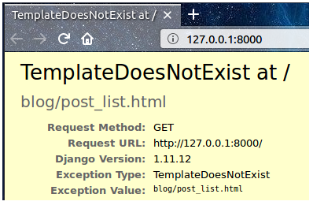

Text hovorí, že server beží, ale stále existujú nejaké problémy. Nebojte sa, je to len chybová stránka, niet sa čoho báť. Rovnako ako chybové hlásenia v konzole aj tieto hlásenia sú skutočne veľmi užitočné. Môžete si prečítať, že **TemplateDoesNotExist** . Poďme opraviť túto chybu a vytvoriť chýbajúcu šablónu (template).

<h3 id="section2"></h3>

### Miesto pre vytvorenie súboru HTML
</a>
Ak by sme sa spýtali čo je to šablóna, odpoveď by bola.

**Šablóna resp. template** je súbor, ktorý môžeme opätovne použiť na prezentovanie rôznych informácií v konzistentnom formáte – môžete napríklad použiť šablónu, ktorá vám pomôže napísať list, pretože hoci každý list môže obsahovať inú správu a byť adresovaný inej osobe, oba budú zdieľať rovnaký formát.

Formát šablóny Django je opísaný v jazyku zvanom HTML (HyperText Markup Language ) ktorý je skriptovací jazyk používaný webovými prehliadačmi na vykresľovanie stránok v celosvetovej sieti www (world wide web).

>## Čo je HTML?
HTML je kód, ktorý interpretuje váš webový prehliadač – napríklad Chrome, Firefox alebo Safari – na zobrazenie webovej stránky pre používateľa.

HTML je skratka pre „HyperText Markup Language“. HyperText znamená, že ide o typ textu, ktorý podporuje hypertextové prepojenia medzi stránkami. Označenie znamená, že sme vzali dokument a označili ho kódom, ktorý niečomu (v tomto prípade prehliadaču) povie, ako má stránku interpretovať. HTML kód je vytvorený pomocou značiek , z ktorých každá začína < a končí na >. Tieto značky predstavujú prvky označovania .

>### Django TEMPLATES

### Vaša prvá šablóna

Vytvorenie šablóny znamená vytvorenie súboru šablóny.

Naše šablóny sú uložené v adresári **blog/templates/blog**. Takže najprv vytvoríme adresár s názvom **templates** v adresári vášho blogu. Potom vytvorte ďalší adresár s názvom **blog** v tomto adresári šablón:
~~~
blog
└───templates
    └───blog
~~~

Možno by ste sa mohli čudovať, prečo potrebujeme dva adresáre s názvom **blog**. Ako neskôr zistíme, je to užitočná konvencia pomenovania, ktorá nám zvýši prehladnsť keď sa veci začnú komplikovať.

A teraz vytvorte v adresári **blog/templates/blog** avizovaný súbor šablóny **post_list.html** (zatiaľ ho však necháme prázdny)  .

Pozrite sa, ako náš web vyzerá teraz: http://127.0.0.1:8000/

Ak chyba **TemplateDoesNotExist** pretrváva, skúste reštartovať server. Prejdite na príkazový riadok, zastavte server stlačením Ctrl+C (klávesy Control a C spolu) a spustite ho znova spustením príkazu **python manage.py runserver**.

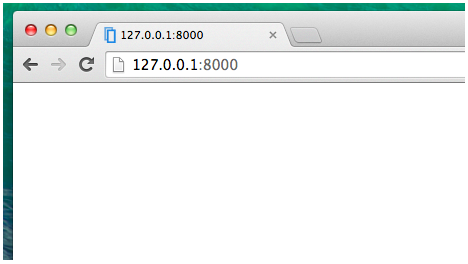

Ak chyba pominula, tak náš web nezverejňuje nič okrem prázdnej stránky, pretože aj naša šablóna je prázdna. To musíme ale napraviť. Otvorte preto post_list.html a pridajme nasledujúci kód:
~~~
<!DOCTYPE html>
<html>
<body>
    
Hi there!

    
It works!

</body>
</html>
~~~

Teraz náš web vyzerá takto. Navštívte ho a zistite použitím príkazu http://127.0.0.1:8000/

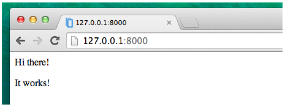

* Riadok &lt;!DOCTYPE html&gt; nie je značka HTML. Deklaruje iba typ dokumentu. Tu informuje prehliadač, že typ dokumentu je HTML5 . Toto je vždy začiatok akéhokoľvek súboru HTML5.
* Základná značka, &lt;html&gt;, vždy označuje začiatok html obsahu a &lt;/html&gt; je vždy značka jeho konca. Ako vidíte, celý obsah webovej stránky sa nachádza medzi počiatočnou značkou &lt;html&gt; a záverečnou značkou &lt;/html
* &lt;p&gt; je značka pre prvky odseku; &lt;/p&gt; potom každý odsek uzatvorí.

Každá stránka HTML je tiež rozdelená na dve časti: hlavu a telo .

* **hlava** je časť, ktorá obsahuje informácie o dokumente, ktoré sa nezobrazujú na obrazovke.

* **telo** je časť, ktorá obsahuje všetko ostatné, čo sa zobrazuje ako súčasť webovej stránky.

Na vyznačenie hlavy používame na to tag &lt;head&gt;. Pomocou neho prehliadaču oznámime konfiguráciu stránky a na vynačenie tela používame tag &lt;body&gt;. Pomocou neho prehliadaču povieme čo sa na stránke vlastne nachádza.

Takto môžete napríklad do post_list.html a jeho bloku &lt;head&gt; vložiť prvok s názvuom webovej stránky:
~~~
<!DOCTYPE html>
<html>
    <head>
        <title>Ola's blog</title>
    </head>
    <body>
        
Hi there!

        
It works!

    </body>
</html>
~~~
Uložte súbor a obnovte stránku čím dostaneme:

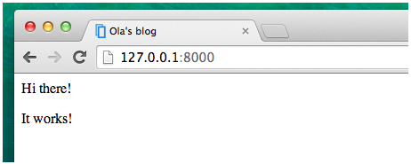

Na základe toho prehliadač pochopil, že názov našej stránky je „Olin blog“. Interpretoval totiž riadok **&lt;title&gt;Ola's blog&lt;/titl&gt;** tak že má umiestniť daný text do záhlavia záložky ktorý zobrazí prehliadač.

Ku každému tagu (značke) v súbore post_list.html ktorý sa nachádza na začiatku musí existovať uzatvárací tag (značka) ktorá začina lomitkom (/). V tejto súvislosti **platí zásada že prvky sú vnorené** (t.j. nemôžete uzavrieť konkrétny tag, kým nie sú uzatvorené všetky tagy ktoré mali začiatky pred ním.

>Je to ako dávať veci do krabíc. Máme napr. jednu veľkú krabicu ktorú predstavuje, &lt;html&gt;&lt;/html&gt; vnútri nej je menšia krabica &lt;body&gt;&lt;/body&gt;, a v nej sa zase nachádzajú ďalšie ešte menšie krabice napr.: &lt;p&gt;&lt;/p&gt;.

Tieto pravidlá je potrebné dôsledne dodržiavať pri uzatváraní tagov a vkladanní prvkov, lebo ak tak neurobíme, prehliadač ich nemusí vedieť správne interpretovať a vaša stránka sa bude zobrazovať nesprávne.

#### Prispôsobenie šablóny

Teraz nastal čas aby sme upravili resp. doplnili a prispôsobili našu šablónu. Tu je niekoľko užitočných značiek:
~~~
* <h1>A heading</h1> pre váš najdôležitejší nadpis
* <h2>A sub-heading</h2>pre nadpis na ďalšej úrovni
* <h3>A sub-sub-heading</h3>…a tak ďalej, až<h6>
* 
A paragraph of text

* <em>text</em>zdôrazní váš text
* <strong>text</strong>silne zdôrazní váš text
*  prejde na iný riadok (do br nemôžete vložiť nič a nie je tam žiadna uzatváracia značka)
* <a href="https://djangogirls.org">link</a> vytvorí odkaz
* <ul><li>first item</li><li>second item</li></* ul>vytvorí zoznam, ako je tento!
* <nav></nav>definuje množinu navigačných odkazov
* <article></article>špecifikuje nezávislý, samostatný obsah
* <section></section>definuje sekciu v dokumente
* <html></html> predstavuje koreň dokumentu HTML aje kontajnerom pre všetky ostatné prvky HTML (okrem značky <!DOCTYPE> ).
* <head></head> je kontajner pre metadáta (údaje o údajoch) a je umiestnený medzi tagom <html> a tagom <body>. Metadáta sú údaje o dokumente HTML a metadáta sa nezobrazujú.
* <header></header>určuje hlavičku dokumentu alebo sekcie
* <body></body> určuje telo dokumentu obsahuje všetok obsah dokumentu HTML, ako sú nadpisy, odseky, obrázky, hypertextové odkazy, tabuľky, zoznamy atď.
* 

definuje časť stránky
* <main></main>určuje hlavný obsah dokumentu
* <aside></aside>definuje nejaký obsah okrem obsahu, do ktorého je umiestnený (napríklad bočný panel)
* <footer></footer>definuje pätu dokumentu alebo sekcie
* <time></time>definuje konkrétny čas (alebo dátum a čas)
~~~

Tu je príklad použitia niektorých príkazov v našej šablóne. Skopírujeme ho a vložíme do **blog/templates/blog/post_list.html**:

~~~
<!DOCTYPE html>
<html>
    <head>
        <title>Django Girls blog</title>
    </head>
    <body>
        <header>
            <h1><a href="/">Django Girls Blog</a></h1>
        </header>

        <article>
            <time>published: 14.06.2014, 12:14</time>
            <h2><a href="">My first post</a></h2>
            
Aenean eu leo quam. Pellentesque ornare sem lacinia quam venenatis vestibulum. Donec id elit non mi porta gravida at eget metus. Fusce dapibus, tellus ac cursus commodo, tortor mauris condimentum nibh, ut fermentum massa justo sit amet risus.

        </article>

        <article>
            <time>published: 14.06.2014, 12:14</time>
            <h2><a href="">My second post</a></h2>
            
Aenean eu leo quam. Pellentesque ornare sem lacinia quam venenatis vestibulum. Donec id elit non mi porta gravida at eget metus. Fusce dapibus, tellus ac cursus commodo, tortor mauris condimentum nibh, ut f.

        </article>
    </body>
</html>
~~~

Vytvorili sme jednu sekciu **header** a dve sekcie.**article**

* Časť **header** obsahuje názov nášho blogu – je to nadpis a odkaz
* Tieto dve časti **article** obsahujú naše blogové príspevky s dátumom zverejnenia v prvku **time**, **h2** prvok s názvom príspevku, na ktorý sa dá kliknúť, a **p** prvok (odsek) pre text nášho blogového príspevku.

Čo nám vytvorí tento efekt:

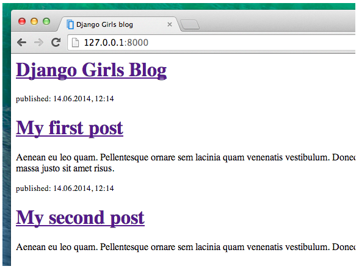

V tomto štádiu je možné znovu nasadiť našu stránku do produkcie vybranému ISP ktorý ponúka prostredie na báze Pythonu a frameworku Django. Taktiež je vhodné výtvoriť zálohu nášho projektu na Git-e resp. GitHub-e.

>## Django - práca s databázou

V tejto časti sa budeme zaoberať problematikou **ako sa Django pripája k databáze a ako do nej ukladá údaje**. Skôr však si povedzme čo je to QuerySets.

<h3 id="section1"></h3>

> ### Django ORM

Čo je to Django ORM a na čo sa používa ?

ORM je skratka pre výraz **O**bject-**R**elational **M**apper ktorý predstavuje jednou z najvýkonnejších funkcií Django, ktorá nám umožňuje interagovať sa s našou databázou rovnakým spôsobom, ako keby sme pracovali s SQL. Ináč povedané Django ORM je v podstate technika založená na pythone ktorá nám umožňuje zostavenie SQL príkazov na dotazovanie a úpravu našej databázy resp. získavanie údajov z nej. ORM je softvér určený na preklad medzi reprezentáciami údajov používanými v databázach a reprezentáciami používanými v objektovo orientovanom programovaní. Je to v podstate akýsi tlmočník a v priloženej tabuľke vidíme ekvivalenciu jednotlivých príkazov.

<h3 id="section3"></h3> 

### QuerySets

Čo je to QuerySet a aký je jeho vzťah s Django ORM ?

Django ORM je vstavaný v QuerySet. QuerySet je jednoducho zoznam objektov z daného modelu Django. Pri použití Django ORM je napr.vytvorenie nového riadku v tabuľke uskutočnené tak že vytvoríme  nový objekt triedy Model v súbore models.py. Django ORM potom mapuje tieto objekty modelu na dotazy do relačnej databázy.

Akýkoľvek SQL dotaz sa dá potom dá jednoducho napísať ako sada dotazov Django. Pomocou Django Shell-u si to môžeme samostatne otestovať napr. na dotazoch Create, Filter, Update, Order, a pod.  Po otestovaní v Django Shell to môžeme následne preniesť do kódu vo views.py .

QuerySets nám umožňujú čítať dáta z databázy, vytvárať ich tam, filtrovať ich, usporiadavať ich a pod. Ako náhle zvládneme Django Queryset, môžeme napísať jeden univerzálny dotaz ktorý vieme použiť pre akýkoľvek pripojený databázový zdroj.

Syntax pre QuerySet je vždy takáto:
~~~
ModelName.objects.method_name(argumenty)
~~~

Ak chcete napríklad získať všetky údaje z modelu *Blog* v rámci najakej aplikácie s názvom  *myapp*, spustíme pomocou pythonu Django Shell a zadáme nasledovné:
~~~
$ shell python manage.py 
>>>  from myapp.models import Blog
 >>> queryset = Blog.objects.all() 
QuerySet [...]
~~~

### SQL query vs. Django ORM QuerySet
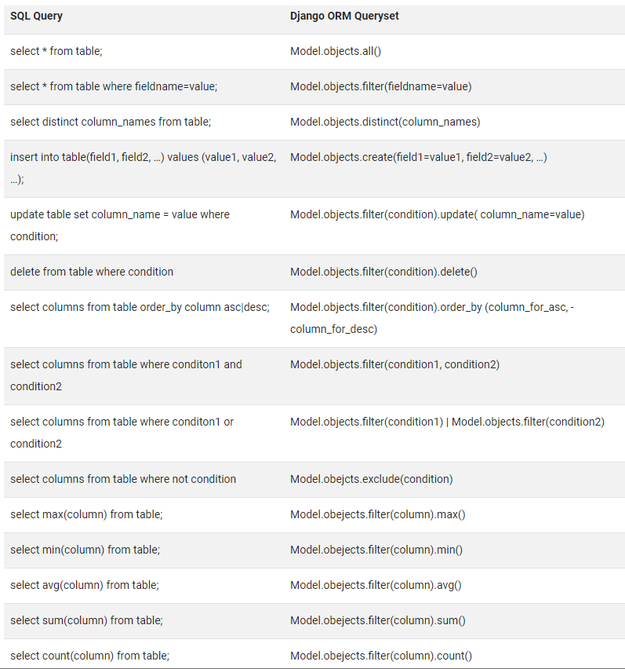

Najjednoduchšie je spoznávať túto problematiku prostredníctvom príkladu ktorý si priblížime prostredníctvom Django Shell-u.

#### Django Shell

Django Shell spustíme tak, že si najprv otvoríme terminálové okno a v ňom spustíme napr. Git Shell ktorý sa nám ohlási dolárom ($). Potom zadáme  tento príkaz:

~~~
(myvenv) ~/djangogirls$ python manage.py shell
~~~

Účinok by mal byť takýto:

~~~
(InteractiveConsole)
>>>
~~~

A tým sme sa dostali do interaktívnej konzoly Django. Je to podobná konzole Pythonu, ale Django Shell na rozdiel od nej naviac disponuje určitými rozšíreniami a špecifikami Django. Na druhej strane to však znamená, že tu môžeme použiť všetky príkazy Pytonu ako v prípade Pythonovského Shellu. V ďalšom použjeme Django Shell na to aby sme si takto individuálne vyskúšali niektoré operácie ktoré neskôr zabudujeme do kódu.

#### Ako vypísať všetky objekty

Skúsme najprv takto zobraziť všetky naše príspevky Post. Môžete to urobiť pomocou nasledujúceho príkazu:
~~~
>>> Post.objects.all()
Traceback (most recent call last):
      File "<console>", line 1, in <module>
NameError: name 'Post' is not defined
~~~
Objavila sa chyba ktorá nám hovorí že neexistuje žiadny príspevok. Je to správne lebo sme to zabudli importovať. Urobíme to príkazom
~~~
>>> from blog.models import Post
~~~
Model importuje **Post** z **blog.models**. Potom skúsime znova zobraziť všetky príspevky:
~~~
>>> Post.objects.all()
<QuerySet [<Post: my post title>, <Post: another post title>]>
~~~

A dostávame zoznam príspevkov, ktoré sme už skôr vytvorili. Tieto príspevky sme vytvorili ale manuálne pomocou administratívneho rozhrania Django. My teraz ale chceme vytvárať nové príspevky pomocou kódu Pythonu.

#### Ako vytvoriť objekt

My si vytvoríte nový objekt Post v databáze príkazom:
~~~
>>> Post.objects.create(author=me, title='Sample title', text='Test')
~~~

Chýba nám tu však jedna ingrediencia **me** t.j. že práve my/ja (me) sme  tvorcami príspevku. Modelu totiž chceme tiež odovzdať inštanciu **User** ktorá identifikuje autora príspevku.

Najprv teda importujme model žívateľa :
~~~
>>> from django.contrib.auth.models import User
~~~

V tejto súvislosti sa pozrime akých všetkých užívateľov v databáze máme:
~~~
>>> User.objects.all()
<QuerySet [<User: admin>]>
~~~

Toto je superužívateľ, ktorého sme predtým vytvorili! Poďme teraz získať inštanciu používateľa (upravte tento riadok tak, aby používal svoje vlastné používateľské meno):
~~~
>>> me = User.objects.get(username='admin')
~~~

Ako môžeme predpokladať, teraz pri použití príkazu **get** by sme dostali odpoveď ktorá sa rovná 'admin'. User sa rovná username a to 'admin'.

Teraz už môžeme konečne vytvoriť náš príspevok:
~~~
>>> Post.objects.create(author=me, title='Sample title', text='Test')
<Post: Sample title>
~~~
Tak to skontrolujme či to zafungovalo.
~~~
>>> Post.objects.all()
<QuerySet [<Post: my post title>, <Post: another post title>, <Post: Sample title>]>
~~~
Ak áno môžeme pokračovať a pridať ďalšie príspevky, aby sme videli, ako to funguje. Pridajme teda ďalšie dve alebo tri pomocou 
~~~
>>> Post.objects.create(author=me, title='Sample title', text='Test')
<Post: Sample title>
~~~
a potom prejdite na ďalšiu časť. 

#### Ako uskutočniť filtrovanie objektov

Veľkým prínosom QuerySets je možnosť filtrovania. Povedzme, že chceme nájsť všetky príspevky, ktoré napísal používateľ ola. Budeme používať **filter** namiesto **all** v **Post.objects.all()**. V zátvorkách uvádzame, aké podmienky musí blogový príspevok spĺňať, aby skončil v našej sade dotazov. V našom prípade je podmienkou to, že **author** by sa mal rovnať **me**. Spôsob, ako to napísať v Django, je **author=me**. Teraz náš kúsok kódu vyzerá takto:
~~~
>>> Post.objects.filter(author=me)
<QuerySet [<Post: Sample title>, <Post: Post number 2>, <Post: My 3rd post!>, <Post: 4th title of post>]>
~~~

Ak chceme vidieť všetky príspevky, ktoré obsahujú slovo „title“ v poli **title**.

~~~
>>> Post.objects.filter(title__contains='title')
<QuerySet [<Post: Sample title>, <Post: 4th title of post>]>
~~~
Poznámka: Medzi **title** a **contains** sú dva znaky podčiarknutia (_). ORM Django používa toto pravidlo na oddelenie názvov polí („title“) a operácií alebo filtrov („contains“). Ak použijete iba jedno podčiarknutie, zobrazí sa chyba ako „FieldError: Cannot resolve keyword title_contains"

Môžeme tiež získať zoznam všetkých uverejnených príspevkov. Robíme to filtrovaním všetkých príspevkov, pre ktoré bolo v minulosti nastavené **published_date**:

~~~
>>> from django.utils import timezone
>>> Post.objects.filter(published_date__lte=timezone.now())
<QuerySet []>
~~~

Príspevok ktorý sme pridali z konzoly Python zatiaľ nie je zverejnený. Ale môžeme to zmeniť tak že najprv získame inštanciu príspevku, ktorý chceme zverejniť. Platí to však iba pre prípad ak máme iba jednu inštanciu modelu (my však máme dve a dokonca rovnaké "Sample title")

~~~
>>> post = Post.objects.get(title="Sample title") je pre jednu inštanciu modelu
>>> posts = Post.objects.filter(title="Sample title") je pre viacero inštancii modelu
~~~
V náväznosti na predchádzajúcu situáciu tu vzniká chyba a operácia sa neuskutoční. Riešenie by vyžadovalo odlíšenie inštancii modelu ako napr. "Sample title 01" a "Sample title 02"
A potom ich publikovať ppostupne našou metódou publish:
~~~
>>> post.publish() možno použiť ak ide iba o jednu inštanciu ktorú priradíme premmenej post
~~~

Teraz teda skúsme znova získať zoznam publikovaných príspevkov (trikrát stlačte kláves so šípkou nahor a stlačte enter):

~~~
>>> Post.objects.filter(published_date__lte=timezone.now())
<QuerySet [<Post: Sample title>]>
~~~

#### Ako urobiť zoradenie objektov

QuerySets vám tiež umožňujú usporiadať zoznam objektov. Skúsme ich zoradiť podľa poľa **created_date**:
~~~
>>> Post.objects.order_by('created_date')
<QuerySet [<Post: Sample title>, <Post: Post number 2>, <Post: My 3rd post!>, <Post: 4th title of post>]>
~~~
Poradie môžeme zmeniť aj tak, že na začiatok pridáme -:
~~~
>>> Post.objects.order_by('-created_date')
<QuerySet [<Post: 4th title of post>,  <Post: My 3rd post!>, <Post: Post number 2>, <Post: Sample title>]>
~~~

#### Komplexné dotazy (queris) prostredníctvom zreťazenia metód (method-chaining)

Ako ste videli, niektoré metódy QuerySet vracajú **Post.objects**. Podobné metódy môžu byť tiež volané na QuerySet a potom vrátia nový QuerySet. Ich účinok teda môžeme spojiť ich reťazením :

~~~
>>> Post.objects.filter(published_date__lte=timezone.now()).order_by('published_date')
<QuerySet [<Post: Post number 2>, <Post: My 3rd post!>, <Post: 4th title of post>, <Post: Sample title>]>
~~~

**Je to veľmi silný nástroj a umožňuje nám písať pomerne zložité dotazy (queries)**. Ak chceme Django Shell zatvoriť, zadáme takýto príkaz:
~~~
>>> exit()
~~~~

>## Dynamické údaje v šablónach

Zatiaľ máme v našej aplikácii tieto tri rôzne časti: 
* model **Post** ktorý je **definovaný v models.py**
* **logiku zobrazenia** obsahu stránky **post_list** ktorá je definovaná vo **views.py** a 
* pridali sme aj jednu **šablónu na vlastné zobrazenie** stránky **post_list.html**. 
  
Ako ale zabezpečíme, aby sa naše príspevky zobrazovali v našej šablóne HTML ? Veď to je nakoniec náš cieľ, to je to, čo vlastne chceme urobiť. **Chceme vziať daný obsah databázy (model uložený v databáze) a zobraziť ho v etetickej podobe pomocou našej šablóny**.

**A to je presne to, čo majú robiť views (zobrazenia): spájajú modely a šablóny**. 

>Na základe toho budeme musieť vziať modely podľa nášho **post_list**, ktoré chceme zobraziť, a odovzdáme ich šablóne. Vo view sa implementujeme logiku na základe ktorej sa bude rozhodovať čo sa (resp. čo model) v šablóne zobrazí .

Riešiť to budeme tak že otvoríme súbor **blog/views.py** v našom editore kódu a v ňom uvidíme jeho doterajší obsah views post_list-u, ktorý vyzerátakto:
~~~
from django.shortcuts import render

def post_list(request):
    return render(request, 'blog/post_list.html', {})
~~~

V prvom kroku aplikujeme myšlienku ktorú sme spomenuli pri prepojení kódu ktorý je napísaný v rôznych súboroch t.j. používanie knižníc a modulov pomocou from... import... . 

Teraz totiž nastáva ten požadovaný krok, kedy musíme prepojiť model pre **Post**, ktorý sme napísali do súboru **models.py** s logikou zobrazenia. Urobíme to v súbore **blog/views.py** pridaním riadku **from .models import Post** takto:

~~~
from django.shortcuts import render
from .models import Post
~~~

>Bodka pred **models** znamená ***aktuálny adresár alebo aktuálnu aplikáciu*** . Môžeme tak urobiť preto, lebo oba súbory **views.py** a **models.py** sú umiestnené v rovnakom adresári. To znamená, že môžeme použiť **.** a iba názov súboru (bez **.py**). Takto importujeme názov modelu ( **Post** ).

Vyvstáva však ešte otázka, čo treba urobiť ďalej aby sme z modelu prevzali skutočné blogové príspevky **Post** ? Na to použijeme operácie z **QuerySet** s ktorým sme sa zoznámi vyššie. Určite nezaškodí aby sme sa k tejto časti znovu vrátili a danú problematiku sme si pred ďalším pokračovaním znovu pozreli.

### QuerySet

Vyššie sme sa oboznámili ako QuerySets fungujú. Hovorili sme o nich v kapitole <a href="#section1">Django ORM a QuerySets</a> .

Takže teraz už vieme ako **zoradiť publikované blogové príspevky podľa dátumu publikovania t.j. published_date**. Urobili sme to už aj v časti QuerySets! Do blog/views.py pridáme riadok :
~~~
Post.objects.filter(published_date__lte=timezone.now()).order_by('published_date')
~~~

Takže otvormíe súbor **blog/views.py** a tento kúsok kódu pridáme do funkcie **def post_list(request)**. Nezabudnime však najprv pridať aj **from django.utils import timezone**. Aktuálny obsah **blog/views.py** potom bude :
~~~
from django.shortcuts import render
from django.utils import timezone
from .models import Post

def post_list(request):
    posts = Post.objects.filter(published_date__lte=timezone.now()).order_by('published_date')
    return render(request, 'blog/post_list.html', {})
~~~
Ak chceme zobraziť našu sadu príspevkov v celom v zozname príspevkov nášho blogu pomocou QuerySet, musíme urobiť dve veci:

1. Treba odovzdat **posts** QuerySet-u do kontextu šablóny. To teraz aj urobíme a urobíme to zmenou volania funkcie **render**.
2. Upravíme šablónu, aby sa zobrazila sada **posts** QuerySet-u. Ale tomu sa budeme venovať v ďalšej časti.
   
>**posts** je premenná pre správy ktorú vytvárame pre náš QuerySet a môžeme ju považovať za názov našej QuerySet a odteraz ho môžeme označovať týmto názvom.

Vo funkcii render máme jeden parameter **request** (čo je všetko to, čo dostaneme ako požiadavku cez internet na server backendu od užívateľa ). Druhým parametrom je súbor ktorý udáva šablónu ( **'blog/post_list.html'**). Posledným parameterom sú **{}**. Je to miesto, do ktorého môžeme pridať nejaké informácie, ktoré má šablóna použiť. Sú to predovšetkým názvy príspevkov ktoré im musíme dať ( príspevky nateraz pomenujeme ako **'posts'**). Tento parameter potom bude vyzerať takto: **{'posts': posts}**. Časť pred **:** je reťazec obsahujúci názov príspevku a preto ho treba zabaliť do úvodzoviek **''**. **post** je ako sme už spomenuli premenná vyjadrujúca jednotlivé príspevky.

Takže náš  **blog/views.py** by mal nakoniec vyzerať takto:
~~~
from django.shortcuts import render
from django.utils import timezone
from .models import Post

def post_list(request):
    posts = Post.objects.filter(published_date__lte=timezone.now()).order_by('published_date')
    return render(request, 'blog/post_list.html', {'posts': posts})
~~~

To je ku QuerySets v Django pre naše potreby všetko. Ak by ste sa chceli s touto problematikou zoznámiť trochu viac mali by ste sa pozrieť na stránku : https://docs.djangoproject.com/en/3.2/ref/models/querysets/

>## Šablóny (templates) Django

Nastal čas aby sme v našom projekte nejaké údaje zobrazili na webovej stránke. Django nám za týmto účelom poskytuje tzv. šablóny (templates) ktoré predstavujú HTML (HyperText Markup Language) súbory. Tie používajú nie len bežné html tagy (značky), ale aj niekoľko užitočných tagov ktoré prináša Django. Tie často používané štandardné tagy sme uviedli v tabuľke vyššie a s tými ktoré pridáva Django sa budeme môcť zoznámiť neskôr napr. v súbore **blog.css** ktorý bude použitý pri šablóne post_list.html.
 
#### Čo sú tagy/značky v šablonách ?

Na začiatok by sme si asi mali povedať, že do HTML súborov nemôžeme písať kód Pythonu. Je to preto, že prehliadače mu nerozumejú. Kódu Python rozumejú iba interprety Pythonu. Internetové prehlaidače ktoré používame na zobrazovanie webových stránok aplikácii poznajú iba kód napísaný v HTML. Všeobecne je známe že HTML a jeho súbor je skôr statického typu (t.j. obsah súboru a jeho interpretácia sú nemenné). Zatiaľ čo Python je nástrojom oveľa dynamickejším t.j. jeho interpretácia sa môže meniť.

>Prínosom tagov ktoré do šablón prináša Django je to, že nám umožňujú prenášať do HTML veci ktoré sú podobné Pythonu. Takže tým môžeme rýchlejšie vytvárať dynamické (menitelné) webové stránky bez nutnosti opakovania statických stránok s odlišným obsahom a prejavom.

> ## Použitie premenných v Django šablónach

### Zobrazenie šablóny so zoznamom príspevkov

V predchádzajúcej časti sme poskytli našej šablóne zoznam príspevkov v premennej **posts**. A teraz zoznam príspevkov zobrazíme v HTML.

> Na použitie premennej v šablónach Django používame dvojité zložené zátvorky s názvom premennej vo vnútri, napríklad v takto:
~~~
{{ posts }}
~~~

Vyskúšajme to v našej šablóne **blog/templates/blog/post_list.html**. Otvorme ju v editore kódu a nahraďme existujúce prvky **<article** s **{{ posts }}**. Uložme súbor a obnovme stránku, aby sme videli výsledky:

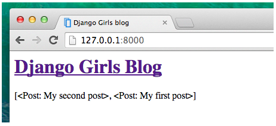

Ako vidieť, všetko, čo máme v **blog/templates/blog/post_list.html**, je toto:
~~~
<QuerySet [<Post: My second post>, <Post: My first post>]>
~~~
To znamená, že použitím QuerySet Django chápe príspevky (post) ako zoznam objektov. V na+som príklade ich máme dva a tak musíme použiť prostriedok ktorý nám umožní zobraziť všetky príspevky. Tým prostriedkom je cyklus for.

### Cykly for v Django

 Zo základov Pythonu by sme si mohli pamätať ako môžeme spracovávať viacprvkové zoznamy a ako takéto zoznamy zobraziť . Áno, s iteráciami v cykle for. **V šablóne Django ich však robíte so zloženými zátvorkami a percentami %** ako napr.:
~~~

    {{ post }}

~~~
Po zabudovaní tejto konštrukcie do súboru views.py dostaneme omnoho čitatelnejší výsledok ako tomu bolo v predchádzajúcom obrázku.

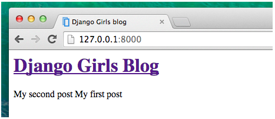

Funguje to, ale my zatiaľ chceme aby sa príspevky zobrazovali iba ako statické príspevky, ktoré sme vytvorili už predtým v časti kde sa zaoberáme <a href="#section2">úvodom do HTML</a> . Tagy HTML však môžete kombinovať so šablónami. Naše **body** v **blog/templates/blog/post_list.html** bude vyzerať takto:
~~~
<header>
    <h1><a href="/">Django Girls Blog</a></h1>
</header>


    <article>
        <time>published: {{ post.published_date }}</time>
        <h2><a href="">{{ post.title }}</a></h2>
        
{{ post.text|linebreaksbr }}

    </article>

~~~

Všetko, čo vložíte medzi **** a **** sa bude opakovať pre každý objekt v zozname. Obnovte svoju stránku a mali by sme dostať niečo takéto:

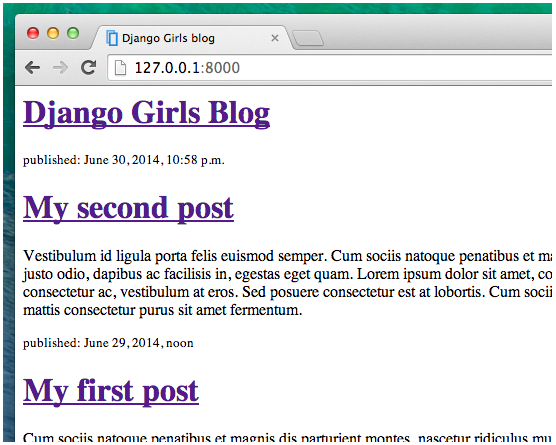

Môžeme si všimnúť, že sme tentoraz sme použili trochu iný zápis ( **{{ post.title }}** alebo **{{ post.text }}** ). Takto pristupujeme k údajom v každom z polí ktoré je definované v našom modeli **Post**. **|linebreaksbr** vyjadruje že text príspevkov prechádza cez filter, aby takto ukončenie riadkov previedli na odseky.

>## CSS nám pomôže urobiť stránku krajšiu

Náš blog zatiaľ vyzerá dosť škaredo. Preto je čas urobiť našu stránku trochu krajšou a použijeme na to CSS.

#### Čo je CSS ?

Cascading Style Sheets (CSS) je jazyk používaný na popis vzhľadu a formátovania webovej stránky napísaný v jazyku používajúcom tagy (značky) ako v HTML. Môžeme to chápať ako make-up pre našu webovú stránku.

Keďže nechceme ani v tejto časti začínať od nuly, môžeme použiť niečo čo programátori uvoľnili na internet zadarmo. Strácať čas a energiu riešením niečoho čo už je vytvorené nie je rozumné ani v tejto oblasti. Tu sa nám ponúka knižnica Bootstrap.

### Použitie Bootstrap

Bootstrap je jedným z najpopulárnejších frameworkov HTML a CSS na vývoj krásnych webových stránok: https://getbootstrap.com/ Napísali ho programátori, ktorí pracovali pre Twitter. Teraz je vyvýjaní dobrovoľníkmi z celého sveta.

#### Nainštalujeme si Bootstrap

Ak chcete nainštalovať Bootstrap, otvoríme svoj blog/templates/blog/post_list.html súbor v editore kódu a Bootstrap pridáme do sekcie **head** :
~~~
<link rel="stylesheet" href="https://cdn.jsdelivr.net/npm/bootstrap@5.1.3/dist/css/bootstrap.min.css" integrity="sha384-1BmE4kWBq78iYhFldvKuhfTAU6auU8tT94WrHftjDbrCEXSU1oBoqyl2QvZ6jIW3" crossorigin="anonymous">
~~~

Týmto sa do nášho projektu síce nepridajú žiadne súbory ale získame odkaz na súbory ktoré existujú na internete a ktoré môžeme takto použiť. Takže pokračujme tým že otvoríme svoj web a obnovíme svoju stránku.

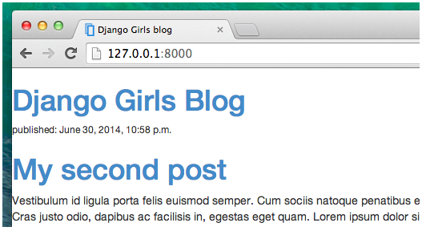

Zmena je tu evidentne batatelná.

### Statické súbory v Django

Nakoniec je potrebné aby sme sa bližšie pozreli na komponenty, ktoré nazývame statické súbory. **Statické súbory** sú všetky vaše CSS prvky a obrázky. Ich obsah nezávisí od kontextu požiadavky a bude stále rovnaký pre každého užívateľa.

#### Kam umiestniť statické súbory pre Django

Django už vie, kde nájsť statické súbory pre vstavanú aplikáciu „admin“. Teraz musíme pridať nejaké statické súbory pre našu vlastnú aplikáciu ktorou je **blog**.

Urobíme to vytvorením priečinka s názvom **static** v aplikácii blogu:
~~~
djangogirls
│
├── blog
│   ├── migrations
│   ├── static
│   └── templates
└── mysite
~~~

Django automaticky nájde všetky priečinky nazývané „statické“ vo všetkých priečinkoch vašich aplikácií. Potom bude môcť použiť ich obsah ako statické súbory.

### Váš prvý súbor CSS

Poďme teraz vytvoriť súbor CSS, aby sme na našu webovú stránku pridali náš vlastný štýl dizajnu. Vytvorme v našom adresári **blog** nový adresár **static** a v ňom nový adresár s názvom **css**. V tomto adresári vytvorme css súbor s názvom **blog.css** tak aby sme dostali nasledovnú štruktúru. 

~~~
DJANGOGIRLS
│
├── blog
│     └─── static
          └─── css
               └─── blog.css
~~~

Týmto máme vytvorené podmienky napísať nejaké CSS. Otvorte preto súbor **blog/static/css/blog.css**.

Aj keď táto problematika je klúčovou pre vizuál a umelecký dojem nebudeme tu zachádzať príliš hlboko do prispôsobovania a učenia sa o CSS. Na konci tejto časti je však uvedené odporúčanie na bezplatný kurz CSS a tu sa môžeme o CSS dozvedieť viac.

Pri tejto príležitosti však urobíme pre CSS aspoň trochu kódu aby sa načrtli väzby a dôsledky ktoré CSS má na jednotlivé stránky. 

Možno by sme napr. mohli zmeniť farbu našich hlavičiek? Na pochopenie farieb používajú počítače špeciálne kódy. Tieto kódy začínajú znakom **#** za ktorým nasleduje 6 písmen (A–F) a čísla (0–9). Napríklad kód pre modrú farbu je **#0000FF**. Kódy farieb ostatných farieb nájdeme tu: http://www.colorpicker.com/ . Môžete tiež použiť [preddefinované farby](http://www.w3schools.com/colors/colors_names.asp), ako napríklad red a green.

Do súboru **blog/static/css/blog.css** by sme mali potom pridať nasledujúci kód :
~~~
h1 a, h2 a {
    color: #F79100;
}
~~~

**h1 a** je selektor CSS. To znamená, že naše štýly aplikujeme na akýkoľvek  prvok **a** vo vnútri prvku **h1** . Selektor **h2 a** urobí to isté pre prvky **h2**. Takže keď máme niečo ako 
~~~
<h1><a href="">link</a></h1>
~~~
použije sa štýl **h1 a**. V tomto prípade mu povieme, aby zmenil svoju farbu na **#C25100**, čo je farba tmavooranžová. Alebo si sem môžeme dať aj inú, svoju vlastnú farbu. Je však potrebné sa uistiť, že má dobrý kontrast na bielom pozadí.

V súbore CSS určujeme štýly pre prvky v súbore HTML. Prvý spôsob, ako identifikujeme prvky, je názov prvku. Možno si ich pamätáte ako značky (tagy) zo sekcie o HTML. Veci ako **a**, **h1**, a **body** sú ďalšie príklady názvov prvkov. Prvky identifikujeme aj podľa atribútu **class** alebo atribútu **id**. Class a id sú názvy, ktoré prvku zadáme my sami. Triedy definujú skupiny prvkov a identifikátory poukazujú na konkrétne prvky. Napríklad nasledujúci prvok môžete identifikovať pomocou názvu prvku **a**, triedy **external_link** alebo id **link_to_wiki_page**:

~~~
<a href="https://en.wikipedia.org/wiki/Django" class="external_link" id="link_to_wiki_page">
~~~

Viac o [CSS Selectoroch](http://www.w3schools.com/cssref/css_selectors.asp) si môžeme prečítať na w3schools .

To že sme pridali nejaké CSS musíme tiež povedať našej šablóne HTML. Otvorme súbor **blog/templates/blog/post_list.html** súbor v editore kódu a pridajme na jeho úplný začiatok tento riadok :
~~~

~~~

Práve takto totiž načítavame statické súbory. Medzi značky **<head>** a **</head>** za odkaz na súbory CSS Bootstrap pridajme tento riadok:
~~~
<link rel="stylesheet" href="">
~~~

Prehliadač číta súbory v poradí, v akom sú zadané, takže sa musíme uistiť, že príslušné riadky sú na správnom mieste. V opačnom prípade môže byť kód v našom súbore prepísaný kódom v súboroch Bootstrap. Práve sme povedali našej šablóne, kde sa nachádza náš súbor CSS a náš súbor **blog/templates/blog/post_list.html** by mal teraz vyzerať takto:

~~~

<!DOCTYPE html>
<html>
    <head>
        <title>Django Girls blog</title>
        <link rel="stylesheet" href="https://cdn.jsdelivr.net/npm/bootstrap@5.1.3/dist/css/bootstrap.min.css" integrity="sha384-1BmE4kWBq78iYhFldvKuhfTAU6auU8tT94WrHftjDbrCEXSU1oBoqyl2QvZ6jIW3" crossorigin="anonymous">
        <link rel="stylesheet" href="">
    </head>
    <body>
        <header>
            <h1><a href="/">Django Girls Blog</a></h1>
        </header>

        
            <article>
                <time>published: {{ post.published_date }}</time>
                <h2><a href="">{{ post.title }}</a></h2>
                
{{ post.text|linebreaksbr }}

            </article>
        
    </body>
</html>
~~~

Keď súbor uložíme súbor a obnovíme stránku dostaneme toto:
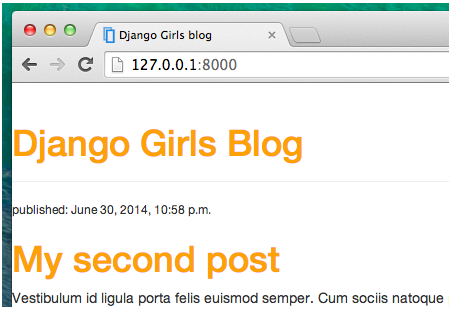

Vo vzhľade našej stránky sme už pokročili, ale možno by sme ju mohli trochu prevzdušniť a zvýšiť odstup od ľavého okraja. Skúsme preto v **blog/static/css/blog.css** pridať toto:
~~~
body {
    padding-left: 15px;
}
~~~
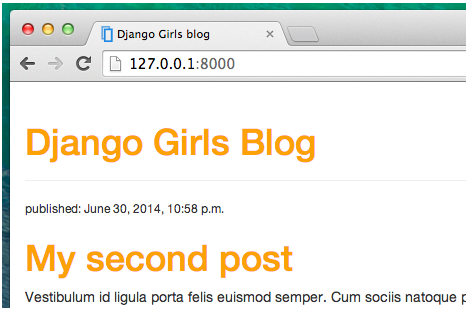

Možno by sme chceli ďalej prispôsobiť písmo v hlavičke. Urobíme to tak, že do hlavičky <**head**> v súbore **blog/templates/blog/post_list.html** pridáme toto:
~~~
<link rel="stylesheet" href="https://fonts.googleapis.com/css?family=Lobster&subset=latin,latin-ext">
~~~

Tento riadok iba importuje font s názvom **Lobster** z Google Fonts ( https://www.google.com/fonts ) a tak ho ešte musíme v súbore blog.css použiť.

V ďalšom kroku nájdeme **h1 a** v súbore **CSS blog/static/css/blog.css** a tam deklaračý blok (kód medzi zloženými zátvorkami **{a }** ) . Sem pridáme riadok **font-family: 'Lobster'** a obnovíme stránku:
~~~
h1 a, h2 a {
    color: #f79100;
    font-family: 'Lobster';
}
~~~
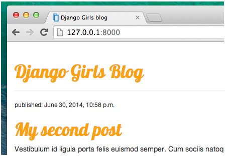

Ako už bolo spomenuté vyššie, CSS má koncept tried. Tieto nám umožňujú pomenovať časť kódu HTML a použiť štýly iba na túto časť bez ovplyvnenia ostatných častí. To môže byť veľmi užitočné. Možno máte dva <**div**>-y, ktoré robia niečo iné (napríklad vaša hlavička a váš príspevok). Trieda vám môže pomôcť, aby vyzerali inak. Pokračujme teda týmto smerom a pomenujme niektoré časti kódu HTML. Nahraďme v <**header**> v súbore **blog/templates/blog/post_list.html**, všetko to čo sa tam nachádza týmto vrátane označenia bloku <**header**> <**/header**> a v prípade potreby upravíme odstupy odstupy od kraja aby zodpovedali tomuto kódu:
~~~
<header class="page-header">
    

        <h1><a href="/">Django Girls Blog</a></h1>
    

</header>
~~~
a následne sem pridáme pod za+ciatok cyklu for triedu **post**, ktorá obsahuje príspevok blogu **article** a tiež tu upravíme odstupy od okraja.

~~~
<article class="post">
    <time>published: {{ post.published_date }}</time>
    <h2><a href="">{{ post.title }}</a></h2>
    
{{ post.text|linebreaksbr }}

</article>
~~~

Následne pridáme do rôznych selektorov bloky deklarácií. Selektory začínajúce na **.** sa pritom týkajú tried. Na webe je na túto tému veľa dobrých návodov a článkov o CSS ako napr. na [freeCodeCamp](https://learn.freecodecamp.org/). Tieto môžu pomôcť pochopiť  aj nasledujúci kód. Zatiaľ iba bez ďalšieho vysvetlenia skopírujeme nižšie uvedený kód a vložíme ho na koniec do súboru **blog/static/css/blog.css**:

~~~
h1 a,
h2 a {
    color: #f79100;
    font-family: 'Lobster';
}

.page-header {
    background-color: #f79100;
    margin-top: 0;
    margin-bottom: 40px;
    padding: 20px 20px 20px 40px;
}

.page-header h1,
.page-header h1 a,
.page-header h1 a:visited,
.page-header h1 a:active {
    color: #ffffff;
    font-size: 36pt;
    text-decoration: none;
}

h1,
h2,
h3,
h4 {
    font-family: 'Lobster', cursive;
}

.date {
    color: #828282;
}

.save {
    float: right;
}

.post-form textarea,
.post-form input {
    width: 100%;
}

.top-menu,
.top-menu:hover,
.top-menu:visited {
    color: #ffffff;
    float: right;
    font-size: 26pt;
    margin-right: 20px;
}

.post {
    margin-bottom: 70px;
}

.post h2 a,
.post h2 a:visited {
    color: #000000;
}

.post > .date,
.post > .actions {
    float: right;
}

.btn-secondary,
.btn-secondary:visited {
    color: #f79100;
    background: none;
    border-color: #f79100;
}

.btn-secondary:hover {
    color: #FFFFFF;
    background-color: #f79100;
}

~~~

Potom ešte pridáme do HTML kódu v súbore **blog/templates/blog/post_list.htm**, pod začiatok cyklu riadok tag <[article](https://www.w3schools.com/tags/tag_article.asp)> ktorý špecifikuje samostatný nezávyslý obsah ktorý možno distribuovať nezávysle od zvyšku stránky.

~~~
<article class="post">
    ...
</artcle>
~~~

HTML kód &lt;article class="post"&gt; predstavuje element článku s atribútom class nastaveným na "post". V HTML sa &lt;article&gt; používa na definovanie samostatného obsahu, ako je napr. blogový príspevok, príspevok na fóre, spravodajský článok atď. Atribút class nám umožňuje aplikovať špecifický štýl (css) alebo spr&gt;ávanie na prvky ktoré sú spojené s touto triedou.

Teda &lt;article class="post"&gt; označuje konkrétnu časť webovej stránky, ktorá obsahuje príspevok alebo článok, a je deklarovaný ako trieda s názvom "post" na ktorú sa môže použiť úprava štýlu alebo priradenie konkrétneho vzhľadu resp. funkčnosťi prostredníctvom CSS.

~~~

    <article class="post">
        <time>published: {{ post.published_date }}</time>
        <h2><a href="">{{ post.title }}</a></h2>
        
{{ post.text|linebreaksbr }}

    </article>

~~~

za tento kód a upravme odstupy. Súbor uložme a obnovme web!

~~~
<main class="container">
    

        

            
                <article class="post">
                    <time class="date">
                        published: {{ post.published_date }}
                    </time>
                    <h2><a href="">{{ post.title }}</a></h2>
                    
{{ post.text|linebreaksbr }}

                </article>
            
        

    

</main>
~~~
Po úpravách a doplnkoch by mal súbor post_list.html vyzerať takto:

~~~


<!DOCTYPE html>

<html>
    <head>
        <title>Django Girls blog</title>
        <link rel="stylesheet" href="https://cdn.jsdelivr.net/npm/bootstrap@5.1.3/dist/css/bootstrap.min.css"
            integrity="sha384-1BmE4kWBq78iYhFldvKuhfTAU6auU8tT94WrHftjDbrCEXSU1oBoqyl2QvZ6jIW3" crossorigin="anonymous">
        <link rel="stylesheet" href="">
        <link rel="stylesheet" href="https://fonts.googleapis.com/css?family=Lobster&subset=latin,latin-ext">
    </head>
    <body>
        <header class="page-header">
            

                <h1><a href="/">Django Girls Blog</a></h1>
            

        </header>

        <main class="container">
            

                

                    
                        <article class="post">
                            <time>published: {{ post.published_date }}</time>
                            <h2><a href="">{{ post.title }}</a></h2>
                            
{{ post.text|linebreaksbr }}

                        </article>
                    
                

            

        </main>
    </body>
</html>
~~~

V kontexte rámcov (frameworkov) pre vývoj webu, ako je Bootstrap, je „kontajner“ trieda alebo prvok, ktorý sa používa na vytvorenie responzívneho rozloženia obsahu v rámci webovej stránky. Čo robí kontajner: 
1./ **Centrovanie obsahu**: Obsah sa vycentruje vodorovne v rámci zobrazovanej oblasti, čím sa zabezpečí, že sa obsah nerozšíri po celej šírke okna prehliadača. Pomáha to zachovať čitateľnosť a estetiku, najmä na väčších obrazovkách.

2./ **Zabezpečí pevnú šírku** : Zvyčajne obmedzuje šírku obsahu a poskytuje kontajner s pevnou šírkou. To môže zabrániť tomu, aby sa obsah stal príliš širokým a ťažko čitateľným na väčších obrazovkách.

3./ **Zabezpečí responzívne správanie** : Kontajnery v rámcoch, ako je Bootstrap, sú navrhnuté tak, aby reagovali, čo znamená, že sa prispôsobujú rôznym veľkostiam obrazovky a zariadeniam. Môžu upraviť ich šírku a výplň, aby poskytovali optimálny zážitok zo sledovania na rôznych zariadeniach vrátane stolných počítačov, tabletov a smartfónov.

Tu je príklad použitia kontajnera v HTML:

~~~

    <!-- Sem pride obsah ktoreho sa to ma tykat -->

~~~

V tomto príklade &lt;div&gt; prvok s triedou "container" slúži ako kontajner pre obsah v ňom. Obsah bude vycentrovaný vodorovne a bude mať pevnú šírku, čím sa zabezpečí konzistentné rozloženie na rôznych zariadeniach.

&lt;div class="container"&gt;je prvok HTML s atribútom class nastaveným na "container".

V HTML &lt;div&gt;je generický kontajnerový prvok, ktorý sám o sebe nemá žiadny sémantický význam, ale používa sa na zoskupenie iných prvkov. Atribút class vám umožňuje aplikovať na prvok štýly CSS alebo správanie JavaScriptu.

Trieda „container“ sa bežne používa v rámci webových vývojových rámcov, ako je Bootstrap, na vytvorenie kontajnera, ktorý drží a vycentruje obsah na webovej stránke. Je to spôsob, ako štruktúrovať a upravovať rozloženie webovej stránky.

Napríklad:
~~~

    <!-- Sem pride obsah ktoreho sa to ma tykat -->

~~~

Toto &lt;div&gt; s triedou „container“ môže byť naštylované pomocou CSS na ovládanie jej šírky, okrajov, výplne atď., čím sa zabezpečí konzistentné rozloženie obsahu, ktorý obsahuje.

Element &lt;main class="container"&gt; HTML predstavuje hlavnú obsahovú oblasť webovej stránky s atribútom class nastaveným na "container".

* &lt;main&gt;: &lt;main&gt; Prvok je sémantický prvok HTML5, ktorý predstavuje hlavný obsah webovej stránky. Zvyčajne sa používa na zapuzdrenie primárneho obsahu stránky, ako sú články, sekcie alebo iný obsah priamo súvisiaci s ústrednou témou alebo účelom stránky.

* class="container": Trieda „container“ sa často používa v rámci webových vývojových rámcov, ako je Bootstrap, na vytvorenie kontajnera, ktorý obsahuje a vycentruje obsah na webovej stránke. Pomáha pri vytváraní konzistentného rozloženia a medzier pre oblasť hlavného obsahu.

Pri zápise &lt;main class="container"&gt; ide teda o kombináciu sémantického významu prvku &lt;main&gt; so štýlom rozloženia poskytovaným triedou „container“, výsledkom čoho je časť hlavného obsahu, ktorá je štruktúrovaná a štylizovaná podľa pokynov rámca.

Napríklad:
~~~
<main class="container">
    <!-- Main content goes here -->
</main>
~~~

Táto štruktúra zaisťuje, že oblasť hlavného obsahu je obsiahnutá v centrovanom kontajneri s vhodným rozstupom a rozložením, čo pomáha pri vytváraní vizuálne príťažlivej a organizovanej webovej stránky.

&lt;div class="row"&gt; je prvok HTML s atribútom triedy nastaveným na "row" (riadok).

Podobne ako &lt;div class="container"&gt;, &lt;div class="row"&gt; sa často používa v rámcoch vývoja webu, ako je Bootstrap, na štruktúrovanie rozloženia webovej stránky.

V rámcoch ako Bootstrap sa trieda "row" (riadok) zvyčajne používa na vytvorenie horizontálneho zoskupenia stĺpcov v rámci mriežkového systému. Pomáha zarovnať a umiestniť obsah v rámci rozloženia mriežky.

Napríklad:
~~~

    

        <!-- Content goes here -->
    

~~~

V rámci tejto štruktúry &lt;div class="row"&gt; by typicky obsahoval jeden alebo viac stĺpcových prvkov ( &lt;div class="col"&gt;), ktoré sa používajú na definovanie rozloženia obsahu v rámci mriežkového systému.

~~~

    

        
Column 1

        
Column 2

        
Column 3

    

~~~

Táto štruktúra pomáha pri vytváraní responzívnych a organizovaných rozložení pre webové stránky.

Súbory uložte a obnovte svoj web aby sme dostali niečo takéto.

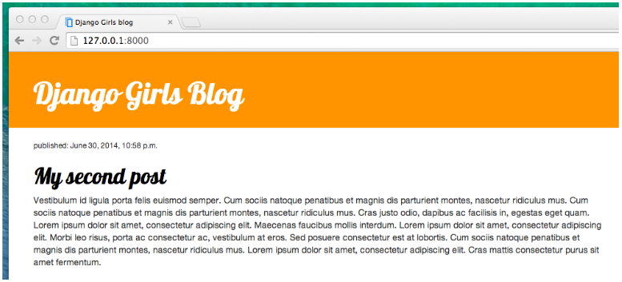

Ak sa pozrieme na kód, ktorý sme práve vložili, tak by sme našli miesta, kde sme pridali  triedy a použili ich v CSS. Napr. kde by ste potom urobili zmenu, ak by ste chceli, aby bol dátum inej farby a bol napr. tyrkysový ?

Nebojte sa v tomto CSS trochu pohrať a skúsiť niektoré veci zmeniť. Hranie sa s CSS vám môže iba pomôcť lepšie pochopiť, čo jednotlivé skripty a bloky robia. Ak niečo pokazíte, nebojte sa, vždy to môžete vrátiť späť !

>## Rozšírenie šablóny

Ďalšou užitočnou a veľmi často používanou programovacou technikou, ​​ktorú Django poskytuje, je **používanie základnej šablóny**. Čo to znamená ? Znamená to to, že časti ktoré sa opakujú vložíme do tejto základnej šablóny a potom ich budeme používať v iných šablónach v ktorých sa nachádza iba kód ktorý sa neopakuje. **Je to vlastne postup kedy sú opakujúce sa časti kódu šablon sústredené do jednej tzv. základnej (base) šablóny a ostatné šablóny s odlišným HTML kódom ju využívajú**.

To nám umožňuje to, že nemusíme opakovať ten istý kód vo viacerých súboroch. Pozitívny dôsledok takéhoto prístupu tiež spočíva v tom, že ak chceme niečo zmeniť v opakujúcom sa kóde, nemusíte to robiť v každej šablóne samostatne, ale stačí keď to urobíme iba v jednej základnej šablóne. Túto **základnú (base) šablónu si však ale musíme vytvoriť** a tento postup ako to urobíme je náplňou nasledovnej časti.

#### Vytvorenie základnej šablóny

Base šablóna je základnou šablónou, ktorú v ostatných šablónach podľa potreby využívame, rozširujeme a doplňame podľa toho ako potrebujeme pre vytváranie jednotlivých webových stránok.

Vytvorme teda **base.html** súbor v adresári **blog/templates/blog/**:
~~~
DJANGOGIRLS
│
blog
└───templates
    └───blog
            base.html
            post_list.html
~~~

Potom ho otvorte v editore kódu a skopírujte všetko zo súboru **post_list.html** do **base.html** t.j. základnú šablónu vytvoríme z úplného obsahu doposiaľ koncipovenej šablóny post_list.html:

~~~

<!DOCTYPE html>
<html>
    <head>
        <title>Django Girls blog</title>
        <link rel="stylesheet" href="https://cdn.jsdelivr.net/npm/bootstrap@5.1.3/dist/css/bootstrap.min.css" integrity="sha384-1BmE4kWBq78iYhFldvKuhfTAU6auU8tT94WrHftjDbrCEXSU1oBoqyl2QvZ6jIW3" crossorigin="anonymous">
        <link rel="stylesheet" href="https://fonts.googleapis.com/css?family=Lobster&subset=latin,latin-ext">
        <link rel="stylesheet" href="">
    </head>
    <body>
        <header class="page-header">
          

              <h1><a href="/">Django Girls Blog</a></h1>
          

        </header>

        <main class="container">
            

                

                
                    <article class="post">
                        <time class="date">
                            published: {{ post.published_date }}
                        </time>
                        <h2><a href="">{{ post.title }}</a></h2>
                        
{{ post.text|linebreaksbr }}

                    </article>
                
                

            

        </main>
    </body>
</html>
~~~
Potom v **base.html**, nahraďte svoju časť <**body**> (všetko medzi <**body**> a <**/body**>) týmto a upravte odstupy:

~~~
<body>
    <header class="page-header">
      

          <h1><a href="/">Django Girls Blog</a></h1>
      

    </header>
    <main class="container">
        

            

            
            
            

        

    </main>
</body>
~~~

Môžeme si všimnúť, že to nahradilo všetko od **** po **** s týmto:
~~~


~~~

### Vytvorenie bloku kódu

Vytvorenie bloku znamená že nejakú časť kódu označíme ako blok s tým zámerom že ho použijeme pod hlavičkou bloku. Na vytvorenei bloku je potrebné použiť príkaz ****. Pomocou značky/tagu šablóny **** sme vytvorili oblasť, do ktorej bude vložený kód HTML. Tento HTML kód bude pochádzať z inej šablóny, a týmto rozširuje túto šablónu ( base.html). V nasledovnom si ukážeme ako tento postup uskutočníme.

Najprv si však súbor **base.html** uložme a znova sa vrátme v editore kódu k súboru **blog/templates/blog/post_list.html**. Musíme tu totiž odstrániť všetko čo sa nachádza v base.html t.j. všetko d príkazom **** až po začiatok a všetko pod príkazom **** t.j. všetko až po koniec. Spravili sme to preto lebo sme tento kód uložili do súboru base.html. Keď tak urobíme tak v posl_list.html zostane iba časť kódu ktorá bude vyzerať nasledovne:

~~~

    <article class="post">
        <time class="date">
            published: {{ post.published_date }}
        </time>
        <h2><a href="">{{ post.title }}</a></h2>
        
{{ post.text|linebreaksbr }}

    </article>

~~~

Urobili sme to preto, lebo chceme príslušný blok použiť nie len ako súčasť našej šablóny **post_list.html** ale tým že použijeme to označenei môžeme vyznačenú časť tiež použiť aj v iných šablónách. **Vytvorenie tagu blok v html súbore sme si definovali časť kódu ktorý môžeme použiť aj v iných súboroch.** Pritom ale chceme aby sa naša značka bloku zhodovala so značkou v našom súbore **base.html**. Tiež chceme, aby tento súbor obsahoval aj kód, ktorý patrí do našich. Ak to chcetme zabezpečiť, tak musíme vložiť všetok kód uvedený vyššie medzi príkazy **** a ****. Na základe toho dostaneme v post_list.html takýto skript:

~~~


    
        <article class="post">
            <time class="date">
                published: {{ post.published_date }}
            </time>
            <h2><a href="">{{ post.title }}</a></h2>
            
{{ post.text|linebreaksbr }}

        </article>
    


~~~

### Prepojenie základnej šablóny so šablónami odvodenými

Pre úplnosť nám nakoniec ešte zostava vyriešiť jednu vec. **Musíme ešte spojiť tieto dve šablóny (post_list.html a base.html) dohromady**. Princíp rozširovania šablón s využívaním základných šablón je totiž o tom. Tým prostriedkom ako to urobiť je použitie tagu **extends** ktorý musíme umiestniť na začiatok súboru. 

~~~



    
        <article class="post">
            <time class="date">
                published: {{ post.published_date }}
            </time>
            <h2><a href="">{{ post.title }}</a></h2>
            
{{ post.text|linebreaksbr }}

        </article>
    

~~~

Dostali sme sa do ďalšieho štádia prípravy webovej aplikácie a preto je vhodné aby sme v tomto štádiu všetky súbory uložili a skontrolovali, či náš web v tomto štádiu stále správne funguje.

**Poznámka**: Ak sa zobrazí chyba TemplateDoesNotExist, znamená to to, že neexistuje žiadny súbor blog/base.html a v konzole máte spustený runserver. Skúste proces výpočtu zastaviť (stlačením Ctrl+C – kláves Control a C spolu) a znovu ho reštartovať spustením príkazu python manage.py runserver cislo_portu.

>## Rozširovanie našej webovej aplikácie

Keď sme dokončili všetky doterajšie kroky potrebné na vytvorenie našej webovej stránky, tak sme sa dostali do štádia kedy vieme, **ako napísať model, URL, views a šablónu**. A vieme tiež, **ako urobiť našu webovú stránku pomocou HTML a CSS peknou**. 

>Vytvorili sme akúsi základnú verziu našej webovej aplikácie a tak nastal čas na jej rozširovanie o ďalšie prvky.

Napr. prvá vec, ktorú v našom blogu potrebujeme, je to aby na+sa aplikácia umožňovala poskytnúť stránku na zobrazenie iba jedného vybraného príspevku. Model príspevku (Post) ktorý k tomu budeme potrebovať, lebo nám poskytne daný príspevok ktorý je uložený v databáze, už máme. Takže sa môžeme vrátiť k našemu súboru models.py v ktorom je tento model definovaný.

### Vytvorenie odkazu na šablónu pre zobrazenie podrobností príspevku

Začneme pridaním odkazu do súboru **blog/templates/blog/post_list.html**. Otvorte ho v editore kódu a zatiaľ by jeho obsah mal vyzerať takto:
~~~



    
        <article class="post">
            <time class="date">
                {{ post.published_date }}
            </time>
            <h2><a href="">{{ post.title }}</a></h2>
            
{{ post.text|linebreaksbr }}

        </article>
    

~~~

Chceme mať odkaz na stránku s podrobnosťami ktoré sa nachádzajú v príspevku a chceme aby sme sa k nim dostali cez názov príspevku ktorý sa nachádza v zozname príspevkov post_list.html. Zmeňme teda riadok
~~~
<h2><a href="">{{ post.title }}</a></h2>
~~~
 tak, že k pôvodnému textu pridáme  čo nám vytvorí odkaz na stránku s podrobnosťami o príspevku. Celý riadok potom nadobudne takýto tvar:
~~~
<h2><a href="">{{ post.title }}</a></h2>
~~~

Keď sme pridali tento doplnok žiada sa aby sme konštrukciu **** vysvetlili. Ako možno tušíte zápis medzi **** znamená, že budú použité tagy šablón Django (tento krát ale nie cyklus pri ktorom sme to použili tiež). Teraz použijeme taký, ktorý nám vytvorí URL adresu a to URL adresu na stránku detailov príspevku.

Zápis **post_detail** znamená, že Django bude očakávať URL zo súboru **blog/urls.py** kde bude mať meno **name=post_detail**

A čo takto použiť **pk=post.pk** ? **pk** je to totiž skratka pre **primárny kľúč**, čo je jedinečný identifikátor pre každý záznam v databáze. Veď každý model Django musí mať pole, ktoré slúži ako jeho primárny kľúč, a nech už má akýkoľvek iný názov, môže byť napr. označený aj ako „pk“ (t.j. počiatočné písmená **p**rimary **k**ey). Pretože sme ale v našom modeli nešpecifikovali primárny kľúč „pk“ pre **Post**, Django nám ho automaticky prevezme z poľa ktoré bolo ako porimary key definované pri tvorbe databázy. Štandardne je to pole s názvom „id“ obsahujúce číslo, ktoré sa zvyšuje pre každý záznam, t.j. nadobúda hodnoty 1, 2, 3 atď. Inými slovami povedané naše „pk“ s ktorým budeme pracovať zodpovedá v databáze názvu poĺa „id“, čo zabezpečí Django. Dôsledok zavedenia „pk“ potom spôsobí že nám Django pridá „pk“ ako pole na každý náš príspevok. **K primárnemu kľúču ktorý je priradený nášmu príspevku potom pristupujeme pomocou bodkovej konvencie  zápisom post.pk**. Je to pritom rovnaký spôsob, akým pristupujeme v našom objekte **Post** aj k iným databázovým poliam ( ako napr. title, author, a pod.).

Keď ale prejdeme po uskutočnení tejto zmeny na adresu http://127.0.0.1:8000/, zobrazí sa nám chyba (je to podľa očakávania, pretože ešte nemáme vytvorenú ani šablónu post_detail ani URL adresu a ani view ). Tá chyba bude  vyzerať nejako takto:

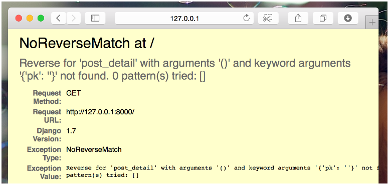

### Vytvorenie URL adresy pre zobrazenie (views) podrobností príspevku

Poďme teda znovu aplikovať štandardný postu a najprv vytvoriť **urls.py** v ktorom umiestníme URL pre naše zobrazenie **post_detail**. Pritom 
chceme, aby sa podrobnosti nášho prvého príspevku zobrazovali na stránke ktorá bude na adrese takéhoto tvaru URL: http://127.0.0.1:8000/post/1/

V súbore **blog/urls.py** zadáme URL adresu, ktorá nasmeruje Djanga na views s názvom **post_detail** a to zobrazí celý príspevok blogu. Otvorte súbor **blog/urls.py** v editore kódu a pridajme do neho riadok **path('post/&lt;int:pk&gt;/', views.post_detail, name='post_detail')**, tak aby celý súbor vyzeral takto:

~~~
from django.urls import path
from . import views

urlpatterns = [
    path('', views.post_list, name='post_list'),
    path('post/<int:pk>/', views.post_detail, name='post_detail'),
]
~~~

Časť **post/&lt;int:pk&gt;/** špecifikuje vzor URL adresy čo si vysvetlíme v ďalšom:

* post/ znamená, že URL adresa by mala začínať slovom **post**, za ktorým nasleduje znak **/** .
* <**int : pk**> – vyjadruje trochu zložitejšiu časť. Znamená to, že Django očakáva celočíselnou hodnotu a prenesie ju do views ako premennú s názvom **pk** (ide o spomínaný primary key).
* / – potrebujeme znova umiestniť pred dokončením URL adresy.
* 
Z toho vyplýva, že ak vstúpime v prehliadači napr. na adresu http://127.0.0.1:8000/post/5/, Django pochopí, že hľadáme views s názvom **post_detail** a prenesie do príslušnej šablóny informácie (údaje z DB tabuľky), ktoré prislúchajú tomuto views s identifikátorom **pk** rovnajúcemu sa hodnote číslo 5 (t.j. rovnajúcemu sa 5. riadku tabuľky DB tabuľky)

Do **blog/urls.py ** sme teda pridali nový vzor URL adresy. Obnovme stránku: http://127.0.0.1:8000/ a opäť zistíme že server prestal bežať. Pozrieme sa na konzolu a ako sme mohli po zásahu do url.py očakávať je tu ďalšia chyba.

~~~
return _bootstrap._gcd_import(name[level:], package, level)
  File "<frozen importlib._bootstrap>", line 1030, in _gcd_import
  File "<frozen importlib._bootstrap>", line 1007, in _find_and_load
  File "<frozen importlib._bootstrap>", line 986, in _find_and_load_unlocked
  File "<frozen importlib._bootstrap>", line 680, in _load_unlocked
  File "<frozen importlib._bootstrap_external>", line 850, in exec_module
  File "<frozen importlib._bootstrap>", line 228, in _call_with_frames_removed
  File "/Users/ola/djangogirls/blog/urls.py", line 6, in <module>
    path('post/<int:pk>/', views.post_detail, name='post_detail'),
AttributeError: module 'blog.views' has no attribute 'post_detail'
~~~

Chyba nám napovedá že problém sa týka views a upozorňuje nás na potrebu pridať nový views pre post_detail.

### Vytvorenie views na podrobnosti príspevku

Tento krát je nášmu views priradený ďalší parameter - **pk**. Náš views ho musí prijať a spracovať. Preto vytvoríme funkciu s návratovou hodnotou, ktorú zadefinujeme ako **def post_detail(request, pk):**. Všimnime si, že tento parameter **pk** musí mať presne rovnaký názov ako ten, ktorý sme zadali v **urls(pk)**. Vynechanie tejto premennej **pk** je nesprávne a bude mať za následok chybu!

Najprv sa budeme zaoberať postupom ako získať len jeden blogový príspevok. Na tento účel môžeme použiť známy <a href="#section3">QuerySets</a> ako je tento:
~~~
Post.objects.get(pk=pk)
~~~

Ale tento kód má problém. Ak tam nie je žiadne **Post** s daným primary key (**pk**), dostaneme veľkú chybu.

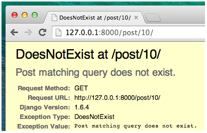

To však nechceme, ale našťastie Django prichádza s niečím, čo to zvládne za nás. Je to pomoc pri ošetrení chyby **get_object_or_404**. V prípade, že tam nie je **Post** s daným **pk**, zobrazí sa oveľa krajšia stránka, **Page Not Found 404** ktorá nás nasmeruje na príčinu chyby.

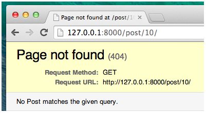

Tento nástroj, ktorý nám Django poskytuje nám umožní vytvoriť aj svoju vlastnú stránku na hlásenie chyby (s inou správou ako Page not found) a urobiť ju tak ako chceme. To v+sak teraz nebude predmetom nášho riešenia a tak túto tému preskočíme.

Čo je dôležitejšie je to aby sme pridali do nášho súboru **views.py** nový views.

V **blog/urls.py** sme vytvorili pravidlo URL s názvom **post_detail**, ktoré odkazuje na views s názvom **views.post_detail**. To znamená, že Django bude očakávať funkciu views (zobrazenia) s názvom **post_detail** vo vnútri súboru **blog/views.py**.

Mali by sme preto otvoriť **blog/views.py** v editore kódu a pridať nasledujúci kód za ostatné riadky s from ... import ...:
~~~
from django.shortcuts import render, get_object_or_404
~~~
A na koniec súboru **blog/views.py pridáme náš view (pohľad) :
~~~
def post_detail(request, pk):
    post = get_object_or_404(Post, pk=pk)
    return render(request, 'blog/post_detail.html', {'post': post})
~~~

Keď obnovíme stránku: http://127.0.0.1:8000/ dostaneme síce známy vizuál, 

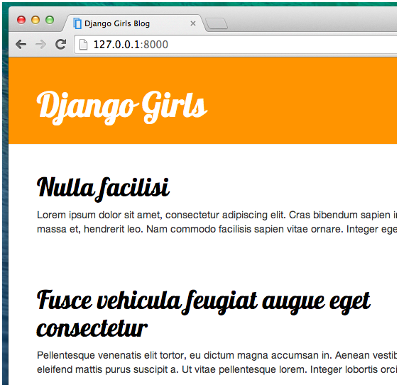

ale po nakliknutí na názov príspevku sa nám podrobnosti alebo príspevku nezobrazia, alebo ked zadáme napr. manualne http://127.0.0.1:8000/post/2/ dostaneme zase chybu.

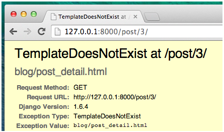

S takouto chybou sme sa však už stretli skôr a tak sa s ňou už vieme vysporiadať. Ak si spomenieme, musíme pridať pre post_detail šablónu!

## Vytvorenie šablóny pre zobrazenie podrobnosti  príspevku

Aby sme mohli skontrolovať či nám urls.py a views.py pre zobrazenie podrobností v príslevku funguje správne musíme si vytvoriť pomocnú šablónu ktorú použijeme s manuálnym zadaním URL. Vytvoríme si teda súbor s názvom **post_detail.html** v adresári **blog/templates/blog** a otvoríme ho v editore kódu. Potom zadáme do neho nasledujúci kód:

~~~



    <article class="post">
        
            <time class="date">
                {{ post.published_date }}
            </time>
        
        <h2>{{ post.title }}</h2>
        
{{ post.text|linebreaksbr }}

    </article>

~~~
Tentó kód sa podobá kódu post_list.html až na to že je tu použitý rozhodovací príkaz if a class="date" ktorá zabezpečí pre dátum použitie stýlu zo súboru blog.css. Opäť v ňom však využijeme base.html. V bloku **content*  chceme zobraziť ak existuje cez premenné dátum zverejnenia príspevku {{ post.published_date }}, názov príspevku {{ post.title }} a jeho obsah {{ post.text|linebreaksbr }}. Skôr než tak však urobíme mali by sme spomenúť niekľko dôležitých vecí.

Týka sa to konštrukcie ** ... ** je tag šablóny, ktorú môžeme použiť, keď chceme niečo skontrolovať. (Spomeňme si na if ... else ...zo základov Pythonu !) V tejto časti chceme napr. skontrolovať, či príspevok **published_date** nie je prázdny. Ak obnovíme našu stránku a zadáme do prehliadača opäť manuálne adresu http://127.0.0.1:8000/post/2/ tak zistíme, že naša chyba **TemplateDoesNotExist** je preč a my uvidíme obsah našej šablóny post_detail.html. Táto pomocná šablóna nám poslúži aj na odstránenie chyby ktorá nastane ak do URL vložíme čislo riadku ktorý v našej databáze neexistuje (napr. 10 keďže máme iba 5 príspevkov)

<s>Čo ešte musíme urobiť je prepojenie šablón post_list.html a post_detail.html tak aby po  nakliknutí názvu príspevku sa nám zobrazil jeho obsah bez toho aby sme manualne zadávali jeho URL</s>

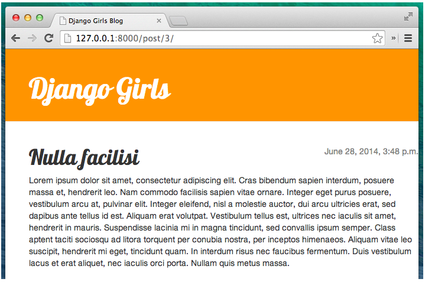

## Formuláre s Djangom

Ďalšia vec, ktorú chceme na našej webovej stránke urobiť, je vytvoriť vhodný spôsob pridávania a úpravy blogových príspevkov. Djangový **admin** sa síce dá použiť na tieto účely, ale je príliš jednoduchý a je dosť náročné ho prispôsobiť na lepší design. Riešením je preto použitie Djangových formulárov tzv. **forms**. To bude vhodnejšie riešenie rozhrania s užívateľom a budeme s ním môcť robiť takmer všetko čo potrebujeme vrátane dizajnových úprav. Naviac túto techniku môžeme použiť kedykoľvek keď budeme potrebovať vytvoríť nejaký vstupný formulár pre zadávanie údajov do databázy.

Zaujímavou vlastnosťou na formulároch Django je aj to, že môžeme ho vždy vytvárať od samotného začiatku alebo môžeme vytvoriť formulár ktorý sa prostredníctvom **ModelForm** uloží do modelu k opakovanému použitiu. A to je presne to, čo chceme urobiť. Vytvoriť formulár pre náš model **Post**.

Ako každá dôležitá časť Djanga, aj formuláre majú svoj vlastný súbor ktorým je **forms.py**. Ten vytvoríme v adresári blog .

~~~
DJANGOGIRLS
│
blog
   └── forms.py
~~~

Kód, ktorý do neho zapíšeme bude vyzerať nasledovne:

~~~
from django import forms
from .models import Post

class PostForm(forms.ModelForm):

    class Meta:
        model = Post
        fields = ('title', 'text',)
~~~

Najprv musíme importovať formuláre Django ( **from django import forms**) a náš model **Post** ( from .models import Post).

**PostForm**, ako pravdepodobne tušíte, je názov nášho formulára. V tejto súvislosti musíme Djangovi povedať, že tento formulár je **ModelForm** takže Django zabezpečí že za to bude zodpovedný **forms.ModelForm** .

Ďalej budeme pracovať s triedou ktorú označíme ako **class Meta**, kde povieme Djangovi, ktorý model by sa mal použiť na vytvorenie nášho formulára ( **model = Post**).

Nakoniec ešte musíme Djangovi povedať, ktoré pole (resp. polia) databázovej tabuľky by mali byť v našom formulári napĺňané. V tomto scenári chceme len tieto tri **title**, **text**, **author**. Je to teda osoba/autor, ktorý je práve prihlásený (napr. Vy ako admin), ďalej text ktorý je nápnou príspevku spolu s jeho názvom a dátum vytvorenia príspevku **created_date** ktorý sa bude vytvárať automaticky pri inicializácii písania príslušného príspevku tak že sa preberie zo systémového času.

Všetko, čo teraz musíme urobiť, je použiť formulár vo views a prepojiť ho na šablónu. Ešte raz si teda budeme musieť zopakovať zaužívaný postup že najprv v urls.py vytvoríme na stránku odkaz, zadať URL, potom vytvoriť views a nakoniec vytvoriť pre formulár šablónu.

### Odkaz na stránku s formulárom

Pred pridaním odkazu na formulá však potrebujeme na naše stránky zabudovať nejaké ikony, ktoré použijeme ako tlačidlá pre aktivovanie odkazu. Pre tento návod si za týmto účelom stiahneme súbor v ktorom sú už takéto ikony vytvorené. Ide o [súbor-earmark-plus.svg](https://icons.getbootstrap.com/icons/file-earmark-plus/) ktorý si uložíme do priečinka **blog/templates/blog/icons/** Ten si ešte pred tým najprv musíme vytvoriť napr. prieskumníkom. Stiahnutý súbor má ale ikony vytvorené v základnom rozmere ktorý je pre naše účely veľmi malý. 

>Rozmery ikony preto zväčšíme zmenou hodnôt v súbore file-earmark-plus.svg napr. na hodnoty width="50" height="50" a keby sme použili súbor pencil-fill.svg tak zmeníme hodnoty na width="15" height="15"

Urobíme to tak že si editorom tento súbor otvoríme a hodnoty 16 prepíseme na 50

Na to aby sme túto knižnicu zabudovali do našel aplikácia musíme v editore kódu otvoriť súbor **blog/templates/blog/base.html**. Teraz môžeme použiť tento súbor s ikonami v našej základnej šablóne nasledovne. Vo  vnútri sekcie **header** a v elemente **div** pridáme pred  **h1**  pod class="container"odkaz:

~~~
<a href="" class="top-menu">
    
</a>
~~~

>Dohodnime sa že náš nový view ktorý bude prislúchať formuláru by bolo vhodné nazvať **post_new**. Tento názov použijeeme pri konštrukcii v urls.py a views.py avšak sablónu ktorá post_new prislúcha nazveme nižšie **post_edit.html** nakoľko bude použitá nie len na vytváranie nových príspevkov, ale aj na editovanie (úpravu) príspevkov už existujúcich.

Súbor s ikonami nám v grafickom formáte SVG poskytol [Bootstrap](https://icons.getbootstrap.com/) a tá naša ktorú sme si stiahli pod názvom file-earmark-plus.svg sa nám zobrazí ako stránka so znamienkom plus. 

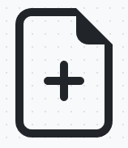

Na vloženie súboru s kódom ikony do našej šablóny sa použije direktíva šablóny Django s názvom **include**. Tým sa vloží zo súboru kód ikony  do šablóny Django. Webový prehliadač už potom vie, ako s týmto typom obsahu zaobchádzať a nie je potrebné žiadne ďalšie manipulovanie s týmto súborom.

Všetky ikony Bootstrap si môžete stiahnuť [tu](https://github.com/twbs/icons/releases/download/v1.1.0/bootstrap-icons-1.1.0.zip). Súbor sa rozbalí a všetky obrazové súbory SVG sa skopírujú do nového priečinka **blog/templates/blog/icons**. Týmto spôsobom môžete získať prístup k ikone, ako je file-earmark-plus.svg alebo pencil-fill.svg ak použijeme k súboru danú cestu **blog/templates/blog/icons/file-earmark-plus.svg**

Po úprave riadku by váš HTML súbor **blog/templates/blog/base.html** mal teraz vyzerať takto:

~~~

<!DOCTYPE html>
<html>
    <head>
        <title>Django Girls blog</title>
        <link rel="stylesheet" href="https://cdn.jsdelivr.net/npm/bootstrap@5.1.3/dist/css/bootstrap.min.css" integrity="sha384-1BmE4kWBq78iYhFldvKuhfTAU6auU8tT94WrHftjDbrCEXSU1oBoqyl2QvZ6jIW3" crossorigin="anonymous">
        <link rel="stylesheet" href="https://fonts.googleapis.com/css?family=Lobster&subset=latin,latin-ext">
        <link rel="stylesheet" href="">
    </head>
    <body>
        <header class="page-header">
            

                <a href="" class="top-menu">
                    
                </a>
                <h1><a href="/">Django Girls Blog</a></h1>
            

        </header>
        <main class="content container">
            

                

                    
                    
                

            

        </main>
    </body>
</html>
~~~

Po uložení a obnovení stránky http://127.0.0.1:8000 sa nám zobrazí známa chyba **NoReverseMatch at /**.

### post_new v urls.py

Otvoríme **blog/urls.py** v editore kódu a pridáme riadok:
~~~
path('post/new/', views.post_new, name='post_new'),
~~~
aby konečný kód bude vyzerať takto:
~~~
from django.urls import path
from . import views

urlpatterns = [
    path('', views.post_list, name='post_list'),
    path('post/<int:pk>/', views.post_detail, name='post_detail'),
    path('post/new/', views.post_new, name='post_new'),
]
~~~
Po obnovení stránky keďže nemáme views **post_new** implementované, tak sa nám zobrazí **AttributeError** . Podme to hneď vyriešiť.

### post_new resp. post_edit vo views.py

Je čas otvoriť v editore kódu súbor **blog/views.py** a pridať nasledujúce riadky k zvyšným riadkom **from ... import ...**:
~~~
from .forms import PostForm
~~~
A potom pre náš views pridať do views.py funkciu:
~~~
def post_new(request):
    form = PostForm()
    return render(request, 'blog/post_edit.html', {'form': form})
~~~

Na vytvorenie nového formulára **Post** musíme zavolať **PostForm()** a odovzdať ho šablóne. K tomuto views sa ešte vrátime, ale teraz si najprv vytvoríme šablónu formulára.

###  šablóna post_edit

V adresári **blog/templates/blog** musíme vytvoriť súbor **post_edit.html** a otvoriť ho v editore kódu. Aby formulár fungoval, potrebujeme niekoľko vecí:

* Musíme najprv formulár zobraziť. Môžeme to napríklad urobiť pomocou **{{ form.as_p }}**.
* Vyššie uvedený riadok je potrebné zabaliť do HTML prvku formulára: **<form method="POST">...</form>**.
* Potrebujeme tlačítko Save (Uložiť) na uloženie formuláru. Urobíme to pomocou HTML tlačidla : **<button type="submit">Save</button>**.
* A nakoniec, hneď za úvodnú značku **<form ...>** musíme pridať ****. Je to veľmi dôležité, pretože to robí vaše formuláre bezpečnými! Ak na tento kód zabudnete,keď sa pokúsite uložiť formulár, Django sa bude takto sťažovať :
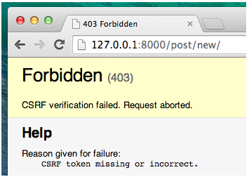

Poďme sa teda pozrieť, ako by mal vyzerať HTML kód v **post_edit.html** :

~~~



    <h2>New post</h2>
    <form method="POST" class="post-form">
        {{ form.as_p }}
        <button type="submit" class="save btn btn-secondary">Save</button>
    </form>

~~~
Ak stránku refrešneme a stlačime ikonu v pravom hornom rohu ktorú sme tam práve vložili mala by sa nám zobraziť stránka formulára s takýmto dizajnom:

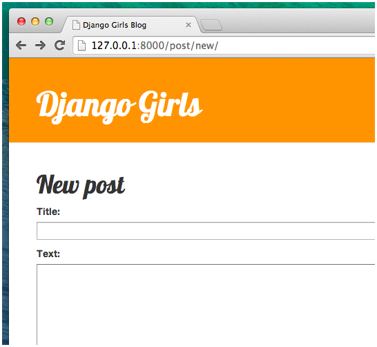

Všimnime si na nej to že jej URL adresa je síce http://127.0.0.1:8000/post/new/ ale šablóna je post_edit.html a nie napr. post_new.html ako sme názvy v urls a views ktoré boli navzájom prepojené používali doposial. Nie je to však ešte všetko. Keď totiž niečo zadáte do polí **title** a **text** a pokúsite sa to uložiť, tak sa nič nestane a opäť zostávame na tej istej stránke. Náš zadaný text je preč a nepridal sa žiadny nový príspevok. Čo sa teda stalo ? Odpoveď znie: že nič. Z nášho pohľadu musíme len ešte niečo doplniť aby to fungovalo tak ako to má a formulár sa so svojim obsahom uložil.

### Uloženie vyplneného formulára

Za týmto účelom znova otvoríme v editore kódu **blog/views.py** a zatiaľ v ňom máme pre post_new iba nasledovný kód:
~~~
def post_new(request):
    form = PostForm()
    return render(request, 'blog/post_edit.html', {'form': form})
~~~

*Príprava riešenia:*

Keď odošleme formulár, vrátime sa späť do rovnakého zobrazenia, lenže tentoraz máme v **request** nejaké ďalšie údaje, presnejšie v **request.POST** (pozor: toto pomenovanie nemá nič spoločné s blogovým príspevkom „post“, súvisí to so skutočnosťou, že pracujeme s údajmi ktoré sa „zverejňujú“ a sú označené ako "published"). Bolo to použté v HTML súbore  pri **<form>** kde mala naša definícia premennú **method="POST"**. 

>Treba si uvedomiť že všetky polia z formulára sú teraz v **request.POST**. Nemali by ste premenovať **POST** na nič iné, lebo jediná platná hodnota pre **method** je **GET**. Tu však nemáme priestor a ani nie je potrebné vysvetľovať podrobnosti v čom spočíva rozdiel.

Takže sa sústredíme na naš cieľ ktorý chceme dosiahnuť a to je zvládnuť dve samostatné situácie: 
* ***po prvé***, keď prvýkrát vstúpime na stránku a chceme prázdny formulár, a 
* ***po druhé***, keď sa vrátime do zobrazenia so všetkými údajmi formulára, ktoré sme práve zadali. 

Musíme teda pridať podmienku a použijeme na to **if**.
~~~
if request.method == "POST":
    [...]
else:
    form = PostForm()
~~~

A v našom prípade to znamená že je tu čas  doplniť tie bodky [...]. Ak **method** je POST, potom chceme zostaviť **PostForms** s údajmi z formulára. To urobíme nasledovne:

~~~
form = PostForm(request.POST)
~~~

Ďalšia vec ktorú musíme tiež ošetriť je skontrolovať, či je formulár správny (t.j. či sú vo všetkých povinných poliach zapísané povolené údaje aby sme zabránili tomu že budú odoslané nesprávne hodnoty). Robíme to validačným príkazom **form.is_valid()** v súbore blog/views.py. Skontrolujeme ním, či je formulár platný a ak áno, umožíme ho uložiť.

~~~
if form.is_valid():
    post = form.save(commit=False)
    post.author = request.user
    post.published_date = timezone.now()
    post.save()
~~~

V zásade tu riešime dve veci: 
* chceli by sme formulár uložiť s tým že bude pridaný **author**. Keďže vo **form.save** ale nebolo na to žiadne pole a toto pole je povinné musíme najprv vyriešiť tento problém. 
* **commi=False** znamená, že model **Post** ešte nemôžeme uložť, ale najprv musíme pridať autora. 

Väčšinu budeme používať **form.save** bez **commit=False**, ale v tomto prípade ho musíme zadať. **post.save()** zachová zmeny (počká na pridanie autora) a až potom sa vytvorí nový blogový príspevok.

Nakoniec by bolo dobré, keby sme mohli okamžite prejsť na stránku **post_detail** nášho novovytvoreného blogového príspevku. No a na to potrebujeme ešte funkciu **redirect** a jej import, ktorý môžeme v súbore blog/views.py pridať k importom existujúcim, alebo ho napísať samostatne ako je to uvedené tu:

~~~
from django.shortcuts import redirect
~~~

Pridajte ho na úplný začiatok súboru **blog/views.py**. A teraz môžeme povedať, „prejdite na stránku **post_detail** pre novovytvorený príspevok“:

~~~
return redirect('post_detail', pk=post.pk)
~~~

**post_detail** je názov zobrazenia, do ktorého chceme ísť. Pamätáte si, že toto ***zobrazenie*** vyžaduje premennú **pk**. Na jej odovzdanie do views používame **pk=post.pk**, kde **post** je novovytvorený blogový príspevok.

*Zhrnutie riešenia*

Celá definícia post_new vo **blog/views.py** potom vyzerá takto:
~~~
from django.shortcuts import redirect
...
def post_new(request):
    if request.method == "POST":
        form = PostForm(request.POST)
        if form.is_valid():
            post = form.save(commit=False)
            post.author = request.user
            post.published_date = timezone.now()
            post.save()
            return redirect('post_detail', pk=post.pk)
    else:
        form = PostForm()
    return render(request, 'blog/post_edit.html', {'form': form})
~~~

Ak v tomto zmysle upravíme **blog/views.py** prejdeme na stránku http://127.0.0.1:8000/post/new/ a uvidíme, či to bude fungovať. Pridajte nejaký text do **title** a **text**, uložte to a skontrolujte či to funguje. Ak áno, nový blogový príspevok je pridaný a my sme presmerovaní na stránku **post_detail** tak ako sme chceli.

Možno ste si všimli, že pred uložením nastavujeme dátum zverejnenia automaticky. Neskôr si vytvoríme na to tlačitko "Publikovať".

Keďže sme nedávno použili admin rozhranie Django, systém si momentálne myslí, že sme stále prihlásení. Existuje niekoľko situácií, ktoré môžu viesť k odhláseniu (zatvorenie prehliadača, reštartovanie databázy atď.). Ak pri vytváraní príspevku zistíte, že sa vám zobrazujú chyby týkajúce sa chýbajúceho prihláseného používateľa, prejdite na stránku správcu http://127.0.0.1:8000/admin a znova sa prihláste. Týmto sa problém dočasne vyrieši. 

### Overenie funkčnosti formulára

Teraz si ukážeme, aké skvelé sú formuláre vytvorené pomocou Djanga. Blogový príspevok musí mať polia **title** a **text**. V našom modeli **Post** sme nepovedali, že tieto polia (na rozdiel od poľa **published_date**) nie sú povinné. Takže Django na základe toho štandardne očakáva, že budú nejako nastavené do východzieho stavu. Pokúste sa teda uložiť formulár bez **title** a **text** a pozrime čo sa staneˇ.

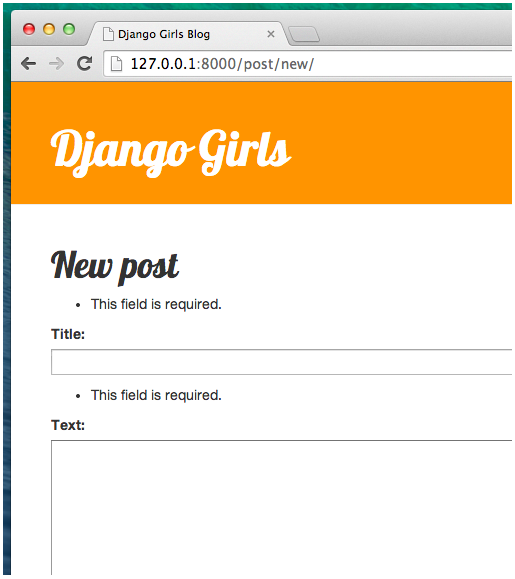

> Django sa postará o overenie správnosti všetkých polí v našom formulári.

### Úprava nášho formulára

Teraz už vieme, ako pridať nový príspevok. Čo ak však chceme upraviť už existujúci príspevok ? Toto je veľmi podobné tomu, čo sme práve urobili, ale má to svoje odlišnosti. Poďme rýchlo vytvoriť dôležité veci.

Najprv si stiahneme a do adresára ikons si uložíme ikonu, ktorá predstavuje tlačidlo úprav. Stiahnite si súbor **pencil-fill.svg** a uložte ho do umiestnenia **blog/templates/blog/icons/**.

Otvorte **blog/templates/blog/post_detail.html** v editore kódu a pridajte nasledujúci kód do prvku **article**:

~~~
<aside class="actions">
    <a class="btn btn-secondary" href="">
      
    </a>
</aside>
~~~

takže celá šablóna post_detail.html bude vyzerať takto:

~~~



    <article class="post">
        <aside class="actions">
            <a class="btn btn-secondary" href="">
                
            </a>
        </aside>
        
            <time class="date">
                Publikované: {{ post.published_date }}&nbsp&nbsp
            </time>
        
        <h2>{{ post.title }}</h2>
        
{{ post.text|linebreaksbr }}

    </article>

~~~
Otvorte v editore kódu **blog/urls.py** a pridajte tento riadok:
~~~
 path('post/<int:pk>/edit/', views.post_edit, name='post_edit'),
~~~

Šablónu **blog/templates/blog/post_edit.html** použijeme znova, a posledná chýbajúca vec je ***view***. Otvorme v editore kódu **blog/views.py** a na úplný koniec súboru pridajme toto:

~~~
def post_edit(request, pk):
    post = get_object_or_404(Post, pk=pk)
    if request.method == "POST":
        form = PostForm(request.POST, instance=post)
        if form.is_valid():
            post = form.save(commit=False)
            post.author = request.user
            post.published_date = timezone.now()
            post.save()
            return redirect('post_detail', pk=post.pk)
    else:
        form = PostForm(instance=post)
    return render(request, 'blog/post_edit.html', {'form': form})
~~~

Tento odstavec vyzerá takmer rovnako ako náš pohľad **post_new**. Ale nie je to celkom tak. 
* Po prvé, z **urls** odovzdáme ďalší parameter **pk**. 
* Po druhé dostaneme model **Post**, s ktorým chceme upraviť **get_object_or_404(Post, pk=pk)** a potom, 
* keď vytvoríme formulár, odovzdáme tento príspevok pri ukladaní formulára ako **instance** …

~~~
form = PostForm(request.POST, instance=post)
~~~
…a keď sme práve otvorili formulár s týmto príspevkom na úpravu:
~~~
form = PostForm(instance=post)
~~~

Vyskúšajme, či to funguje a poďme na stránku **post_detail**. Vedľa príspevku by malo byť tlačidlo úprav s ceruzkou:

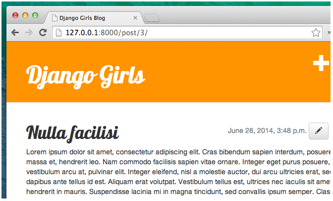

a keď naň klikneme, zobrazí sa nám formulár s príspevkom na našom blogu:

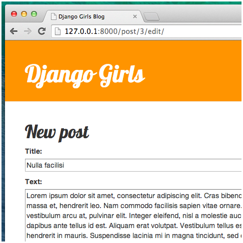

Teraz tu môžeme zmeniť názov alebo text a tieto zmeny uložiť.

Viacej informácií o formulároch Django si možno prečítať v dokumentácii: https://docs.djangoproject.com/en/3.2/topics/forms/

## Bezpečnosť našich stránok

Možnosť vytvárať nové príspevky kliknutím na odkaz je úžasná. Ale práve teraz bude môcť každý, kto navštívi vašu stránku, vytvoriť nový blogový príspevok, a to pravdepodobne nie je niečo čo by sme chceli. Preto zatiaľ kým nebudeme mať implementovanú funkciu prihlásenia registrovaného užívateľa, to urobme tak, aby sa tlačítko zobrazovalo iba vám a nikomu inému.

Otvorte v editore kódu **blog/templates/blog/base.html** a nájdite vo vnútri **header** prvok **div**, ktorý sme tam predtým vložili. Malo by to vyzerať takto:

~~~
<a href="" class="top-menu">
    
</a>
~~~

K tomuto textu pridáme ďalšiu značku ****, vďaka ktorej sa odkaz zobrazí iba užívateľom, ktorí sú prihlásení s privilégiami správcu. Práve teraz ste to len vy. Zmeňte prvok <**a**> tak, aby vyzeral takto:

~~~

    <a href="" class="top-menu">
        
    </a>

~~~

To **** spôsobí, že sa odkaz odošle do prehliadača iba v prípade, že používateľ, ktorý stránku požaduje, je prihlásený. Vytváranie nových príspevkov to úplne nechráni, ale ako prvý krok ochrany je to celkom dobré. Problematike bezpečnosti sa budeme venovať v ďalších častiach.

Podobný problém sa týka aj ikony úprav, ktorú sme práve pridali na našu stránku s podrobnosťami príspevku. Tiež by sme tam potrebovali pridať rovnakú zmenu aby iní ľudia nenemohli upravovať existujúce príspevky a aby to bola iba výsada administrátora alebo vlastníka príspevku.

Otvorte preto v editore kódu **blog/templates/blog/post_detail.html** a nájdite tento riadok:

~~~
<a class="btn btn-secondary" href="">
    
</a>
~~~
Následne ho zmeňme na toto:

~~~

     <a class="btn btn-secondary" href="">
        
     </a>

~~~

Keďže ste pravdepodobne prihlásení, ak obnovíte stránku, neuvidíte žiadnu zmenu. Preto načítajte stránku v inom prehliadači alebo v okne inkognito (nazývanom „InPrivate“ v systéme Windows Edge) a uvidíte, že odkaz sa nezobrazí a nezobrazí sa ani ikona.

# Rozšírenia funkcionality webovej aplikácie

V rámci rozšírenia funkcionality našej webovej aplikácie sa môžeme napr. zaoberať nasledovnými témami :
***Riešené***
* ***Zvýšenie konfortu práce s aplikáciou***
  * Implementácia vytvárania konceptov
  * Publikovanie konceptov príspevkov
  * Odstránenie príspevku
* ***Zvýšenie bezpečnosti aplikácie***
  * Implementácia prihlasovania užívateľov
* ***Vytvorenie diskusného fóra*** 
  * Komentovanie publikovaných príspevkov 

***Neriešené***
* ***Zavedenie registrácie užívateľov***
* ***Použitie výkonnejšej databázy***
  * Pripojenie databázy PostgreSQL***
* ***Použitie vlastnej domény***
* a pod.

>## Implementácia vytvárania konceptov

Náš blog už prešiel dlhou cestou, ale stále je čo zlepšovať. Ďalej pridáme funkcie pre vytáranie konceptov príspevkov a ich publikovanie. Pridáme aj mazanie príspevkov, ktoré už nechceme.

V súčasnosti, keď vytvárame nové príspevky pomocou nášho formulára ***Nový príspevok***, tak sa príspevok hneď uverejňuje-publikuje. Ak chcete namiesto toho uložiť príspevok ako koncept, odstráňme v **blog/views.py** v metódach **post_new** a **post_edit** tento riadok:

~~~
post.published_date = timezone.now()
~~~
Týmto spôsobom sa nové **príspevky uložia ako koncepty**, ktoré môžeme namiesto toho, aby boli okamžite zverejnené napr. neskôr ešte skontrolovať a až potom publikovať. Všetko, čo teraz k tomu potrebujeme, je spôsob, ako uviesť a zverejniť koncepty.

### Vytvorenie stránky so zoznamom nezverejnených príspevkov

V časti o súboroch dotazov sme vytvorili zobrazenie **post_list**, ktoré zobrazuje iba publikované blogové príspevky (t.j. tie, ktoré nemajú prázdne **published_date**). Niečo podobné môžeme urobiť aj pre koncepty príspevkov.

Pridajme do hlavičky súboru **blog/templates/blog/base.html** odkaz. Náš zoznam konceptov však nechceme zobrazovať každému, preto ho vložíme do kontroly pre autentifikáciu ****. To už však máme spravené v predchádzajúcej časti, kedy sme na zobrazenie tlačítka použili ikonu Bootstrap file-earmark-plus.svg. Tu je ako ukážka použitá ikona glyphicon-edit z [Bootstrap Glipcon Components](https://www.w3schools.com/bootstrap/bootstrap_ref_comp_glyphs.asp) 

~~~
<a href="" class="top-menu"></a>
~~~
Ďalej medzi adresy URL v súbore **blog/urls.py** pridávame:
~~~
path('drafts/', views.post_draft_list, name='post_draft_list'),
~~~
a môžeme pre koncept vytvoriť nové zobrazenie v súbore ***blog/views.py** :

~~~
def post_draft_list(request):
    posts = Post.objects.filter(published_date__isnull=True).order_by('created_date')
    return render(request, 'blog/post_draft_list.html', {'posts': posts})
~~~

Riadok **posts = Post.objects.filter(published_date__isnull=True).order_by('created_date')** zabezpečuje, že berieme len nezverejnené príspevky (t.j. tie kde platí **published_date__isnull=True**) a zoraďujeme ich podľa dátumu vytvorenia **created_date( order_by('created_date'))**.

Poslednou častou v **postupnosti urls.py, views.py je samozrejme tempaltes**. Vytvorme súbor **blog/templates/blog/post_draft_list.html ** a pridajte do neho nasledujúce:

~~~



    
        

            
created: {{ post.created_date|date:'d-m-Y' }}

            <h1><a href="">{{ post.title }}</a></h1>
            
{{ post.text|truncatechars:200 }}

        

    

~~~

Vyzerá to veľmi podobne ako u nášho post_list.html. Teraz, keď prejdete na, http://127.0.0.1:8000/drafts/ uvidíme zoznam nezverejnených príspevkov.

***Naše prvé rozšírenie funkcionality našej webovej aplikácie blogu je hotové!***

>## Publikovanie konceptov  príspevkov

Bolo by dobré mať na stránke s podrobnosťami o blogovom príspevku tlačítko, ktoré príspevok okamžite zverejní. Otvorme súbor **blog/templates/blog/post_detail.html** a zmeňme tieto riadky:

~~~

    

        Publikované: {{ post.published_date }}
    


~~~
na takéto
~~~

    

        Publikované: {{ post.published_date }}
    


    <a class="btn btn-secondary" href="">Publikuj</a>

~~~

Pridali sme sem riadok
~~~

~~~
To znamená že ak nie sú splné podmienky z 
~~~

~~~
t.j. ak nie je zadaný dátum publikovania 
`published_date`, a potom chceme aby sa vykonal riadok
~~~
<a class="btn btn-secondary" href="">Publikuj</a>
~~~

Pamätajme však že do `url` sme vložili premennú **pk**

A nastal čas aby sme v súbore **blog/urls.py** doplnili URL adresu:

~~~
path('post/<pk>/publish/', views.post_publish, name='post_publish'),
~~~
a nakoniec ako vždy musíme vytvoriť zobrazenie pre **post_publish** v súbore **blog/views.py** :

~~~
def post_publish(request, pk):
    post = get_object_or_404(Post, pk=pk)
    post.publish()
    return redirect('post_detail', pk=pk)
~~~

Tu sme požiili príkaz redirect ktorý však musíme podložiť importom v tvare 
~~~
from django.shortcuts import redirect
~~~
resp. pridaním jeho importu k inému riadku.

Keď sme vytvorili model **Post**, napísali sme metódu **publish**. Vyzeralo to takto:
~~~
def publish(self):
    self.published_date = timezone.now()
    self.save()
~~~
a teraz to konečne môžeme použiť. Po zverejnení príspevku sme okamžite presmerovaní na stránku **post_detail**.

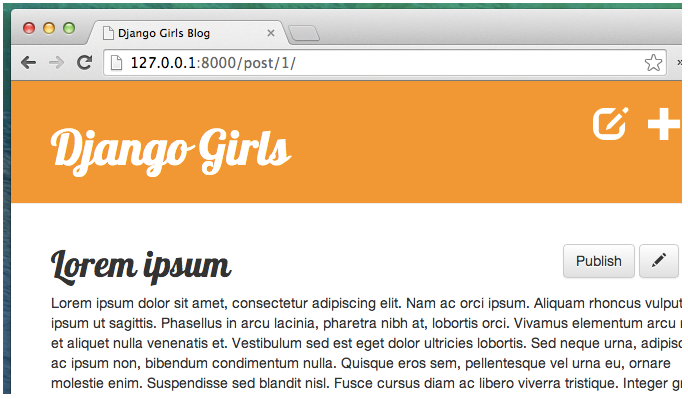

Posledným krokom bude pridanie tlačidla Odstrániť.

>## Odstránenie príspevku

Opäť otvoríme súbor **blog/templates/blog/post_detail.html** a pridáme tento riadok hneď pod riadkom s tlačidlom Edit (Upraviť) :

~~~
<a class="btn btn-secondary" href=""></a>
~~~

Teraz potrebujeme adresu URL v súbore **blog/urls.py** :

~~~
path('post/<pk>/remove/', views.post_remove, name='post_remove'),
~~~
V ďalšom opäť k tomu vytvoríme zobrazenie. Otvorme preto súbor **blog/views.py** a pridajte tento kód spolu s importom redirect do súboru views.py:

~~~
from django.shortcuts import redirect, get_object_or_404

def post_remove(request, pk):
    post = get_object_or_404(Post, pk=pk)
    post.delete()
    return redirect('post_list')
~~~

Jedinou funkcionalitou tejto časti je skutočne odstrániť blogový príspevok. Každý model Django môže byť odstránený pomocou **.delete()**. Prejdite na niektorú stránku s príspevkom a skúste ju odstrániť!

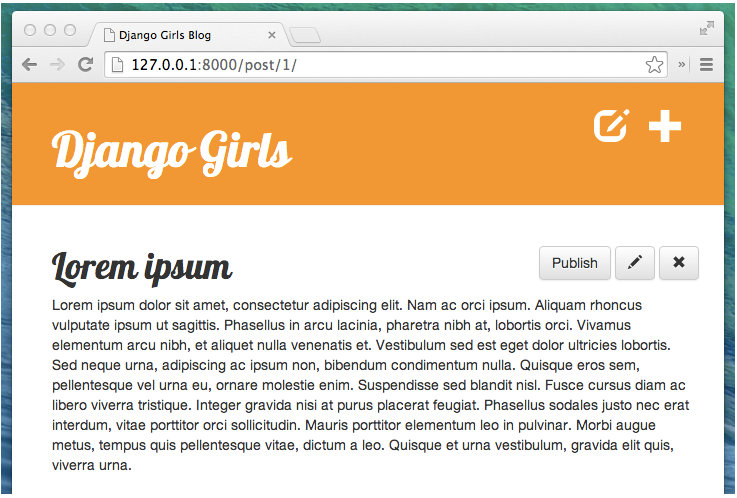

>## Implementácia prihlasovania užívateľov

Doteraz sme pri prístupe k webovej aplikácie nemuseli použiť meno a ani svoje heslo. Okrem prípadu keď sme použili administrátorské rozhranie. To ale znamená, že ktokoľvek môže pridávať alebo upravovať príspevky vo vašom blogu. Pokiaľ nechceme, aby len tak niekto písal na náš blog, tak s tým niečo musíme urobiť.

#### Autorizácia pridávania/úpravy príspevkov

Najprv zabezpečíme nasledovné veci. Naše zobrazenia **post_new**, **post_edit** a **post_draft_list** budeme chrániť tak, aby k nim mali prístup iba prihlásení používatelia. Django má na to niekoľko vhodných nástrojov, ktoré sa nazývajú **dekoratóri**. Teraz sa nebudeme zaoberať technickými detailami. O nich si môžeme niečo prečítať neskôr. Dekoratóri, ktoré budeme používať, sa dodávajú v module Django a volajú sa **post_remove post_publish django.contrib.auth.decorators login_required**

Takže upravme najprv naše **blog/views.py** a pridajme hore spolu pod zvyšok importov tieto riadky:

~~~
from django.contrib.auth.decorators import login_required
~~~

Potom pred každý zo zobrazení **post_new**, **post_edit**, **post_draft_list, post_remove a post_publish**, pridajme riadok ktorý sa nazýva dekorátor :
~~~
@login_required
~~~
a takto ich doplňme  

~~~
@login_required
def post_new(request):
    [...]
~~~
To je všetko! Teraz sa pokúsme získať prístup http://127.0.0.1:8000/post/new/ a všimnúť si rozdiel.

Ak sme dostali prázdny formulár, pravdepodobne sme stále prihlásení ako správca. Prejdite preto na http://127.0.0.1:8000/admin/logout/ odhláste sa a potom sa znovu prihláste na http://127.0.0.1:8000/post/new .

Mali by sme ale dostať jednu z našich známich chýb o ktorej už vieme ako ju odstrániť. Dekorátor, ktorý sme pridali, vás totiž presmeruje na prihlasovaciu stránku, ale keďže ešte táto stránka nie je k dispozícii, zobrazí sa chyba ktorú už poznáme že „Stránka sa nenašla (404)“.

Dosiahli sme časť nášho cieľa. Teraz už iní ľudia nemôžu vytvárať príspevky na našom blogu. Bohužiaľ pokiaľ sa neprihlásime ako admin, tak už nemôžeme vytvárať príspevky ani my. To ale v ďalšom napravíme.

### Prihlasovanie užívateľov - LogIn resp. SignIn

Teraz by sme sa mohli pokúsiť urobiť pár vecí na implementáciu užívateľov, hesiel a autentifikácie. Ale urobiť to správne nie je jednoduché. Keďže ale v Djangu pojde iba o to aby sme tieto poskytované autentifikačné nástroje iba použili.

V našom súbore **mysite/urls.py** najprv pridajme adresu URL **path('accounts/login/', views.LoginView.as_view(), name='login')** a potom hore **from django.contrib.auth import views**. Takže tento súbor by mal teraz vyzerať takto:

~~~
from django.urls import path, include
from django.contrib import admin

from django.contrib.auth import views

urlpatterns = [
    path('admin/', admin.site.urls),
    path('', include('blog.urls')),
    path('accounts/login/', views.LoginView.as_view(), name='login'),
]
~~~

Potom potrebujeme šablónu pre prihlasovaciu stránku, takže vytvorte adresár **blog/templates/registration** a súbor v jeho vnútri s názvom **login.html**:

~~~



    
        
Vaše meno užívateľa a heslo nie je správne. Prosím skúste to znovu.

    

    <form method="post" action="">
    
        <table>
        <tr>
            <td>{{ form.username.label_tag }}</td>
            <td>{{ form.username }}</td>
        </tr>
        <tr>
            <td>{{ form.password.label_tag }}</td>
            <td>{{ form.password }}</td>
        </tr>
        </table>

        <input type="submit" value="login" />
        <input type="hidden" name="next" value="{{ next }}" />
    </form>

~~~

Ako uvidíme, aj táto funkcionalita využíva našu základnú šablónu pre celkový vzhľad nášho blogu.

Je to dobré, že to funguje jednoducho a že nemusíme riešiť manipuláciu s odoslaním formulára ani heslá a ich zabezpečenie. Zostáva nám urobiť len pár vecí medzi ktorými je pridanie nastavenia v **mysite/settings.py** :

~~~
LOGIN_REDIRECT_URL = '/'
~~~
čo spôsobí že pri priamom prístupe na prihlasovaciu stránku, presmeruje úspešné prihlásenie na index najvyššej úrovne (t.j. domovskú stránku nášho blogu).

V tomto štádiu súbpr views.py potom bude mať nasledovný obsah:
~~~
from django.shortcuts import render
from django.utils import timezone
from .models import Post
# pridane kvoli post_detail.html
from django.shortcuts import redirect, get_object_or_404
# pridane kvoli post_edit.html
from .forms import PostForm

# Create your views here.
# Pridanie views pre post_list.html
def post_list(request):
    posts = Post.objects.filter(published_date__lte=timezone.now()).order_by('published_date')
    return render(request, 'blog/post_list.html', {'posts': posts})

# Pridanie views pre post_detail.html
def post_detail(request, pk):
    post = get_object_or_404(Post, pk=pk)
    return render(request, 'blog/post_detail.html', {'post': post})

# Pridanie views pre post_edit.html
def post_new(request):
    if request.method == "POST":
        form = PostForm(request.POST)
        if form.is_valid():
            post = form.save(commit=False)
            post.author = request.user
            post.published_date = timezone.now()
            post.save()
            return redirect('post_detail', pk=post.pk)
    else:
        form = PostForm()
    return render(request, 'blog/post_edit.html', {'form': form})
~~~

### Zlepšenie layoutu - rozloženia prvkov

Keď už máme všetko nastavené tak, že tlačítka na pridávanie a úpravu príspevkov uvidia len oprávnení užívatelia (teda napr. my) môžeme pokračovať ďalej. Teraz sa chceme uistiť, že prihlasovacie tlačítko sa zobrazí aj všetkým ostatným užívatelom ktorí sa dostanú na počiatočnú domovskú stránku.

Pridáme prihlasovacie tlačidlo, a tým zistíme aká je situácia:
~~~
    <a href="" class="top-menu"></a>
~~~

Na to potrebujeme upraviť šablóny. Tak si otvoríme **blog/templates/blog/base.html** a zmeníme časť medzy značkami <**body**> tak, aby vyzerala takto:

~~~
<body>
        

            
                <a href="" class="top-menu"></a>
<!--                <a href="" class="top-menu"></a> -->
            
                <a> Klikom na zámok sa môžete prihlásiť --></>
                <a href="" class="top-menu"></a>    
            
            <h1><a href="/">Django Girls Blog</a></h1>
        

        

            

                

                    

                        
                        
                    

                
    
            

        

    </body>
~~~

Šablóna týmto obsahuje podmienku **if**, ktorá kontroluje overených používateľov na to aby pre nich umožnila zobrazenie tlačítok pre pridanie a úpravy príspevkov. V opačnom prípade sa zobrazí iba tlačítko prihlásenia.

### Niečo viac o overených užívateloch

Keď už sme pri autentifikácii, pridáme do našich šablón trochu logiky. Najprv pridáme nejaké podrobnosti, ktoré sa zobrazia, keď už sme prihlásení. Upravme **blog/templates/blog/base.html** takto:

~~~

    
        <a href="" class="top-menu"></a>
        <a href="" class="top-menu"></a>
        
Vítaj {{ user.username }} <small>(<a href="">Log out</a>)</small>

    
        <a href="" class="top-menu"></a>
    
    <h1><a href="/">Django Girls Blog</a></h1>

~~~

To nám pridáva privítanie užívateľa "Vítaj ***<username>*** ", ktoré nám aj napovie pod akým menom sme prihlásený a potvrdí že sme prešli overením. Tiež nám to pridáva odkaz na odhlásenie z blogu, avšak táto funkcia nám ešte nefunguje. Poďme ju teda doplniť.

Už sme zistili že Django prihlásenie zvládne a že sa na neho môžeme spoliehať. Tak uvidíme, či Django za nás zvládne aj odhlásenie. Skontrolujme stránku dokumentácie Djanga https://docs.djangoproject.com/en/2.0/topics/auth/default/ či tam nie je v súvislosti s touto problematikou nejaká aktualizácia.

V ďalšom kroku pridáme URL adresu do **mysite/urls.py**, ktorá bude smerovať na zobrazenie Django pre odhlásenie (tj **django.contrib.auth.views.logout**) a ktorá bude vyzerať takto:

~~~
from django.urls import path, include
from django.contrib import admin

from django.contrib.auth import views

urlpatterns = [
    path('admin/', admin.site.urls),
    path('accounts/login/', views.LoginView.as_view(), name='login'),
    path('accounts/logout/', views.LogoutView.as_view(next_page='/'), name='logout'),
    path('', include('blog.urls')),
]
~~~

Nuž a to je zatiaľ všetko. Ak sme dodržali všetky vyššie uvedené pokyny získali sme webovú aplikáciu pri ktorej
* na prihlásenie potrebujeme užívateľské meno a heslo,
* ak chcete pridávať, upravovať, zverejňovať alebo mazať príspevky, musíte byť prihlásený
* a môžete sa aj znova odhlásiť

>## Komentovanie publikovaných príspevkov

Momentálne máme len Post model nami vytvoreného blogu. Čo tak získať spätnú väzbu od jeho čitateľov a nechať ich náš príspevok komentovať čo si o ňom myslia resp. aké majú návrhy, čo o danej veci vedia, čo by poradili, aké riešenia a zdroje by doporučili a pod.

### Vytvorenie modelu blogu s komentármi

Poďme otvoriť súbor **blog/models.py a pripojiť tento kúsok kódu na jeho koniec :

~~~
class Comment(models.Model):
    post = models.ForeignKey('blog.Post', on_delete=models.CASCADE, related_name='comments')
    author = models.CharField(max_length=200)
    text = models.TextField()
    created_date = models.DateTimeField(default=timezone.now)
    approved_comment = models.BooleanField(default=False)

    def approve(self):
        self.approved_comment = True
        self.save()

    def __str__(self):
        return self.text
~~~

Ak si potrebujeme zopakovať, čo znamenajú jednotlivé typy polí, môžeme sa vrátiť ku kapitole o modeloch. V tomto rozšírení funkcionality máme **nový typ poľa**:
~~~
models.BooleanField- ktorý vyjadruje či je pole pravda/alebo nepravda
~~~
Možnosť **related_name** v**models.ForeignKey** nám umožňuje prístup ku komentárom v rámci modelu Post.

### Vytvorenie tabuľky pre modely v databáze

Teraz je čas pridať náš model komentárov do databázy. Aby sme to urobili, musíme Djangovi povedať, že sme v našom modeli urobili zmeny. Zadajte do Git Bash-u **python manage.py makemigrations blog** . Výstup by ste mali vidieť v takejto podobe :

~~~
(myvenv) ~/djangogirls$ python manage.py makemigrations blog
Migrations for 'blog':
  0002_comment.py:
    - Create model Comment
~~~

Môžete sa presvedčiť že tento príkaz nám v adresári **blog/migrations** vytvoril ďalší migračný súbor **blog\migrations\0002_comment.py**. Teraz musíme tieto zmeny ale aplikovať na databázu použiťím príkazu **python manage.py migrate blog** . Výstup by mal vyzerať takto:

~~~
(myvenv) ~/djangogirls$ python manage.py migrate blog
    Operations to perform:
      Apply all migrations: blog
    Running migrations:
      Rendering model states... DONE
      Applying blog.0002_comment... OK
~~~

Náš model komentárov tým vznikol v databáze. Asi by bolo vhodné aby sme k nemu mali prístup na našom admin paneli.

### Zaregistrovanie modelu komentárov v paneli administrátora 

Ak chcete zaregistrovať model komentárov v paneli správcu, musíme prejísť na **blog/admin.py** a pridať tento riadok :

~~~
admin.site.register(Comment)
~~~
priamo pod týmto riadkom:
~~~
admin.site.register(Post)
~~~

Je potrebné importovať aj model komentárov v hornej časti súboru, a to takto:

~~~
from django.contrib import admin
from .models import Post, Comment

admin.site.register(Post)
admin.site.register(Comment)
~~~

Ak zadáte **python manage.py runserver** do príkazového riadka a prejdete na adresu http://127.0.0.1:8000/admin/ vo svojom prehliadači, mali by ste mať prístup k zoznamu komentárov a tiež možnosť pridávať a odstraňovať komentáre. 

### Zobrazenie našich komentárov

Prejdite do súboru **blog/templates/blog/post_detail.html** a pred značku  **** na konci pridajte nasledujúce riadky :

~~~


    

        
{{ comment.created_date }}

        <strong>{{ comment.author }}</strong>
        
{{ comment.text|linebreaks }}

    


    
Zatiaľ tu nie sú žiadne komentáre :(


~~~

Teraz môžeme vidieť sekciu komentárov na stránkach s podrobnosťami o príspevku. Mohlo by to však vyzerať o niečo lepšie, takže do spodnej časti súboru pridajme nejaké CSS do súboru **static/css/blog.css** :

~~~
.comment {
    margin: 20px 0px 20px 20px;
}
~~~

Návštevníkov nášho diskusného fóra môžeme tiež informovať o komentároch ktoré boli pridané na stránku zo zoznamom príspevkov. Prejdime do súboru **blog/templates/blog/post_list.html** a pridajte riadok:

~~~
<a href="">Comments: {{ post.comments.count }}</a>
~~~

Potom by naša šablóna mala vyzerať takto:

~~~



    
        

            

                {{ post.published_date }}
            

            <h1><a href="">{{ post.title }}</a></h1>
            
{{ post.text|linebreaksbr }}

            <a href="">Komentár : {{ post.comments.count }}</a>
        

    

~~~

### Nechajme čitateľov písať komentáre

Práve teraz síce vidíme komentáre na našom blogu, ale nemôžeme ich pridávať. Poďme to teda zmeniť. Prejdite na **blog/forms.py** a pridajme nasledujúce riadky na koniec súboru:

~~~
class CommentForm(forms.ModelForm):

    class Meta:
        model = Comment
        fields = ('author', 'text',)
~~~

Nezabudnime importovať model komentárov a zmeňme riadok:

~~~
from .models import Post
~~~
na 
~~~
from .models import Post, Comment
~~~

Teraz prejdime na **blog/templates/blog/post_detail.html** a pred riadok **** pridajme:
~~~
<a class="btn btn-secondary" href="">Pridaj komentár</a>
~~~
Ak prejdeme na stránku s podrobnosťami o príspevku, mala by sa vám zobraziť táto chyba:

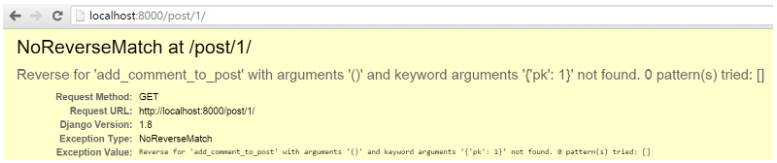

Vieme, ako to napraviť a prejdite na **blog/urls.py** aby sme pridali tento vzor do url **patterns** :
~~~
path('post/<int:pk>/comment/', views.add_comment_to_post, name='add_comment_to_post'),
~~~

Keď obnovíme stránku tak sa zobrazí iná chyba.

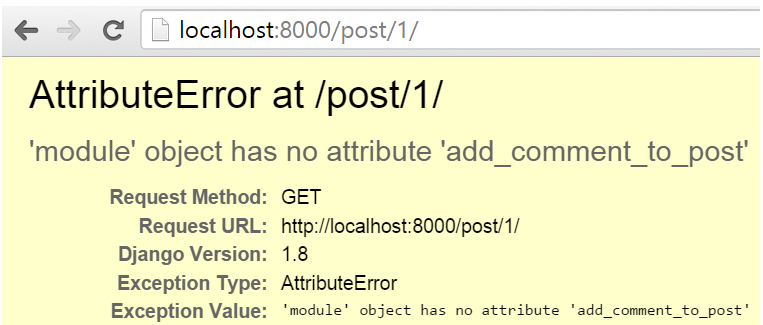

Ak chceme túto chybu opraviť, pridáme do importov a na koniec do **blog/views.py** toto zobrazenie :
~~~
from django.shortcuts import redirect

...

def add_comment_to_post(request, pk):
    post = get_object_or_404(Post, pk=pk)
    if request.method == "POST":
        form = CommentForm(request.POST)
        if form.is_valid():
            comment = form.save(commit=False)
            comment.post = post
            comment.save()
            return redirect('post_detail', pk=post.pk)
    else:
        form = CommentForm()
    return render(request, 'blog/add_comment_to_post.html', {'form': form})
~~~

Nezabudnime však importovať na začiatok súboru **CommentForm** :

~~~
from .forms import PostForm, CommentForm
~~~

Teraz by ste mali na stránke s podrobnosťami o príspevku vidieť tlačidlo „Pridaj komentár“ (Add comment).

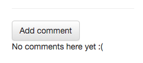

Keď však kliknete na toto tlačidlo, uvidíte:

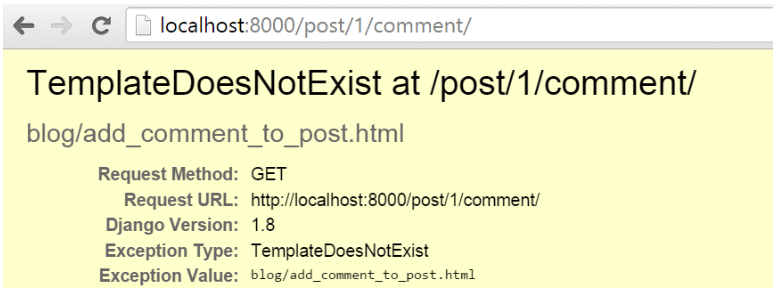

Ako nám chyba hovorí, šablóna zatiaľ neexistuje. Takže vytvorte nový súbor na adrese **blog/templates/blog/add_comment_to_post.html** a pridajte do neho nasledujúci kód:

~~~



    <h1>New comment</h1>
    <form method="POST" class="post-form">
        {{ form.as_p }}
        <button type="submit" class="save btn btn-secondary">Odošli</button>
    </form>

~~~
Tak a teraz nám čitatelia našich príspevkov môžu dávať vedieť, čo si myslia o našich blogových názoroch.

### Moderovanie komentárov

Nie všetky komentáre by sa mali zobrazovať. Ako vlastník blogu pravdepodobne chceme mať možnosť schvaľovať alebo mazať komentáre. 

Ak ste tak ešte neurobili, všetky ikony Bootstrap si môžete stiahnuť [**tu**](https://github.com/twbs/icons/releases/download/v1.1.0/bootstrap-icons-1.1.0.zip). Rozbaľte súbor a odtiaľ si skopírujte požadované obrazové súbory SVG do priečinka s názvom **blog/templates/blog/icons**. Týmto spôsobom môžete získať prístup k ľubovolnej ikone ktorá sa tu nachádza. Patrí k nim aj **hand-thumbs-down.svg** ktorú si nakopírujeme do spomenutého priečinka **blog/templates/blog/icons**

Prejdime na **blog/templates/blog/post_detail.html** a zmeňte riadky:

~~~

    

        
{{ comment.created_date }}

        <strong>{{ comment.author }}</strong>
        
{{ comment.text|linebreaks }}

    


    
Zatiaľ tu nie sú žiadne komentáre :


~~~
na takéto :

~~~

    
    

        

            {{ comment.created_date }}
            
                <a class="btn btn-secondary" href="">
                   
                </a>
                <a class="btn btn-secondary" href="">
                   
                </a>
            
        

        <strong>{{ comment.author }}</strong>
        
{{ comment.text|linebreaks }}

    

    

    
Zatiaľ tu nie sú žiadne komentáre :


~~~

Pri spustení aplikácie by sme mali vidieť chybu **NoReverseMatch**, pretože zatiaľ žiadna adresa URL nezodpovedá vzorom **comment_remove** a **comment_approve**.

Ak chcete chybu opraviť, pridajme do **blog/urls.py** tieto vzory adries URL :

~~~
path('comment/<int:pk>/approve/', views.comment_approve, name='comment_approve'),
path('comment/<int:pk>/remove/', views.comment_remove, name='comment_remove'),
~~~

Teraz by sme mali ešte vidieť chybu **AttributeError**. Ak chceme túto chybu opraviť, musíme pridať tieto zobrazenia do **blog/views.py** :

~~~
@login_required
def comment_approve(request, pk):
    comment = get_object_or_404(Comment, pk=pk)
    comment.approve()
    return redirect('post_detail', pk=comment.post.pk)

@login_required
def comment_remove(request, pk):
    comment = get_object_or_404(Comment, pk=pk)
    comment.delete()
    return redirect('post_detail', pk=comment.post.pk)
~~~

a naviac v hornrj časti súboru budeme musieť importovať do modelov modul **Comment**

~~~
from .models import Post, Comment
~~~

Ak všetko funguje, je tu ešte jedna malá úprava, ktorú môžeme urobiť. Na našej stránke so zoznamom príspevkov momentálne vidíme pod príspevkami počet **všetkých** komentárov, ktoré blogový príspevok získal. Zmeňme to tak, aby sa tam zobrazoval **iba** počet schválených komentárov, nakoľko niektoré z komentárov môžu byť tak isto nevhodné ako to bolo v prípade kontroly vlastných príspevkov.

Ak to chcete vyriešiť, prejdite na **blog/templates/blog/post_list.html** a zmeňte riadok:
~~~
<a href="">Komentáre : {{ post.comments.count }}</a>
~~~
na riadok s týmto obsahom :

~~~
<a href="">Komentáre : {{ post.approved_comments.count }}</a>
~~~

Nakoniec je od nás ešte očakávané aby sme do modelu Post v **blog/models.py** pridali ešte túto metódu  :

~~~
ef approved_comments(self):
    return self.comments.filter(approved_comment=True)
~~~

Tým je rozšírenie funkcionality webovej aplikácie o funkciu komentárov dokončená!
